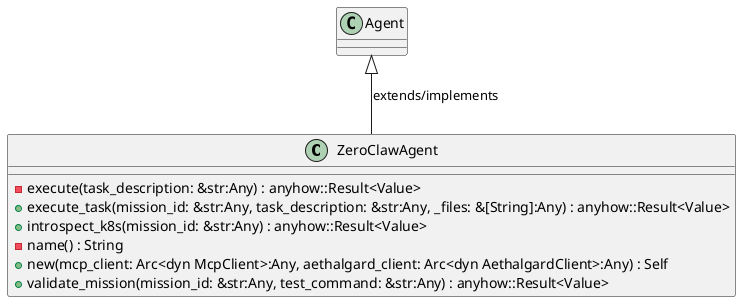
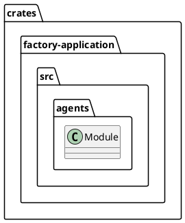
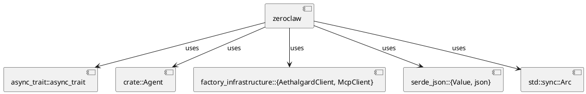
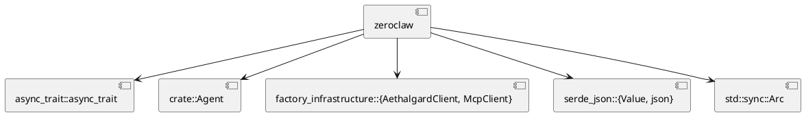
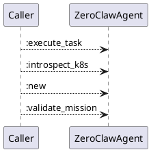
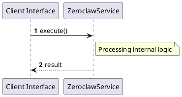

# File: zeroclaw.rs

**Source Path:** `crates/factory-application/src/agents/zeroclaw.rs`

## Overview

### Purpose
Provides implementation for zeroclaw.rs.

### Responsibilities
* Handles logic related to zeroclaw.

### Dependencies
* async_trait::async_trait, crate::Agent, factory_infrastructure::{AethalgardClient, McpClient}, serde_json::{Value, json}, std::sync::Arc

### Imported modules
* None

### Exported classes
* ZeroClawAgent

### Exported interfaces
* None

### Exported functions
* None

## Public API

### Exported Classes / Structs / Interfaces

#### ZeroClawAgent

**Overview:**
No description provided.

**Constructor:**

##### `new(mcp_client: Arc<dyn McpClient> (Any), aethalgard_client: Arc<dyn AethalgardClient> (Any))`
Parameters: mcp_client: Arc<dyn McpClient> (Any), aethalgard_client: Arc<dyn AethalgardClient> (Any)
Dependencies: Inherited from context
Initialization: Sets up ZeroClawAgent

**Attributes:**

* `aethalgard_client` (Arc<dyn AethalgardClient>): Purpose - Stores aethalgard_client data. Constraints - Valid Arc<dyn AethalgardClient>.
* `mcp_client` (Arc<dyn McpClient>): Purpose - Stores mcp_client data. Constraints - Valid Arc<dyn McpClient>.

**Public Methods:**

##### `execute_task(mission_id: &str (Any), task_description: &str (Any), _files: &[String] (Any)) -> anyhow::Result<Value>`

###### Description
No description provided.

###### Inputs
* `mission_id: &str`: type=Any, meaning=Input for mission_id: &str, valid values=Any valid Any, optional=No, default value=None
* `task_description: &str`: type=Any, meaning=Input for task_description: &str, valid values=Any valid Any, optional=No, default value=None
* `_files: &[String]`: type=Any, meaning=Input for _files: &[String], valid values=Any valid Any, optional=No, default value=None

###### Output
Return type: anyhow::Result<Value>
Semantic meaning: Result of execute_task
Possible null values: Conditional
Exceptions: None handled explicitly

###### Side Effects
Database updates: None
File operations: None
Network calls: None
Cache: None
State changes: Updates internal variables

###### Complexity
Time Complexity: O(1) mostly
Space Complexity: O(1) mostly

###### Example
```
let result = instance.execute_task();
```

##### `introspect_k8s(mission_id: &str (Any)) -> anyhow::Result<Value>`

###### Description
No description provided.

###### Inputs
* `mission_id: &str`: type=Any, meaning=Input for mission_id: &str, valid values=Any valid Any, optional=No, default value=None

###### Output
Return type: anyhow::Result<Value>
Semantic meaning: Result of introspect_k8s
Possible null values: Conditional
Exceptions: None handled explicitly

###### Side Effects
Database updates: None
File operations: None
Network calls: None
Cache: None
State changes: Updates internal variables

###### Complexity
Time Complexity: O(1) mostly
Space Complexity: O(1) mostly

###### Example
```
let result = instance.introspect_k8s();
```

##### `validate_mission(mission_id: &str (Any), test_command: &str (Any)) -> anyhow::Result<Value>`

###### Description
No description provided.

###### Inputs
* `mission_id: &str`: type=Any, meaning=Input for mission_id: &str, valid values=Any valid Any, optional=No, default value=None
* `test_command: &str`: type=Any, meaning=Input for test_command: &str, valid values=Any valid Any, optional=No, default value=None

###### Output
Return type: anyhow::Result<Value>
Semantic meaning: Result of validate_mission
Possible null values: Conditional
Exceptions: None handled explicitly

###### Side Effects
Database updates: None
File operations: None
Network calls: None
Cache: None
State changes: Updates internal variables

###### Complexity
Time Complexity: O(1) mostly
Space Complexity: O(1) mostly

###### Example
```
let result = instance.validate_mission();
```

**Private Methods:**

* `execute(task_description: &str (Any)) -> anyhow::Result<Value>`: Internal helper logic.
* `name() -> String`: Internal helper logic.

### Exported Functions

None.

## Internal architecture



## Package Diagram



## Component Diagram



## Dependency Graph



## Call Graph



## Execution flow & Sequence explanation



## Examples

```
// Example usage of zeroclaw.rs components
import { ... } from 'crates/factory-application/src/agents/zeroclaw.rs';
```

## Cross References
* **Parent module:** `crates/factory-application/src/agents`
* **Dependencies:** async_trait::async_trait, crate::Agent, factory_infrastructure::{AethalgardClient, McpClient}, serde_json::{Value, json}, std::sync::Arc
