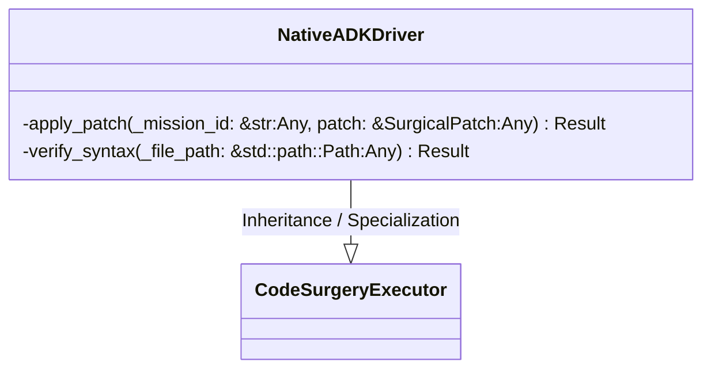
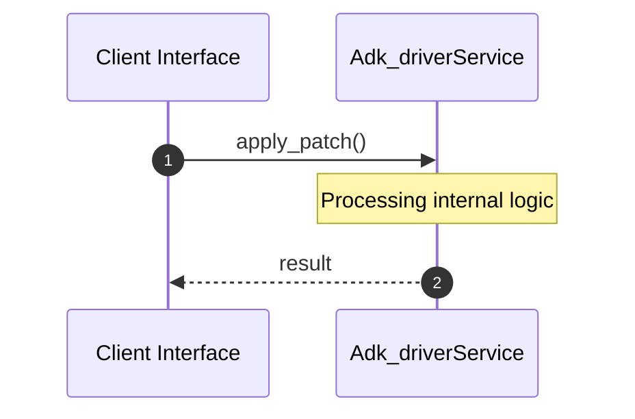
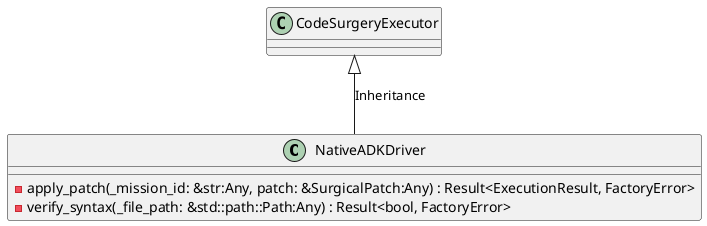
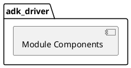
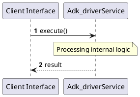
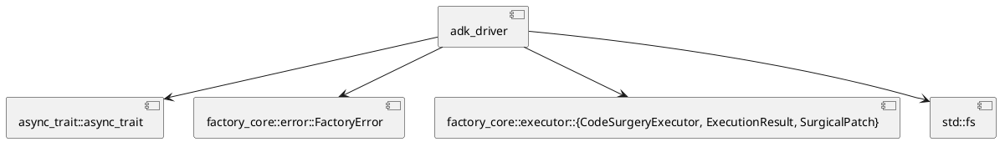
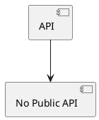

# File: adk_driver.rs

**Source Path:** `crates/factory-application/src/bridge/adk_driver.rs`

## Overview

### Purpose
Provides implementation for adk_driver.rs.

### Responsibilities
* Handles logic related to adk_driver.

### Main Workflow
* Initialization and execution of adk_driver logic.

### Dependencies
* async_trait::async_trait, factory_core::error::FactoryError, factory_core::executor::{CodeSurgeryExecutor, ExecutionResult, SurgicalPatch}, std::fs

### Imported modules
* None

### Exported classes
* NativeADKDriver

### Exported interfaces
* None

### Exported functions
* None

## Public API

### Exported Classes / Structs / Interfaces

#### NativeADKDriver

**Overview:**
Why it exists:
Provides capabilities related to NativeADKDriver.

What business capability it provides:
Supports core domain concepts.

How it collaborates with other classes:
Works with related entities to process logic.

**Constructor:**

Default constructor.

**Attributes:**

* `workspace_root` (std::path::PathBuf): Purpose - Stores workspace_root data. Constraints - Valid std::path::PathBuf.

**Public Methods:**

None.

**Private Methods:**

* `apply_patch(_mission_id: &str (Any), patch: &SurgicalPatch (Any)) -> Result<ExecutionResult, FactoryError>`: Internal helper logic.
* `verify_syntax(_file_path: &std::path::Path (Any)) -> Result<bool, FactoryError>`: Internal helper logic.

### Exported Functions

None.

## Internal architecture



## Execution flow & Sequence explanation



## UML

### Class Diagram


### Package Diagram


### Sequence Diagram


### Component Diagram
```plantuml
@startuml
component "adk_driver" as comp
component "async_trait::async_trait" as async_trait::async_trait
comp --> async_trait::async_trait
component "factory_core::error::FactoryError" as factory_core::error::FactoryError
comp --> factory_core::error::FactoryError
component "factory_core::executor::{CodeSurgeryExecutor, ExecutionResult, SurgicalPatch}" as factory_core::executor::{CodeSurgeryExecutor, ExecutionResult, SurgicalPatch}
comp --> factory_core::executor::{CodeSurgeryExecutor, ExecutionResult, SurgicalPatch}
component "std::fs" as std::fs
comp --> std::fs
@enduml

```

### Dependency Graph


### Call Graph


## Examples

```
// Example usage of adk_driver.rs components
import { ... } from 'crates/factory-application/src/bridge/adk_driver.rs';
```

## Cross References
* **Parent module:** `crates/factory-application/src/bridge`
* **Dependencies:** async_trait::async_trait, factory_core::error::FactoryError, factory_core::executor::{CodeSurgeryExecutor, ExecutionResult, SurgicalPatch}, std::fs
