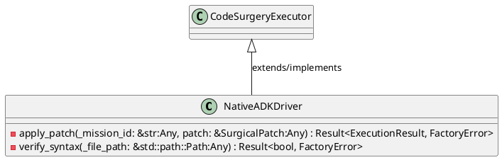
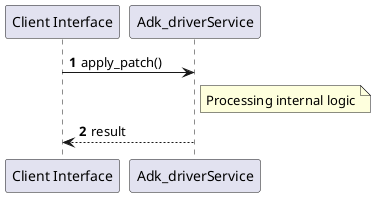

# File: adk_driver.rs

**Source Path:** `crates/factory-application/src/bridge/adk_driver.rs`

## Overview

### Purpose
Provides implementation for adk_driver.rs.

### Responsibilities
* Handles logic related to adk_driver.

### Dependencies
* async_trait::async_trait, factory_core::error::FactoryError, factory_core::executor::{CodeSurgeryExecutor, ExecutionResult, SurgicalPatch}, std::fs

### Imported modules
* None

### Exported classes
* NativeADKDriver

### Exported interfaces
* None

### Exported functions
* None

## Public API

### Exported Classes / Structs / Interfaces

#### NativeADKDriver

**Overview:**
No description provided.

**Constructor:**

Default constructor.

**Attributes:**

* `workspace_root` (std::path::PathBuf): Purpose - Stores workspace_root data. Constraints - Valid std::path::PathBuf.

**Public Methods:**

None.

**Private Methods:**

* `apply_patch(_mission_id: &str (Any), patch: &SurgicalPatch (Any)) -> Result<ExecutionResult, FactoryError>`: Internal helper logic.
* `verify_syntax(_file_path: &std::path::Path (Any)) -> Result<bool, FactoryError>`: Internal helper logic.

### Exported Functions

None.

## Internal architecture



## Execution flow & Sequence explanation



## Examples

```
// Example usage of adk_driver.rs components
import { ... } from 'crates/factory-application/src/bridge/adk_driver.rs';
```

## Cross References
* **Parent module:** `crates/factory-application/src/bridge`
* **Dependencies:** async_trait::async_trait, factory_core::error::FactoryError, factory_core::executor::{CodeSurgeryExecutor, ExecutionResult, SurgicalPatch}, std::fs
