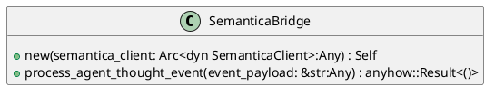
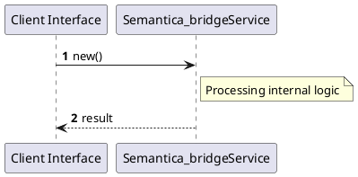

# File: semantica_bridge.rs

**Source Path:** `crates/factory-application/src/bridge/semantica_bridge.rs`

## Overview

### Purpose
Provides implementation for semantica_bridge.rs.

### Responsibilities
* Handles logic related to semantica_bridge.

### Dependencies
* factory_infrastructure::MockSemanticaClient, factory_infrastructure::{DecisionRecord, SemanticaClient}, std::sync::Arc, super::*, tracing::{error, info}

### Imported modules
* None

### Exported classes
* SemanticaBridge

### Exported interfaces
* None

### Exported functions
* None

## Public API

### Exported Classes / Structs / Interfaces

#### SemanticaBridge

**Overview:**
No description provided.

**Constructor:**

##### `new(semantica_client: Arc<dyn SemanticaClient> (Any))`
Parameters: semantica_client: Arc<dyn SemanticaClient> (Any)
Dependencies: Inherited from context
Initialization: Sets up SemanticaBridge

**Attributes:**

* `semantica_client` (Arc<dyn SemanticaClient>): Purpose - Stores semantica_client data. Constraints - Valid Arc<dyn SemanticaClient>.

**Public Methods:**

##### `process_agent_thought_event(event_payload: &str (Any)) -> anyhow::Result<()>`

###### Description
No description provided.

###### Inputs
* `event_payload: &str`: type=Any, meaning=Input for event_payload: &str, valid values=Any valid Any, optional=No, default value=None

###### Output
Return type: anyhow::Result<()>
Semantic meaning: Result of process_agent_thought_event
Possible null values: Conditional
Exceptions: None handled explicitly

###### Side Effects
Database updates: None
File operations: None
Network calls: None
Cache: None
State changes: Updates internal variables

###### Complexity
Time Complexity: O(1) mostly
Space Complexity: O(1) mostly

###### Example
```
let result = instance.process_agent_thought_event();
```

**Private Methods:**

None.

### Exported Functions

None.

## Internal architecture



## Execution flow & Sequence explanation




## Examples

```
// Example usage of semantica_bridge.rs components
import { ... } from 'crates/factory-application/src/bridge/semantica_bridge.rs';
```


## Cross References
* **Parent module:** `crates/factory-application/src/bridge`
* **Dependencies:** factory_infrastructure::MockSemanticaClient, factory_infrastructure::{DecisionRecord, SemanticaClient}, std::sync::Arc, super::*, tracing::{error, info}
