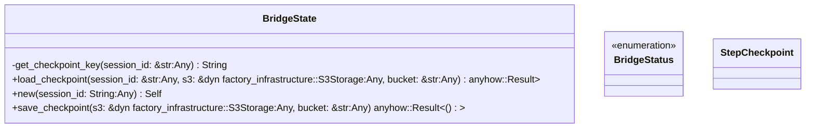
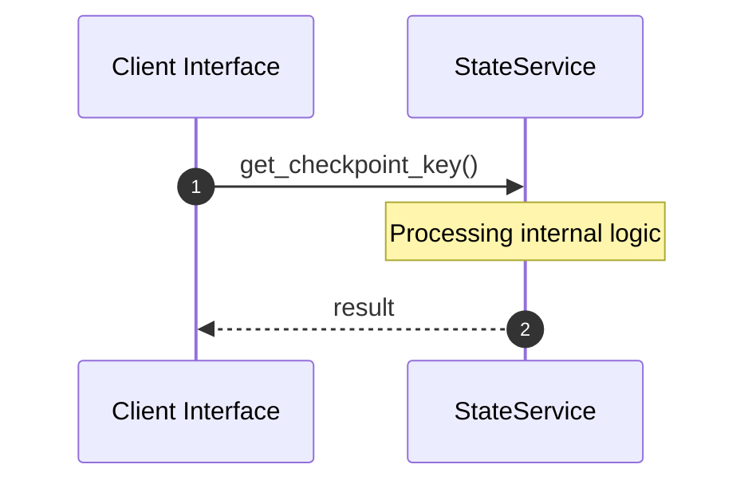

# File: state.rs

**Source Path:** `crates/factory-application/src/bridge/state.rs`

## Overview

### Purpose
Provides implementation for state.rs.

### Responsibilities
* Handles logic related to state.

### Dependencies
* chrono::{DateTime, Utc}, serde::{Deserialize, Serialize}, std::collections::HashMap

### Imported modules
* None

### Exported classes
* BridgeState, StepCheckpoint

### Exported interfaces
* None

### Exported functions
* None

## Public API

### Exported Classes / Structs / Interfaces

#### BridgeState

**Overview:**
Why it exists:
Provides capabilities related to BridgeState.

What business capability it provides:
Supports core domain concepts.

How it collaborates with other classes:
Works with related entities to process logic.

**Constructor:**

##### `new(session_id: String (Any))`
Parameters: session_id: String (Any)
Dependencies: Inherited from context
Initialization: Sets up BridgeState

**Attributes:**

* `checkpoints` (HashMap<String, StepCheckpoint>): Purpose - Stores checkpoints data. Constraints - Valid HashMap<String, StepCheckpoint>.
* `current_step` (String): Purpose - Stores current_step data. Constraints - Valid String.
* `last_updated` (u64): Purpose - Stores last_updated data. Constraints - Valid u64.
* `run_status` (BridgeStatus): Purpose - Stores run_status data. Constraints - Valid BridgeStatus.
* `session_id` (String): Purpose - Stores session_id data. Constraints - Valid String.
* `spec_version` (String): Purpose - Stores spec_version data. Constraints - Valid String.

**Public Methods:**

##### `load_checkpoint(session_id: &str (Any), s3: &dyn factory_infrastructure::S3Storage (Any), bucket: &str (Any)) -> anyhow::Result<Option<Self>>`

###### Description
Executes load_checkpoint.

###### Inputs
* `session_id: &str`: type=Any, meaning=Input for session_id: &str, valid values=Any valid Any, optional=No, default value=None
* `s3: &dyn factory_infrastructure::S3Storage`: type=Any, meaning=Input for s3: &dyn factory_infrastructure::S3Storage, valid values=Any valid Any, optional=No, default value=None
* `bucket: &str`: type=Any, meaning=Input for bucket: &str, valid values=Any valid Any, optional=No, default value=None

###### Output
Return type: anyhow::Result<Option<Self>>
Semantic meaning: Result of load_checkpoint
Possible null values: Conditional
Exceptions: None handled explicitly

###### Side Effects
Database updates: None
File operations: None
Network calls: None
Cache: None
State changes: Updates internal variables

###### Complexity
Time Complexity: O(1) mostly
Space Complexity: O(1) mostly

###### Example
```
let result = instance.load_checkpoint();
```

##### `save_checkpoint(s3: &dyn factory_infrastructure::S3Storage (Any), bucket: &str (Any)) -> anyhow::Result<()>`

###### Description
Executes save_checkpoint.

###### Inputs
* `s3: &dyn factory_infrastructure::S3Storage`: type=Any, meaning=Input for s3: &dyn factory_infrastructure::S3Storage, valid values=Any valid Any, optional=No, default value=None
* `bucket: &str`: type=Any, meaning=Input for bucket: &str, valid values=Any valid Any, optional=No, default value=None

###### Output
Return type: anyhow::Result<()>
Semantic meaning: Result of save_checkpoint
Possible null values: Conditional
Exceptions: None handled explicitly

###### Side Effects
Database updates: None
File operations: None
Network calls: None
Cache: None
State changes: Updates internal variables

###### Complexity
Time Complexity: O(1) mostly
Space Complexity: O(1) mostly

###### Example
```
let result = instance.save_checkpoint();
```

**Private Methods:**

* `get_checkpoint_key(session_id: &str (Any)) -> String`: Internal helper logic.

#### BridgeStatus

**Overview:**
Why it exists:
Provides capabilities related to BridgeStatus.

What business capability it provides:
Supports core domain concepts.

How it collaborates with other classes:
Works with related entities to process logic.

**Constructor:**

Default constructor.

**Attributes:**

None.

**Public Methods:**

None.

**Private Methods:**

None.

#### StepCheckpoint

**Overview:**
Why it exists:
Provides capabilities related to StepCheckpoint.

What business capability it provides:
Supports core domain concepts.

How it collaborates with other classes:
Works with related entities to process logic.

**Constructor:**

Default constructor.

**Attributes:**

* `completed_at` (Option<DateTime<Utc>>): Purpose - Stores completed_at data. Constraints - Valid Option<DateTime<Utc>>.
* `input_snapshot` (serde_json::Value): Purpose - Stores input_snapshot data. Constraints - Valid serde_json::Value.
* `output_snapshot` (Option<serde_json::Value>): Purpose - Stores output_snapshot data. Constraints - Valid Option<serde_json::Value>.
* `step_name` (String): Purpose - Stores step_name data. Constraints - Valid String.

**Public Methods:**

None.

**Private Methods:**

None.

### Exported Functions

None.

## Internal architecture



## Execution flow & Sequence explanation



## Examples

```
// Example usage of state.rs components
import { ... } from 'crates/factory-application/src/bridge/state.rs';
```

## Cross References
* **Parent module:** `crates/factory-application/src/bridge`
* **Dependencies:** chrono::{DateTime, Utc}, serde::{Deserialize, Serialize}, std::collections::HashMap
