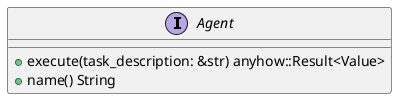
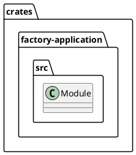
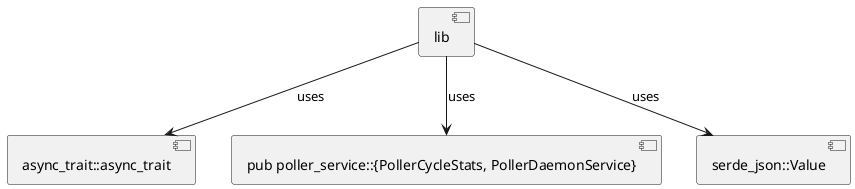
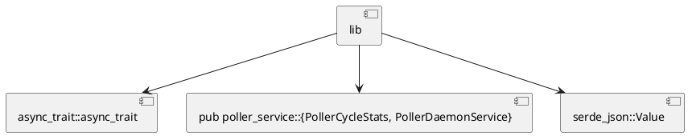
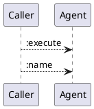
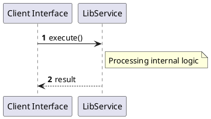

# File: lib.rs

**Source Path:** `crates/factory-application/src/lib.rs`

## Overview

### Purpose
Provides implementation for lib.rs.

### Responsibilities
* Handles logic related to lib.

### Dependencies
* async_trait::async_trait, pub poller_service::{PollerCycleStats, PollerDaemonService}, serde_json::Value

### Imported modules
* None

### Exported classes
* None

### Exported interfaces
* Agent

### Exported functions
* None

## Public API

### Exported Classes / Structs / Interfaces

#### Agent

**Overview:**
No description provided.

**Constructor:**

Default constructor.

**Attributes:**

None.

**Public Methods:**

##### `execute(task_description (&str)) -> anyhow::Result<Value>`

###### Description
No description provided.

###### Inputs
* `task_description`: type=&str, meaning=Input for task_description, valid values=Any valid &str, optional=No, default value=None

###### Output
Return type: anyhow::Result<Value>
Semantic meaning: Result of execute
Possible null values: Conditional
Exceptions: None handled explicitly

###### Side Effects
Database updates: None
File operations: None
Network calls: None
Cache: None
State changes: Updates internal variables

###### Complexity
Time Complexity: O(1) mostly
Space Complexity: O(1) mostly

###### Example
```
let result = instance.execute();
```

##### `name() -> String`

###### Description
No description provided.

###### Inputs
None.

###### Output
Return type: String
Semantic meaning: Result of name
Possible null values: Conditional
Exceptions: None handled explicitly

###### Side Effects
Database updates: None
File operations: None
Network calls: None
Cache: None
State changes: Updates internal variables

###### Complexity
Time Complexity: O(1) mostly
Space Complexity: O(1) mostly

###### Example
```
let result = instance.name();
```

**Private Methods:**

None.

### Exported Functions

None.

## Internal architecture



## Package Diagram



## Component Diagram



## Dependency Graph



## Call Graph



## Execution flow & Sequence explanation



## Examples

```
// Example usage of lib.rs components
import { ... } from 'crates/factory-application/src/lib.rs';
```

## Cross References
* **Parent module:** `crates/factory-application/src`
* **Dependencies:** async_trait::async_trait, pub poller_service::{PollerCycleStats, PollerDaemonService}, serde_json::Value
