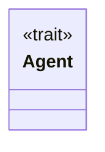
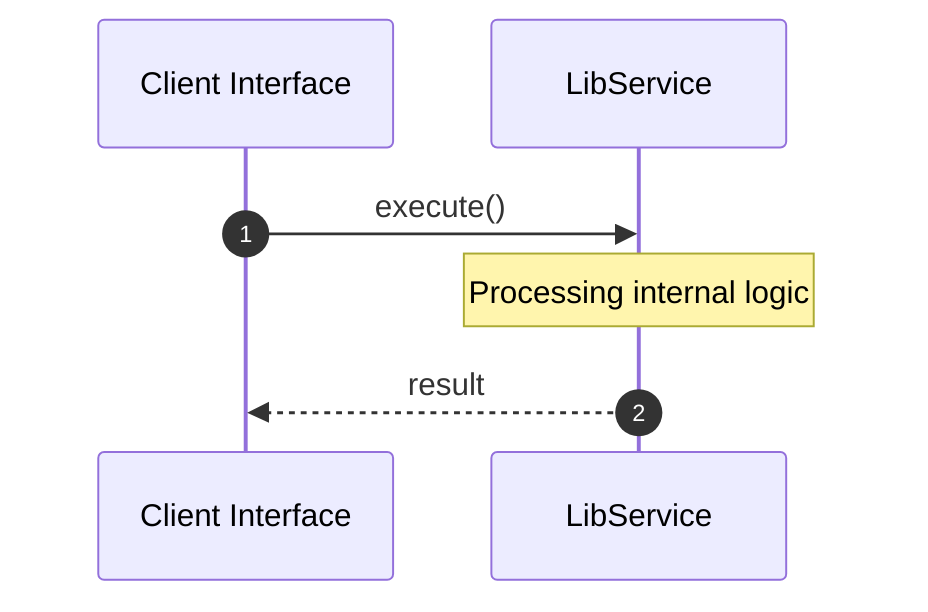
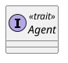
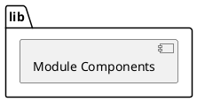
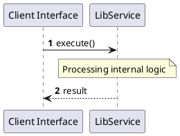
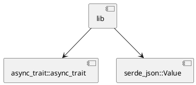
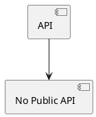

# File: lib.rs

**Source Path:** `crates/factory-application/src/lib.rs`

## Overview

### Purpose
Provides implementation for lib.rs.

### Responsibilities
* Handles logic related to lib.

### Main Workflow
* Initialization and execution of lib logic.

### Dependencies
* async_trait::async_trait, serde_json::Value

### Imported modules
* None

### Exported classes
* None

### Exported interfaces
* Agent

### Exported functions
* None

## Public API

### Exported Classes / Structs / Interfaces

#### Agent

**Overview:**
Why it exists:
Provides capabilities related to Agent.

What business capability it provides:
Supports core domain concepts.

How it collaborates with other classes:
Works with related entities to process logic.

**Constructor:**

Default constructor.

**Attributes:**

None.

**Public Methods:**

None.

**Private Methods:**

None.

### Exported Functions

None.

## Internal architecture



## Execution flow & Sequence explanation



## UML

### Class Diagram


### Package Diagram


### Sequence Diagram


### Component Diagram
```plantuml
@startuml
component "lib" as comp
component "async_trait::async_trait" as async_trait::async_trait
comp --> async_trait::async_trait
component "serde_json::Value" as serde_json::Value
comp --> serde_json::Value
@enduml

```

### Dependency Graph


### Call Graph


## Examples

```
// Example usage of lib.rs components
import { ... } from 'crates/factory-application/src/lib.rs';
```

## Cross References
* **Parent module:** `crates/factory-application/src`
* **Dependencies:** async_trait::async_trait, serde_json::Value
