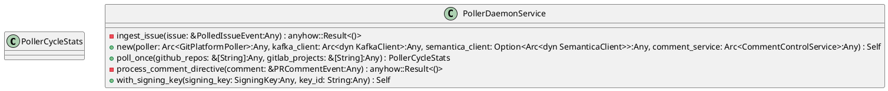
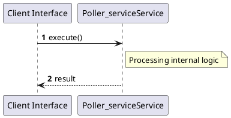

# File: poller_service.rs

**Source Path:** `crates/factory-application/src/poller_service.rs`

## Overview

### Purpose
Provides implementation for poller_service.rs.

### Responsibilities
* Handles logic related to poller_service.

### Dependencies
* chrono::Utc, crate::workflows::comment_control::{CommentControlInput, CommentControlService}, ed25519_dalek::SigningKey, factory_core::security::nhi::{AgentSubject, VerifiableCredential}, factory_core::{PRCommentEvent, PolledIssueEvent}, factory_infrastructure::aethalgard::MockAethalgardClient, factory_infrastructure::cursor_store::InMemoryCursorStore, factory_infrastructure::git_poller::GitPlatformPoller, factory_infrastructure::github::{
        GithubComment, GithubIssue, GithubPullRequest, GithubUser, MockGithubClient,
    }, factory_infrastructure::kafka::KafkaClient, factory_infrastructure::kafka::SimpleMockKafkaClient, factory_infrastructure::mcp_client::MockMcpClient, factory_infrastructure::r2r::MockR2rClient, factory_infrastructure::semantica::SemanticaClient, rand::rngs::OsRng, serde::{Deserialize, Serialize}, std::sync::Arc, super::*

### Imported modules
* None

### Exported classes
* PollerCycleStats, PollerDaemonService

### Exported interfaces
* None

### Exported functions
* None

## Public API

### Exported Classes / Structs / Interfaces

#### PollerCycleStats

**Overview:**
No description provided.

**Constructor:**

Default constructor.

**Attributes:**

* `directives_processed` (usize): Purpose - Stores directives_processed data. Constraints - Valid usize.
* `errors` (Vec<String>): Purpose - Stores errors data. Constraints - Valid Vec<String>.
* `issues_ingested` (usize): Purpose - Stores issues_ingested data. Constraints - Valid usize.

**Public Methods:**

None.

**Private Methods:**

None.

#### PollerDaemonService

**Overview:**
No description provided.

**Constructor:**

##### `new(poller: Arc<GitPlatformPoller> (Any), kafka_client: Arc<dyn KafkaClient> (Any), semantica_client: Option<Arc<dyn SemanticaClient>> (Any), comment_service: Arc<CommentControlService> (Any))`
Parameters: poller: Arc<GitPlatformPoller> (Any), kafka_client: Arc<dyn KafkaClient> (Any), semantica_client: Option<Arc<dyn SemanticaClient>> (Any), comment_service: Arc<CommentControlService> (Any)
Dependencies: Inherited from context
Initialization: Sets up PollerDaemonService

**Attributes:**

* `comment_service` (Arc<CommentControlService>): Purpose - Stores comment_service data. Constraints - Valid Arc<CommentControlService>.
* `kafka_client` (Arc<dyn KafkaClient>): Purpose - Stores kafka_client data. Constraints - Valid Arc<dyn KafkaClient>.
* `key_id` (String): Purpose - Stores key_id data. Constraints - Valid String.
* `poller` (Arc<GitPlatformPoller>): Purpose - Stores poller data. Constraints - Valid Arc<GitPlatformPoller>.
* `semantica_client` (Option<Arc<dyn SemanticaClient>>): Purpose - Stores semantica_client data. Constraints - Valid Option<Arc<dyn SemanticaClient>>.
* `signing_key` (SigningKey): Purpose - Stores signing_key data. Constraints - Valid SigningKey.

**Public Methods:**

##### `poll_once(github_repos: &[String] (Any), gitlab_projects: &[String] (Any)) -> PollerCycleStats`

###### Description
/// Executes a single polling cycle across configured repositories.

###### Inputs
* `github_repos: &[String]`: type=Any, meaning=Input for github_repos: &[String], valid values=Any valid Any, optional=No, default value=None
* `gitlab_projects: &[String]`: type=Any, meaning=Input for gitlab_projects: &[String], valid values=Any valid Any, optional=No, default value=None

###### Output
Return type: PollerCycleStats
Semantic meaning: Result of poll_once
Possible null values: Conditional
Exceptions: None handled explicitly

###### Side Effects
Database updates: None
File operations: None
Network calls: None
Cache: None
State changes: Updates internal variables

###### Complexity
Time Complexity: O(1) mostly
Space Complexity: O(1) mostly

###### Example
```
let result = instance.poll_once();
```

##### `with_signing_key(signing_key: SigningKey (Any), key_id: String (Any)) -> Self`

###### Description
No description provided.

###### Inputs
* `signing_key: SigningKey`: type=Any, meaning=Input for signing_key: SigningKey, valid values=Any valid Any, optional=No, default value=None
* `key_id: String`: type=Any, meaning=Input for key_id: String, valid values=Any valid Any, optional=No, default value=None

###### Output
Return type: Self
Semantic meaning: Result of with_signing_key
Possible null values: Conditional
Exceptions: None handled explicitly

###### Side Effects
Database updates: None
File operations: None
Network calls: None
Cache: None
State changes: Updates internal variables

###### Complexity
Time Complexity: O(1) mostly
Space Complexity: O(1) mostly

###### Example
```
let result = instance.with_signing_key();
```

**Private Methods:**

* `ingest_issue(issue: &PolledIssueEvent (Any)) -> anyhow::Result<()>`: Internal helper logic.
* `process_comment_directive(comment: &PRCommentEvent (Any)) -> anyhow::Result<()>`: Internal helper logic.

### Exported Functions

None.

## Internal architecture



## Execution flow & Sequence explanation



## Examples

```
// Example usage of poller_service.rs components
import { ... } from 'crates/factory-application/src/poller_service.rs';
```

## Cross References
* **Parent module:** `crates/factory-application/src`
* **Dependencies:** chrono::Utc, crate::workflows::comment_control::{CommentControlInput, CommentControlService}, ed25519_dalek::SigningKey, factory_core::security::nhi::{AgentSubject, VerifiableCredential}, factory_core::{PRCommentEvent, PolledIssueEvent}, factory_infrastructure::aethalgard::MockAethalgardClient, factory_infrastructure::cursor_store::InMemoryCursorStore, factory_infrastructure::git_poller::GitPlatformPoller, factory_infrastructure::github::{
        GithubComment, GithubIssue, GithubPullRequest, GithubUser, MockGithubClient,
    }, factory_infrastructure::kafka::KafkaClient, factory_infrastructure::kafka::SimpleMockKafkaClient, factory_infrastructure::mcp_client::MockMcpClient, factory_infrastructure::r2r::MockR2rClient, factory_infrastructure::semantica::SemanticaClient, rand::rngs::OsRng, serde::{Deserialize, Serialize}, std::sync::Arc, super::*
