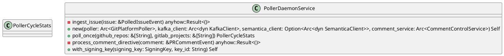
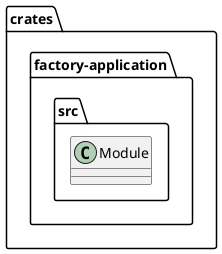
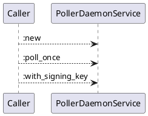
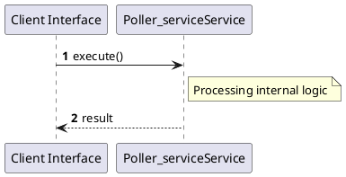

# File: poller_service.rs

**Source Path:** `crates/factory-application/src/poller_service.rs`

## Overview

### Purpose
Provides implementation for poller_service.rs.

### Responsibilities
* Handles logic related to poller_service.

### Dependencies
* chrono::Utc, crate::workflows::comment_control::{CommentControlInput, CommentControlService}, ed25519_dalek::SigningKey, factory_core::security::nhi::{AgentSubject, VerifiableCredential}, factory_core::{PRCommentEvent, PolledIssueEvent}, factory_infrastructure::aethalgard::MockAethalgardClient, factory_infrastructure::cursor_store::InMemoryCursorStore, factory_infrastructure::git_poller::GitPlatformPoller, factory_infrastructure::github::{
        GithubComment, GithubIssue, GithubPullRequest, GithubUser, MockGithubClient,
    }, factory_infrastructure::kafka::KafkaClient, factory_infrastructure::kafka::SimpleMockKafkaClient, factory_infrastructure::mcp_client::MockMcpClient, factory_infrastructure::r2r::MockR2rClient, factory_infrastructure::semantica::SemanticaClient, rand::rngs::OsRng, serde::{Deserialize, Serialize}, std::sync::Arc, super::*

### Imported modules
* None

### Exported classes
* PollerCycleStats, PollerDaemonService

### Exported interfaces
* None

### Exported functions
* None

## Public API

### Exported Classes / Structs / Interfaces

#### PollerCycleStats

**Overview:**
No description provided.

**Constructor:**

Default constructor.

**Attributes:**

* `directives_processed` (usize): Purpose - Stores directives_processed data. Constraints - Valid usize.
* `errors` (Vec<String>): Purpose - Stores errors data. Constraints - Valid Vec<String>.
* `issues_ingested` (usize): Purpose - Stores issues_ingested data. Constraints - Valid usize.

**Public Methods:**

None.

**Private Methods:**

None.

#### PollerDaemonService

**Overview:**
No description provided.

**Constructor:**

##### `new(poller (Arc<GitPlatformPoller>), kafka_client (Arc<dyn KafkaClient>), semantica_client (Option<Arc<dyn SemanticaClient>>), comment_service (Arc<CommentControlService>))`
Parameters: poller (Arc<GitPlatformPoller>), kafka_client (Arc<dyn KafkaClient>), semantica_client (Option<Arc<dyn SemanticaClient>>), comment_service (Arc<CommentControlService>)
Dependencies: Inherited from context
Initialization: Sets up PollerDaemonService

**Attributes:**

* `comment_service` (Arc<CommentControlService>): Purpose - Stores comment_service data. Constraints - Valid Arc<CommentControlService>.
* `kafka_client` (Arc<dyn KafkaClient>): Purpose - Stores kafka_client data. Constraints - Valid Arc<dyn KafkaClient>.
* `key_id` (String): Purpose - Stores key_id data. Constraints - Valid String.
* `poller` (Arc<GitPlatformPoller>): Purpose - Stores poller data. Constraints - Valid Arc<GitPlatformPoller>.
* `semantica_client` (Option<Arc<dyn SemanticaClient>>): Purpose - Stores semantica_client data. Constraints - Valid Option<Arc<dyn SemanticaClient>>.
* `signing_key` (SigningKey): Purpose - Stores signing_key data. Constraints - Valid SigningKey.

**Public Methods:**

##### `poll_once(github_repos (&[String]), gitlab_projects (&[String])) -> PollerCycleStats`

###### Description
/// Executes a single polling cycle across configured repositories.

###### Inputs
* `github_repos`: type=&[String], meaning=Input for github_repos, valid values=Any valid &[String], optional=No, default value=None
* `gitlab_projects`: type=&[String], meaning=Input for gitlab_projects, valid values=Any valid &[String], optional=No, default value=None

###### Output
Return type: PollerCycleStats
Semantic meaning: Result of poll_once
Possible null values: Conditional
Exceptions: None handled explicitly

###### Side Effects
Database updates: None
File operations: None
Network calls: None
Cache: None
State changes: Updates internal variables

###### Complexity
Time Complexity: O(1) mostly
Space Complexity: O(1) mostly

###### Example
```
let result = instance.poll_once();
```

##### `with_signing_key(signing_key (SigningKey), key_id (String)) -> Self`

###### Description
No description provided.

###### Inputs
* `signing_key`: type=SigningKey, meaning=Input for signing_key, valid values=Any valid SigningKey, optional=No, default value=None
* `key_id`: type=String, meaning=Input for key_id, valid values=Any valid String, optional=No, default value=None

###### Output
Return type: Self
Semantic meaning: Result of with_signing_key
Possible null values: Conditional
Exceptions: None handled explicitly

###### Side Effects
Database updates: None
File operations: None
Network calls: None
Cache: None
State changes: Updates internal variables

###### Complexity
Time Complexity: O(1) mostly
Space Complexity: O(1) mostly

###### Example
```
let result = instance.with_signing_key();
```

**Private Methods:**

* `ingest_issue(issue (&PolledIssueEvent)) -> anyhow::Result<()>`: Internal helper logic.
* `process_comment_directive(comment (&PRCommentEvent)) -> anyhow::Result<()>`: Internal helper logic.

### Exported Functions

None.

## Internal architecture



## Package Diagram



## Component Diagram

```plantuml
@startuml
component "poller_service" as Main
component "chrono::Utc" as chrono__Utc
Main --> chrono__Utc : uses
component "crate::workflows::comment_control::{CommentControlInput, CommentControlService}" as crate__workflows__comment_control___CommentControlInput__CommentControlService_
Main --> crate__workflows__comment_control___CommentControlInput__CommentControlService_ : uses
component "ed25519_dalek::SigningKey" as ed25519_dalek__SigningKey
Main --> ed25519_dalek__SigningKey : uses
component "factory_core::security::nhi::{AgentSubject, VerifiableCredential}" as factory_core__security__nhi___AgentSubject__VerifiableCredential_
Main --> factory_core__security__nhi___AgentSubject__VerifiableCredential_ : uses
component "factory_core::{PRCommentEvent, PolledIssueEvent}" as factory_core___PRCommentEvent__PolledIssueEvent_
Main --> factory_core___PRCommentEvent__PolledIssueEvent_ : uses
component "factory_infrastructure::aethalgard::MockAethalgardClient" as factory_infrastructure__aethalgard__MockAethalgardClient
Main --> factory_infrastructure__aethalgard__MockAethalgardClient : uses
component "factory_infrastructure::cursor_store::InMemoryCursorStore" as factory_infrastructure__cursor_store__InMemoryCursorStore
Main --> factory_infrastructure__cursor_store__InMemoryCursorStore : uses
component "factory_infrastructure::git_poller::GitPlatformPoller" as factory_infrastructure__git_poller__GitPlatformPoller
Main --> factory_infrastructure__git_poller__GitPlatformPoller : uses
component "factory_infrastructure::github::{
        GithubComment, GithubIssue, GithubPullRequest, GithubUser, MockGithubClient,
    }" as factory_infrastructure__github____________GithubComment__GithubIssue__GithubPullRequest__GithubUser__MockGithubClient_______
Main --> factory_infrastructure__github____________GithubComment__GithubIssue__GithubPullRequest__GithubUser__MockGithubClient_______ : uses
component "factory_infrastructure::kafka::KafkaClient" as factory_infrastructure__kafka__KafkaClient
Main --> factory_infrastructure__kafka__KafkaClient : uses
component "factory_infrastructure::kafka::SimpleMockKafkaClient" as factory_infrastructure__kafka__SimpleMockKafkaClient
Main --> factory_infrastructure__kafka__SimpleMockKafkaClient : uses
component "factory_infrastructure::mcp_client::MockMcpClient" as factory_infrastructure__mcp_client__MockMcpClient
Main --> factory_infrastructure__mcp_client__MockMcpClient : uses
component "factory_infrastructure::r2r::MockR2rClient" as factory_infrastructure__r2r__MockR2rClient
Main --> factory_infrastructure__r2r__MockR2rClient : uses
component "factory_infrastructure::semantica::SemanticaClient" as factory_infrastructure__semantica__SemanticaClient
Main --> factory_infrastructure__semantica__SemanticaClient : uses
component "rand::rngs::OsRng" as rand__rngs__OsRng
Main --> rand__rngs__OsRng : uses
component "serde::{Deserialize, Serialize}" as serde___Deserialize__Serialize_
Main --> serde___Deserialize__Serialize_ : uses
component "std::sync::Arc" as std__sync__Arc
Main --> std__sync__Arc : uses
component "super::*" as super___
Main --> super___ : uses
@enduml

```

## Dependency Graph

```plantuml
@startuml
[poller_service]
[poller_service] --> [chrono::Utc]
[poller_service] --> [crate::workflows::comment_control::{CommentControlInput, CommentControlService}]
[poller_service] --> [ed25519_dalek::SigningKey]
[poller_service] --> [factory_core::security::nhi::{AgentSubject, VerifiableCredential}]
[poller_service] --> [factory_core::{PRCommentEvent, PolledIssueEvent}]
[poller_service] --> [factory_infrastructure::aethalgard::MockAethalgardClient]
[poller_service] --> [factory_infrastructure::cursor_store::InMemoryCursorStore]
[poller_service] --> [factory_infrastructure::git_poller::GitPlatformPoller]
[poller_service] --> [factory_infrastructure::github::{
        GithubComment, GithubIssue, GithubPullRequest, GithubUser, MockGithubClient,
    }]
[poller_service] --> [factory_infrastructure::kafka::KafkaClient]
[poller_service] --> [factory_infrastructure::kafka::SimpleMockKafkaClient]
[poller_service] --> [factory_infrastructure::mcp_client::MockMcpClient]
[poller_service] --> [factory_infrastructure::r2r::MockR2rClient]
[poller_service] --> [factory_infrastructure::semantica::SemanticaClient]
[poller_service] --> [rand::rngs::OsRng]
[poller_service] --> [serde::{Deserialize, Serialize}]
[poller_service] --> [std::sync::Arc]
[poller_service] --> [super::*]
@enduml

```

## Call Graph



## Execution flow & Sequence explanation



## Examples

```
// Example usage of poller_service.rs components
import { ... } from 'crates/factory-application/src/poller_service.rs';
```

## Cross References
* **Parent module:** `crates/factory-application/src`
* **Dependencies:** chrono::Utc, crate::workflows::comment_control::{CommentControlInput, CommentControlService}, ed25519_dalek::SigningKey, factory_core::security::nhi::{AgentSubject, VerifiableCredential}, factory_core::{PRCommentEvent, PolledIssueEvent}, factory_infrastructure::aethalgard::MockAethalgardClient, factory_infrastructure::cursor_store::InMemoryCursorStore, factory_infrastructure::git_poller::GitPlatformPoller, factory_infrastructure::github::{
        GithubComment, GithubIssue, GithubPullRequest, GithubUser, MockGithubClient,
    }, factory_infrastructure::kafka::KafkaClient, factory_infrastructure::kafka::SimpleMockKafkaClient, factory_infrastructure::mcp_client::MockMcpClient, factory_infrastructure::r2r::MockR2rClient, factory_infrastructure::semantica::SemanticaClient, rand::rngs::OsRng, serde::{Deserialize, Serialize}, std::sync::Arc, super::*
