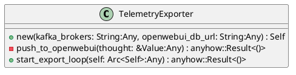
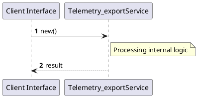

# File: telemetry_export.rs

**Source Path:** `crates/factory-application/src/telemetry_export.rs`

## Overview

### Purpose
Provides implementation for telemetry_export.rs.

### Responsibilities
* Handles logic related to telemetry_export.

### Dependencies
* rdkafka::Message, rdkafka::consumer::{Consumer, StreamConsumer}, reqwest::Client, serde_json::Value, std::sync::Arc

### Imported modules
* None

### Exported classes
* TelemetryExporter

### Exported interfaces
* None

### Exported functions
* None

## Public API

### Exported Classes / Structs / Interfaces

#### TelemetryExporter

**Overview:**
No description provided.

**Constructor:**

##### `new(kafka_brokers: String (Any), openwebui_db_url: String (Any))`
Parameters: kafka_brokers: String (Any), openwebui_db_url: String (Any)
Dependencies: Inherited from context
Initialization: Sets up TelemetryExporter

**Attributes:**

* `http_client` (Client): Purpose - Stores http_client data. Constraints - Valid Client.
* `kafka_brokers` (String): Purpose - Stores kafka_brokers data. Constraints - Valid String.
* `openwebui_db_url` (String): Purpose - Stores openwebui_db_url data. Constraints - Valid String.

**Public Methods:**

##### `start_export_loop(self: Arc<Self> (Any)) -> anyhow::Result<()>`

###### Description
/// Starts a background task consuming `agent-thought` from Kafka and exporting to OpenWebUI.

###### Inputs
* `self: Arc<Self>`: type=Any, meaning=Input for self: Arc<Self>, valid values=Any valid Any, optional=No, default value=None

###### Output
Return type: anyhow::Result<()>
Semantic meaning: Result of start_export_loop
Possible null values: Conditional
Exceptions: None handled explicitly

###### Side Effects
Database updates: None
File operations: None
Network calls: None
Cache: None
State changes: Updates internal variables

###### Complexity
Time Complexity: O(1) mostly
Space Complexity: O(1) mostly

###### Example
```
let result = instance.start_export_loop();
```

**Private Methods:**

* `push_to_openwebui(thought: &Value (Any)) -> anyhow::Result<()>`: Internal helper logic.

### Exported Functions

None.

## Internal architecture



## Execution flow & Sequence explanation




## Examples

```
// Example usage of telemetry_export.rs components
import { ... } from 'crates/factory-application/src/telemetry_export.rs';
```


## Cross References
* **Parent module:** `crates/factory-application/src`
* **Dependencies:** rdkafka::Message, rdkafka::consumer::{Consumer, StreamConsumer}, reqwest::Client, serde_json::Value, std::sync::Arc
