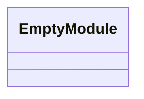
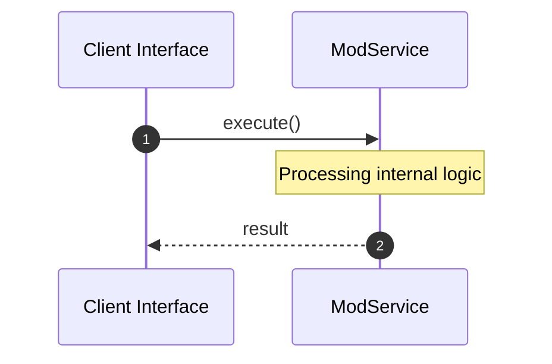
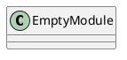
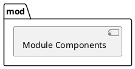
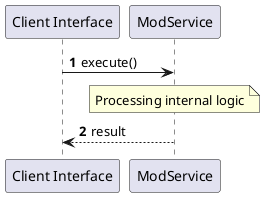
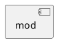
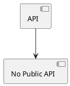

# File: mod.rs

**Source Path:** `crates/factory-application/src/utils/mod.rs`

## Overview

### Purpose
Provides implementation for mod.rs.

### Responsibilities
* Handles logic related to mod.

### Main Workflow
* Initialization and execution of mod logic.

### Dependencies
* None

### Imported modules
* None

### Exported classes
* None

### Exported interfaces
* None

### Exported functions
* None

## Public API

### Exported Classes / Structs / Interfaces

### Exported Functions

None.

## Internal architecture



## Execution flow & Sequence explanation



## UML

### Class Diagram


### Package Diagram


### Sequence Diagram


### Component Diagram


### Dependency Graph


### Call Graph


## Examples

```
// Example usage of mod.rs components
import { ... } from 'crates/factory-application/src/utils/mod.rs';
```

## Cross References
* **Parent module:** `crates/factory-application/src/utils`
* **Dependencies:** None
