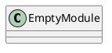
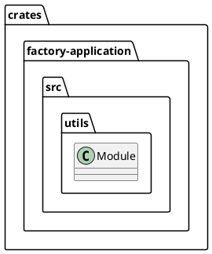
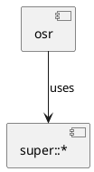
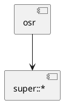
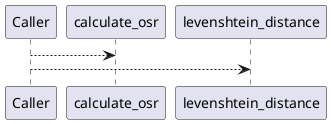
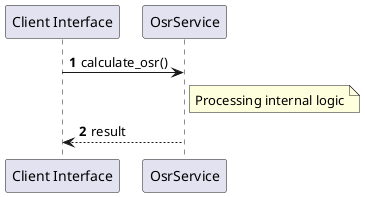

# File: osr.rs

**Source Path:** `crates/factory-application/src/utils/osr.rs`

## Overview

### Purpose
Provides implementation for osr.rs.

### Responsibilities
* Handles logic related to osr.

### Dependencies
* super::*

### Imported modules
* None

### Exported classes
* None

### Exported interfaces
* None

### Exported functions
* calculate_osr, levenshtein_distance

## Public API

### Exported Classes / Structs / Interfaces

### Exported Functions

#### `calculate_osr(wiki_content (&str), r2r_text (&str)) -> f32`
No description provided.

#### `levenshtein_distance(a (&str), b (&str)) -> usize`
No description provided.

## Internal architecture



## Package Diagram



## Component Diagram



## Dependency Graph



## Call Graph



## Execution flow & Sequence explanation



## Examples

```
// Example usage of osr.rs components
import { ... } from 'crates/factory-application/src/utils/osr.rs';
```

## Cross References
* **Parent module:** `crates/factory-application/src/utils`
* **Dependencies:** super::*
