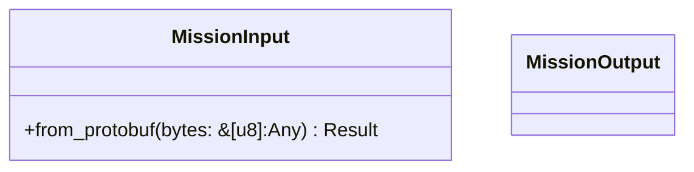
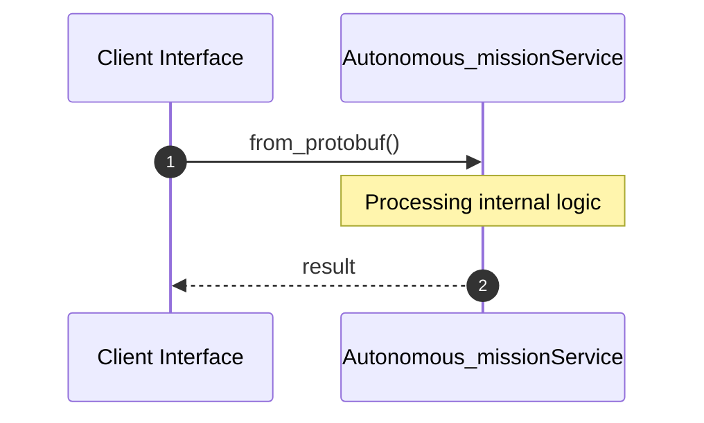
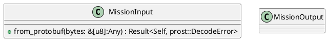
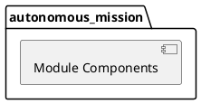
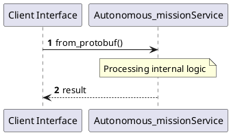
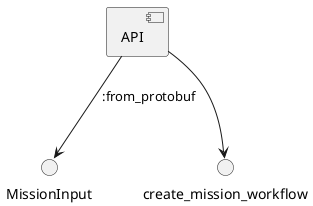

# File: autonomous_mission.rs

**Source Path:** `crates/factory-application/src/workflows/autonomous_mission.rs`

## Overview

### Purpose
Provides implementation for autonomous_mission.rs.

### Responsibilities
* Handles logic related to autonomous_mission.

### Main Workflow
* Initialization and execution of autonomous_mission logic.

### Dependencies
* crate::agents::{AuditorAgent, FinOpsAgent, RustantAgent, ZeroClawAgent}, factory_core::proto::v1::MissionInput as ProtoInput, factory_infrastructure::{
    HttpR2rClient, KafkaClient, McpClient, McpHttpClient, R2rClient,
    aethalgard::{AethalgardClient, HttpAethalgardClient},
}, hatchet_sdk::Hatchet, hatchet_sdk::runnables::Workflow, prost::Message, serde::{Deserialize, Serialize}, std::sync::Arc, super::*, uuid::Uuid

### Imported modules
* None

### Exported classes
* MissionInput, MissionOutput

### Exported interfaces
* None

### Exported functions
* create_mission_workflow

## Public API

### Exported Classes / Structs / Interfaces

#### MissionInput

**Overview:**
Why it exists:
Provides capabilities related to MissionInput.

What business capability it provides:
Supports core domain concepts.

How it collaborates with other classes:
Works with related entities to process logic.

**Constructor:**

Default constructor.

**Attributes:**

* `goal` (String): Purpose - Stores goal data. Constraints - Valid String.
* `mission_id` (Option<String>): Purpose - Stores mission_id data. Constraints - Valid Option<String>.
* `repository_path` (String): Purpose - Stores repository_path data. Constraints - Valid String.

**Public Methods:**

##### `from_protobuf(bytes: &[u8] (Any)) -> Result<Self, prost::DecodeError>`

###### Description
Executes from_protobuf.

###### Inputs
* `bytes: &[u8]`: type=Any, meaning=Input for bytes: &[u8], valid values=Any valid Any, optional=No, default value=None

###### Output
Return type: Result<Self, prost::DecodeError>
Semantic meaning: Result of from_protobuf
Possible null values: Conditional
Exceptions: None handled explicitly

###### Side Effects
Database updates: None
File operations: None
Network calls: None
Cache: None
State changes: Updates internal variables

###### Complexity
Time Complexity: O(1) mostly
Space Complexity: O(1) mostly

###### Example
```
let result = instance.from_protobuf();
```

**Private Methods:**

None.

#### MissionOutput

**Overview:**
Why it exists:
Provides capabilities related to MissionOutput.

What business capability it provides:
Supports core domain concepts.

How it collaborates with other classes:
Works with related entities to process logic.

**Constructor:**

Default constructor.

**Attributes:**

* `mission_id` (String): Purpose - Stores mission_id data. Constraints - Valid String.
* `pr_url` (Option<String>): Purpose - Stores pr_url data. Constraints - Valid Option<String>.
* `status` (String): Purpose - Stores status data. Constraints - Valid String.
* `summary` (String): Purpose - Stores summary data. Constraints - Valid String.

**Public Methods:**

None.

**Private Methods:**

None.

### Exported Functions

#### `create_mission_workflow(hatchet: &Hatchet (Any), mcp_url: String (Any), r2r_url: String (Any), kafka_brokers: String (Any), aethalgard_webhook_url: String (Any)) -> Workflow<MissionInput, MissionOutput>`
Executes create_mission_workflow.

## Internal architecture



## Execution flow & Sequence explanation



## UML

### Class Diagram


### Package Diagram


### Sequence Diagram


### Component Diagram
```plantuml
@startuml
component "autonomous_mission" as comp
component "crate::agents::{AuditorAgent, FinOpsAgent, RustantAgent, ZeroClawAgent}" as crate::agents::{AuditorAgent, FinOpsAgent, RustantAgent, ZeroClawAgent}
comp --> crate::agents::{AuditorAgent, FinOpsAgent, RustantAgent, ZeroClawAgent}
component "factory_core::proto::v1::MissionInput as ProtoInput" as factory_core::proto::v1::MissionInput as ProtoInput
comp --> factory_core::proto::v1::MissionInput as ProtoInput
component "factory_infrastructure::{
    HttpR2rClient, KafkaClient, McpClient, McpHttpClient, R2rClient,
    aethalgard::{AethalgardClient, HttpAethalgardClient},
}" as factory_infrastructure::{
    HttpR2rClient, KafkaClient, McpClient, McpHttpClient, R2rClient,
    aethalgard::{AethalgardClient, HttpAethalgardClient},
}
comp --> factory_infrastructure::{
    HttpR2rClient, KafkaClient, McpClient, McpHttpClient, R2rClient,
    aethalgard::{AethalgardClient, HttpAethalgardClient},
}
component "hatchet_sdk::Hatchet" as hatchet_sdk::Hatchet
comp --> hatchet_sdk::Hatchet
component "hatchet_sdk::runnables::Workflow" as hatchet_sdk::runnables::Workflow
comp --> hatchet_sdk::runnables::Workflow
component "prost::Message" as prost::Message
comp --> prost::Message
component "serde::{Deserialize, Serialize}" as serde::{Deserialize, Serialize}
comp --> serde::{Deserialize, Serialize}
component "std::sync::Arc" as std::sync::Arc
comp --> std::sync::Arc
component "super::*" as super::*
comp --> super::*
component "uuid::Uuid" as uuid::Uuid
comp --> uuid::Uuid
@enduml

```

### Dependency Graph
```plantuml
@startuml
[autonomous_mission]
[autonomous_mission] --> [crate::agents::{AuditorAgent, FinOpsAgent, RustantAgent, ZeroClawAgent}]
[autonomous_mission] --> [factory_core::proto::v1::MissionInput as ProtoInput]
[autonomous_mission] --> [factory_infrastructure::{
    HttpR2rClient, KafkaClient, McpClient, McpHttpClient, R2rClient,
    aethalgard::{AethalgardClient, HttpAethalgardClient},
}]
[autonomous_mission] --> [hatchet_sdk::Hatchet]
[autonomous_mission] --> [hatchet_sdk::runnables::Workflow]
[autonomous_mission] --> [prost::Message]
[autonomous_mission] --> [serde::{Deserialize, Serialize}]
[autonomous_mission] --> [std::sync::Arc]
[autonomous_mission] --> [super::*]
[autonomous_mission] --> [uuid::Uuid]
@enduml

```

### Call Graph


## Examples

```
// Example usage of autonomous_mission.rs components
import { ... } from 'crates/factory-application/src/workflows/autonomous_mission.rs';
```

## Cross References
* **Parent module:** `crates/factory-application/src/workflows`
* **Dependencies:** crate::agents::{AuditorAgent, FinOpsAgent, RustantAgent, ZeroClawAgent}, factory_core::proto::v1::MissionInput as ProtoInput, factory_infrastructure::{
    HttpR2rClient, KafkaClient, McpClient, McpHttpClient, R2rClient,
    aethalgard::{AethalgardClient, HttpAethalgardClient},
}, hatchet_sdk::Hatchet, hatchet_sdk::runnables::Workflow, prost::Message, serde::{Deserialize, Serialize}, std::sync::Arc, super::*, uuid::Uuid
