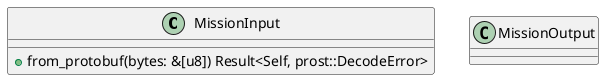
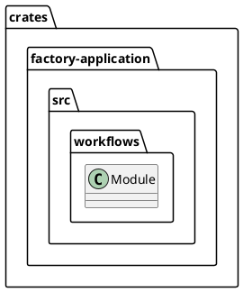
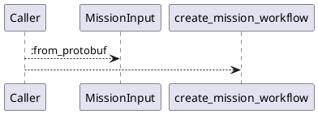
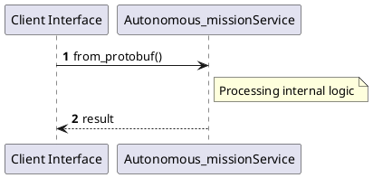

# File: autonomous_mission.rs

**Source Path:** `crates/factory-application/src/workflows/autonomous_mission.rs`

## Overview

### Purpose
Provides implementation for autonomous_mission.rs.

### Responsibilities
* Handles logic related to autonomous_mission.

### Dependencies
* crate::agents::{AuditorAgent, FinOpsAgent, RustantAgent, ZeroClawAgent}, factory_core::proto::v1::MissionInput as ProtoInput, factory_infrastructure::{
    HttpR2rClient, KafkaClient, McpClient, McpHttpClient, R2rClient,
    aethalgard::{AethalgardClient, HttpAethalgardClient},
}, hatchet_sdk::Hatchet, hatchet_sdk::runnables::Workflow, prost::Message, serde::{Deserialize, Serialize}, std::hash::{Hash, Hasher}, std::sync::Arc, super::*, uuid::Uuid

### Imported modules
* None

### Exported classes
* MissionInput, MissionOutput

### Exported interfaces
* None

### Exported functions
* create_mission_workflow

## Public API

### Exported Classes / Structs / Interfaces

#### MissionInput

**Overview:**
No description provided.

**Constructor:**

Default constructor.

**Attributes:**

* `goal` (String): Purpose - Stores goal data. Constraints - Valid String.
* `mission_id` (Option<String>): Purpose - Stores mission_id data. Constraints - Valid Option<String>.
* `repository_path` (String): Purpose - Stores repository_path data. Constraints - Valid String.

**Public Methods:**

##### `from_protobuf(bytes (&[u8])) -> Result<Self, prost::DecodeError>`

###### Description
No description provided.

###### Inputs
* `bytes`: type=&[u8], meaning=Input for bytes, valid values=Any valid &[u8], optional=No, default value=None

###### Output
Return type: Result<Self, prost::DecodeError>
Semantic meaning: Result of from_protobuf
Possible null values: Conditional
Exceptions: None handled explicitly

###### Side Effects
Database updates: None
File operations: None
Network calls: None
Cache: None
State changes: Updates internal variables

###### Complexity
Time Complexity: O(1) mostly
Space Complexity: O(1) mostly

###### Example
```
let result = instance.from_protobuf();
```

**Private Methods:**

None.

#### MissionOutput

**Overview:**
No description provided.

**Constructor:**

Default constructor.

**Attributes:**

* `mission_id` (String): Purpose - Stores mission_id data. Constraints - Valid String.
* `pr_url` (Option<String>): Purpose - Stores pr_url data. Constraints - Valid Option<String>.
* `status` (String): Purpose - Stores status data. Constraints - Valid String.
* `summary` (String): Purpose - Stores summary data. Constraints - Valid String.

**Public Methods:**

None.

**Private Methods:**

None.

### Exported Functions

#### `create_mission_workflow(hatchet (&Hatchet), mcp_url (String), r2r_url (String), kafka_brokers (String), aethalgard_webhook_url (String)) -> Workflow<MissionInput, MissionOutput>`
No description provided.

## Internal architecture



## Package Diagram



## Component Diagram

```plantuml
@startuml
component "autonomous_mission" as Main
component "crate::agents::{AuditorAgent, FinOpsAgent, RustantAgent, ZeroClawAgent}" as crate__agents___AuditorAgent__FinOpsAgent__RustantAgent__ZeroClawAgent_
Main --> crate__agents___AuditorAgent__FinOpsAgent__RustantAgent__ZeroClawAgent_ : uses
component "factory_core::proto::v1::MissionInput as ProtoInput" as factory_core__proto__v1__MissionInput_as_ProtoInput
Main --> factory_core__proto__v1__MissionInput_as_ProtoInput : uses
component "factory_infrastructure::{
    HttpR2rClient, KafkaClient, McpClient, McpHttpClient, R2rClient,
    aethalgard::{AethalgardClient, HttpAethalgardClient},
}" as factory_infrastructure________HttpR2rClient__KafkaClient__McpClient__McpHttpClient__R2rClient______aethalgard___AethalgardClient__HttpAethalgardClient____
Main --> factory_infrastructure________HttpR2rClient__KafkaClient__McpClient__McpHttpClient__R2rClient______aethalgard___AethalgardClient__HttpAethalgardClient____ : uses
component "hatchet_sdk::Hatchet" as hatchet_sdk__Hatchet
Main --> hatchet_sdk__Hatchet : uses
component "hatchet_sdk::runnables::Workflow" as hatchet_sdk__runnables__Workflow
Main --> hatchet_sdk__runnables__Workflow : uses
component "prost::Message" as prost__Message
Main --> prost__Message : uses
component "serde::{Deserialize, Serialize}" as serde___Deserialize__Serialize_
Main --> serde___Deserialize__Serialize_ : uses
component "std::hash::{Hash, Hasher}" as std__hash___Hash__Hasher_
Main --> std__hash___Hash__Hasher_ : uses
component "std::sync::Arc" as std__sync__Arc
Main --> std__sync__Arc : uses
component "super::*" as super___
Main --> super___ : uses
component "uuid::Uuid" as uuid__Uuid
Main --> uuid__Uuid : uses
@enduml

```

## Dependency Graph

```plantuml
@startuml
[autonomous_mission]
[autonomous_mission] --> [crate::agents::{AuditorAgent, FinOpsAgent, RustantAgent, ZeroClawAgent}]
[autonomous_mission] --> [factory_core::proto::v1::MissionInput as ProtoInput]
[autonomous_mission] --> [factory_infrastructure::{
    HttpR2rClient, KafkaClient, McpClient, McpHttpClient, R2rClient,
    aethalgard::{AethalgardClient, HttpAethalgardClient},
}]
[autonomous_mission] --> [hatchet_sdk::Hatchet]
[autonomous_mission] --> [hatchet_sdk::runnables::Workflow]
[autonomous_mission] --> [prost::Message]
[autonomous_mission] --> [serde::{Deserialize, Serialize}]
[autonomous_mission] --> [std::hash::{Hash, Hasher}]
[autonomous_mission] --> [std::sync::Arc]
[autonomous_mission] --> [super::*]
[autonomous_mission] --> [uuid::Uuid]
@enduml

```

## Call Graph



## Execution flow & Sequence explanation



## Examples

```
// Example usage of autonomous_mission.rs components
import { ... } from 'crates/factory-application/src/workflows/autonomous_mission.rs';
```

## Cross References
* **Parent module:** `crates/factory-application/src/workflows`
* **Dependencies:** crate::agents::{AuditorAgent, FinOpsAgent, RustantAgent, ZeroClawAgent}, factory_core::proto::v1::MissionInput as ProtoInput, factory_infrastructure::{
    HttpR2rClient, KafkaClient, McpClient, McpHttpClient, R2rClient,
    aethalgard::{AethalgardClient, HttpAethalgardClient},
}, hatchet_sdk::Hatchet, hatchet_sdk::runnables::Workflow, prost::Message, serde::{Deserialize, Serialize}, std::hash::{Hash, Hasher}, std::sync::Arc, super::*, uuid::Uuid
