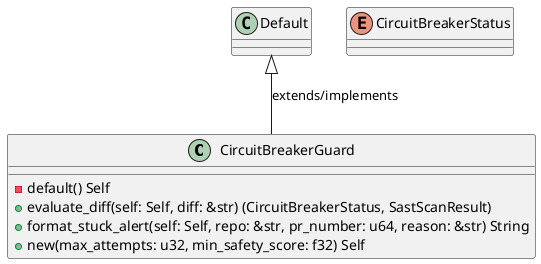
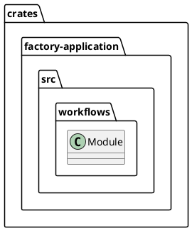
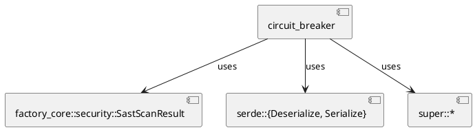
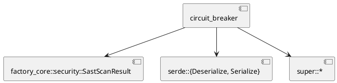
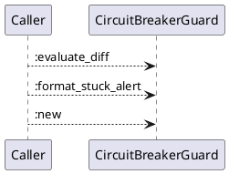
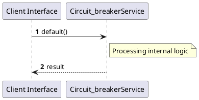

# File: circuit_breaker.rs

**Source Path:** `crates/factory-application/src/workflows/circuit_breaker.rs`

## Overview

### Purpose
Provides implementation for circuit_breaker.rs.

### Responsibilities
* Handles logic related to circuit_breaker.

### Dependencies
* factory_core::security::SastScanResult, serde::{Deserialize, Serialize}, super::*

### Imported modules
* None

### Exported classes
* CircuitBreakerGuard

### Exported interfaces
* None

### Exported functions
* None

## Public API

### Exported Classes / Structs / Interfaces

#### CircuitBreakerGuard

**Overview:**
No description provided.

**Constructor:**

##### `new(max_attempts (u32), min_safety_score (f32))`
Parameters: max_attempts (u32), min_safety_score (f32)
Dependencies: Inherited from context
Initialization: Sets up CircuitBreakerGuard

**Attributes:**

* `current_attempt` (u32): Purpose - Stores current_attempt data. Constraints - Valid u32.
* `max_attempts` (u32): Purpose - Stores max_attempts data. Constraints - Valid u32.
* `min_safety_score` (f32): Purpose - Stores min_safety_score data. Constraints - Valid f32.

**Public Methods:**

##### `evaluate_diff(self (Self), diff (&str)) -> (CircuitBreakerStatus, SastScanResult)`

###### Description
/// Evaluates the code diff against the security threshold and tracks attempts.

###### Inputs
* `self`: type=Self, meaning=Input for self, valid values=Any valid Self, optional=No, default value=None
* `diff`: type=&str, meaning=Input for diff, valid values=Any valid &str, optional=No, default value=None

###### Output
Return type: (CircuitBreakerStatus, SastScanResult)
Semantic meaning: Result of evaluate_diff
Possible null values: Conditional
Exceptions: None handled explicitly

###### Side Effects
Database updates: None
File operations: None
Network calls: None
Cache: None
State changes: Updates internal variables

###### Complexity
Time Complexity: O(1) mostly
Space Complexity: O(1) mostly

###### Example
```
let result = instance.evaluate_diff();
```

##### `format_stuck_alert(self (Self), repo (&str), pr_number (u64), reason (&str)) -> String`

###### Description
/// Generates human architect escalation message when stuck.

###### Inputs
* `self`: type=Self, meaning=Input for self, valid values=Any valid Self, optional=No, default value=None
* `repo`: type=&str, meaning=Input for repo, valid values=Any valid &str, optional=No, default value=None
* `pr_number`: type=u64, meaning=Input for pr_number, valid values=Any valid u64, optional=No, default value=None
* `reason`: type=&str, meaning=Input for reason, valid values=Any valid &str, optional=No, default value=None

###### Output
Return type: String
Semantic meaning: Result of format_stuck_alert
Possible null values: Conditional
Exceptions: None handled explicitly

###### Side Effects
Database updates: None
File operations: None
Network calls: None
Cache: None
State changes: Updates internal variables

###### Complexity
Time Complexity: O(1) mostly
Space Complexity: O(1) mostly

###### Example
```
let result = instance.format_stuck_alert();
```

**Private Methods:**

* `default() -> Self`: Internal helper logic.

#### CircuitBreakerStatus

**Overview:**
No description provided.

**Constructor:**

Default constructor.

**Attributes:**

None.

**Public Methods:**

None.

**Private Methods:**

None.

### Exported Functions

None.

## Internal architecture



## Package Diagram



## Component Diagram



## Dependency Graph



## Call Graph



## Execution flow & Sequence explanation



## Examples

```
// Example usage of circuit_breaker.rs components
import { ... } from 'crates/factory-application/src/workflows/circuit_breaker.rs';
```

## Cross References
* **Parent module:** `crates/factory-application/src/workflows`
* **Dependencies:** factory_core::security::SastScanResult, serde::{Deserialize, Serialize}, super::*
