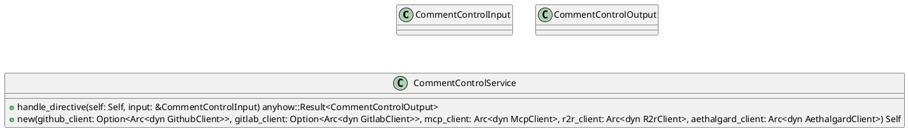
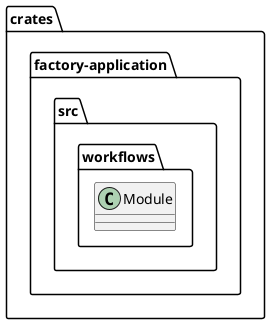
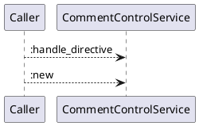
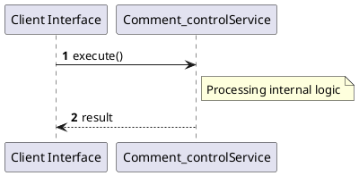

# File: comment_control.rs

**Source Path:** `crates/factory-application/src/workflows/comment_control.rs`

## Overview

### Purpose
Provides implementation for comment_control.rs.

### Responsibilities
* Handles logic related to comment_control.

### Dependencies
* chrono::Utc, crate::agents::{RustantAgent, ZeroClawAgent}, factory_core::{PRCommentEvent, PRDirective}, factory_infrastructure::McpClient, factory_infrastructure::aethalgard::AethalgardClient, factory_infrastructure::aethalgard::MockAethalgardClient, factory_infrastructure::github::GithubClient, factory_infrastructure::github::{GithubComment, GithubUser, MockGithubClient}, factory_infrastructure::gitlab::GitlabClient, factory_infrastructure::mcp_client::MockMcpClient, factory_infrastructure::r2r::MockR2rClient, factory_infrastructure::r2r::R2rClient, serde::{Deserialize, Serialize}, std::sync::Arc, super::*

### Imported modules
* None

### Exported classes
* CommentControlInput, CommentControlOutput, CommentControlService

### Exported interfaces
* None

### Exported functions
* None

## Public API

### Exported Classes / Structs / Interfaces

#### CommentControlInput

**Overview:**
No description provided.

**Constructor:**

Default constructor.

**Attributes:**

* `event` (PRCommentEvent): Purpose - Stores event data. Constraints - Valid PRCommentEvent.

**Public Methods:**

None.

**Private Methods:**

None.

#### CommentControlOutput

**Overview:**
No description provided.

**Constructor:**

Default constructor.

**Attributes:**

* `comment_posted` (bool): Purpose - Stores comment_posted data. Constraints - Valid bool.
* `directive_type` (String): Purpose - Stores directive_type data. Constraints - Valid String.
* `response_body` (String): Purpose - Stores response_body data. Constraints - Valid String.
* `status` (String): Purpose - Stores status data. Constraints - Valid String.

**Public Methods:**

None.

**Private Methods:**

None.

#### CommentControlService

**Overview:**
No description provided.

**Constructor:**

##### `new(github_client (Option<Arc<dyn GithubClient>>), gitlab_client (Option<Arc<dyn GitlabClient>>), mcp_client (Arc<dyn McpClient>), r2r_client (Arc<dyn R2rClient>), aethalgard_client (Arc<dyn AethalgardClient>))`
Parameters: github_client (Option<Arc<dyn GithubClient>>), gitlab_client (Option<Arc<dyn GitlabClient>>), mcp_client (Arc<dyn McpClient>), r2r_client (Arc<dyn R2rClient>), aethalgard_client (Arc<dyn AethalgardClient>)
Dependencies: Inherited from context
Initialization: Sets up CommentControlService

**Attributes:**

* `_mcp_client` (Arc<dyn McpClient>): Purpose - Stores _mcp_client data. Constraints - Valid Arc<dyn McpClient>.
* `github_client` (Option<Arc<dyn GithubClient>>): Purpose - Stores github_client data. Constraints - Valid Option<Arc<dyn GithubClient>>.
* `gitlab_client` (Option<Arc<dyn GitlabClient>>): Purpose - Stores gitlab_client data. Constraints - Valid Option<Arc<dyn GitlabClient>>.
* `rustant_agent` (Arc<RustantAgent>): Purpose - Stores rustant_agent data. Constraints - Valid Arc<RustantAgent>.
* `zeroclaw_agent` (Arc<ZeroClawAgent>): Purpose - Stores zeroclaw_agent data. Constraints - Valid Arc<ZeroClawAgent>.

**Public Methods:**

##### `handle_directive(self (Self), input (&CommentControlInput)) -> anyhow::Result<CommentControlOutput>`

###### Description
No description provided.

###### Inputs
* `self`: type=Self, meaning=Input for self, valid values=Any valid Self, optional=No, default value=None
* `input`: type=&CommentControlInput, meaning=Input for input, valid values=Any valid &CommentControlInput, optional=No, default value=None

###### Output
Return type: anyhow::Result<CommentControlOutput>
Semantic meaning: Result of handle_directive
Possible null values: Conditional
Exceptions: None handled explicitly

###### Side Effects
Database updates: None
File operations: None
Network calls: None
Cache: None
State changes: Updates internal variables

###### Complexity
Time Complexity: O(1) mostly
Space Complexity: O(1) mostly

###### Example
```
let result = instance.handle_directive();
```

**Private Methods:**

None.

### Exported Functions

None.

## Internal architecture



## Package Diagram



## Component Diagram

```plantuml
@startuml
component "comment_control" as Main
component "chrono::Utc" as chrono__Utc
Main --> chrono__Utc : uses
component "crate::agents::{RustantAgent, ZeroClawAgent}" as crate__agents___RustantAgent__ZeroClawAgent_
Main --> crate__agents___RustantAgent__ZeroClawAgent_ : uses
component "factory_core::{PRCommentEvent, PRDirective}" as factory_core___PRCommentEvent__PRDirective_
Main --> factory_core___PRCommentEvent__PRDirective_ : uses
component "factory_infrastructure::McpClient" as factory_infrastructure__McpClient
Main --> factory_infrastructure__McpClient : uses
component "factory_infrastructure::aethalgard::AethalgardClient" as factory_infrastructure__aethalgard__AethalgardClient
Main --> factory_infrastructure__aethalgard__AethalgardClient : uses
component "factory_infrastructure::aethalgard::MockAethalgardClient" as factory_infrastructure__aethalgard__MockAethalgardClient
Main --> factory_infrastructure__aethalgard__MockAethalgardClient : uses
component "factory_infrastructure::github::GithubClient" as factory_infrastructure__github__GithubClient
Main --> factory_infrastructure__github__GithubClient : uses
component "factory_infrastructure::github::{GithubComment, GithubUser, MockGithubClient}" as factory_infrastructure__github___GithubComment__GithubUser__MockGithubClient_
Main --> factory_infrastructure__github___GithubComment__GithubUser__MockGithubClient_ : uses
component "factory_infrastructure::gitlab::GitlabClient" as factory_infrastructure__gitlab__GitlabClient
Main --> factory_infrastructure__gitlab__GitlabClient : uses
component "factory_infrastructure::mcp_client::MockMcpClient" as factory_infrastructure__mcp_client__MockMcpClient
Main --> factory_infrastructure__mcp_client__MockMcpClient : uses
component "factory_infrastructure::r2r::MockR2rClient" as factory_infrastructure__r2r__MockR2rClient
Main --> factory_infrastructure__r2r__MockR2rClient : uses
component "factory_infrastructure::r2r::R2rClient" as factory_infrastructure__r2r__R2rClient
Main --> factory_infrastructure__r2r__R2rClient : uses
component "serde::{Deserialize, Serialize}" as serde___Deserialize__Serialize_
Main --> serde___Deserialize__Serialize_ : uses
component "std::sync::Arc" as std__sync__Arc
Main --> std__sync__Arc : uses
component "super::*" as super___
Main --> super___ : uses
@enduml

```



## Dependency Graph

```plantuml
@startuml
[comment_control]
[comment_control] --> [chrono::Utc]
[comment_control] --> [crate::agents::{RustantAgent, ZeroClawAgent}]
[comment_control] --> [factory_core::{PRCommentEvent, PRDirective}]
[comment_control] --> [factory_infrastructure::McpClient]
[comment_control] --> [factory_infrastructure::aethalgard::AethalgardClient]
[comment_control] --> [factory_infrastructure::aethalgard::MockAethalgardClient]
[comment_control] --> [factory_infrastructure::github::GithubClient]
[comment_control] --> [factory_infrastructure::github::{GithubComment, GithubUser, MockGithubClient}]
[comment_control] --> [factory_infrastructure::gitlab::GitlabClient]
[comment_control] --> [factory_infrastructure::mcp_client::MockMcpClient]
[comment_control] --> [factory_infrastructure::r2r::MockR2rClient]
[comment_control] --> [factory_infrastructure::r2r::R2rClient]
[comment_control] --> [serde::{Deserialize, Serialize}]
[comment_control] --> [std::sync::Arc]
[comment_control] --> [super::*]
@enduml

```



## Call Graph



## Execution flow & Sequence explanation



## Examples

```
// Example usage of comment_control.rs components
import { ... } from 'crates/factory-application/src/workflows/comment_control.rs';
```

## Cross References
* **Parent module:** `crates/factory-application/src/workflows`
* **Dependencies:** chrono::Utc, crate::agents::{RustantAgent, ZeroClawAgent}, factory_core::{PRCommentEvent, PRDirective}, factory_infrastructure::McpClient, factory_infrastructure::aethalgard::AethalgardClient, factory_infrastructure::aethalgard::MockAethalgardClient, factory_infrastructure::github::GithubClient, factory_infrastructure::github::{GithubComment, GithubUser, MockGithubClient}, factory_infrastructure::gitlab::GitlabClient, factory_infrastructure::mcp_client::MockMcpClient, factory_infrastructure::r2r::MockR2rClient, factory_infrastructure::r2r::R2rClient, serde::{Deserialize, Serialize}, std::sync::Arc, super::*
