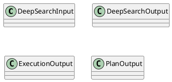
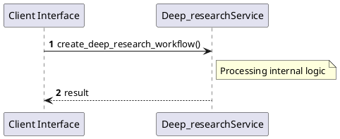

# File: deep_research.rs

**Source Path:** `crates/factory-application/src/workflows/deep_research.rs`

## Overview

### Purpose
Provides implementation for deep_research.rs.

### Responsibilities
* Handles logic related to deep_research.

### Dependencies
* async_openai::{
    Client,
    types::{
        ChatCompletionRequestSystemMessageArgs, ChatCompletionRequestUserMessageArgs,
        CreateChatCompletionRequestArgs,
    },
}, chrono::Utc, factory_infrastructure::{HttpR2rClient, R2rClient}, hatchet_sdk::Hatchet, hatchet_sdk::runnables::Workflow, reqwest::header::{HeaderMap, HeaderValue}, serde::{Deserialize, Serialize}, std::sync::Arc, zeroize::Zeroize

### Imported modules
* None

### Exported classes
* DeepSearchInput, DeepSearchOutput, ExecutionOutput, PlanOutput

### Exported interfaces
* None

### Exported functions
* create_deep_research_workflow

## Public API

### Exported Classes / Structs / Interfaces

#### DeepSearchInput

**Overview:**
No description provided.

**Constructor:**

Default constructor.

**Attributes:**

* `job_id` (String): Purpose - Stores job_id data. Constraints - Valid String.
* `query` (String): Purpose - Stores query data. Constraints - Valid String.

**Public Methods:**

None.

**Private Methods:**

None.

#### DeepSearchOutput

**Overview:**
No description provided.

**Constructor:**

Default constructor.

**Attributes:**

* `job_id` (String): Purpose - Stores job_id data. Constraints - Valid String.
* `status` (String): Purpose - Stores status data. Constraints - Valid String.

**Public Methods:**

None.

**Private Methods:**

None.

#### ExecutionOutput

**Overview:**
No description provided.

**Constructor:**

Default constructor.

**Attributes:**

* `job_id` (String): Purpose - Stores job_id data. Constraints - Valid String.
* `okf_content` (String): Purpose - Stores okf_content data. Constraints - Valid String.
* `query` (String): Purpose - Stores query data. Constraints - Valid String.

**Public Methods:**

None.

**Private Methods:**

None.

#### PlanOutput

**Overview:**
No description provided.

**Constructor:**

Default constructor.

**Attributes:**

* `job_id` (String): Purpose - Stores job_id data. Constraints - Valid String.
* `query` (String): Purpose - Stores query data. Constraints - Valid String.
* `sub_queries` (Vec<String>): Purpose - Stores sub_queries data. Constraints - Valid Vec<String>.

**Public Methods:**

None.

**Private Methods:**

None.

### Exported Functions

#### `create_deep_research_workflow(hatchet: &Hatchet (Any), r2r_url: String (Any)) -> Workflow<DeepSearchInput, DeepSearchOutput>`
No description provided.

## Internal architecture



## Execution flow & Sequence explanation



## Examples

```
// Example usage of deep_research.rs components
import { ... } from 'crates/factory-application/src/workflows/deep_research.rs';
```

## Cross References
* **Parent module:** `crates/factory-application/src/workflows`
* **Dependencies:** async_openai::{
    Client,
    types::{
        ChatCompletionRequestSystemMessageArgs, ChatCompletionRequestUserMessageArgs,
        CreateChatCompletionRequestArgs,
    },
}, chrono::Utc, factory_infrastructure::{HttpR2rClient, R2rClient}, hatchet_sdk::Hatchet, hatchet_sdk::runnables::Workflow, reqwest::header::{HeaderMap, HeaderValue}, serde::{Deserialize, Serialize}, std::sync::Arc, zeroize::Zeroize
