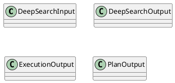
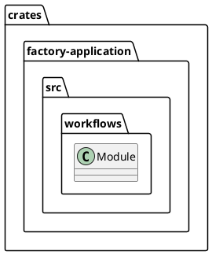
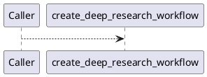
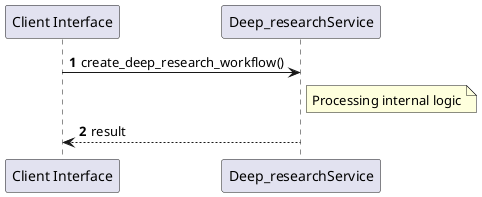

# File: deep_research.rs

**Source Path:** `crates/factory-application/src/workflows/deep_research.rs`

## Overview

### Purpose
Provides implementation for deep_research.rs.

### Responsibilities
* Handles logic related to deep_research.

### Dependencies
* async_openai::{
    Client,
    types::{
        ChatCompletionRequestSystemMessageArgs, ChatCompletionRequestUserMessageArgs,
        CreateChatCompletionRequestArgs,
    },
}, chrono::Utc, factory_infrastructure::{HttpR2rClient, R2rClient}, hatchet_sdk::Hatchet, hatchet_sdk::runnables::Workflow, reqwest::header::{HeaderMap, HeaderValue}, serde::{Deserialize, Serialize}, std::sync::Arc, zeroize::Zeroize

### Imported modules
* None

### Exported classes
* DeepSearchInput, DeepSearchOutput, ExecutionOutput, PlanOutput

### Exported interfaces
* None

### Exported functions
* create_deep_research_workflow

## Public API

### Exported Classes / Structs / Interfaces

#### DeepSearchInput

**Overview:**
No description provided.

**Constructor:**

Default constructor.

**Attributes:**

* `job_id` (String): Purpose - Stores job_id data. Constraints - Valid String.
* `query` (String): Purpose - Stores query data. Constraints - Valid String.

**Public Methods:**

None.

**Private Methods:**

None.

#### DeepSearchOutput

**Overview:**
No description provided.

**Constructor:**

Default constructor.

**Attributes:**

* `job_id` (String): Purpose - Stores job_id data. Constraints - Valid String.
* `status` (String): Purpose - Stores status data. Constraints - Valid String.

**Public Methods:**

None.

**Private Methods:**

None.

#### ExecutionOutput

**Overview:**
No description provided.

**Constructor:**

Default constructor.

**Attributes:**

* `job_id` (String): Purpose - Stores job_id data. Constraints - Valid String.
* `okf_content` (String): Purpose - Stores okf_content data. Constraints - Valid String.
* `query` (String): Purpose - Stores query data. Constraints - Valid String.

**Public Methods:**

None.

**Private Methods:**

None.

#### PlanOutput

**Overview:**
No description provided.

**Constructor:**

Default constructor.

**Attributes:**

* `job_id` (String): Purpose - Stores job_id data. Constraints - Valid String.
* `query` (String): Purpose - Stores query data. Constraints - Valid String.
* `sub_queries` (Vec<String>): Purpose - Stores sub_queries data. Constraints - Valid Vec<String>.

**Public Methods:**

None.

**Private Methods:**

None.

### Exported Functions

#### `create_deep_research_workflow(hatchet (&Hatchet), r2r_url (String)) -> Workflow<DeepSearchInput, DeepSearchOutput>`
No description provided.

## Internal architecture



## Package Diagram



## Component Diagram

```plantuml
@startuml
component "deep_research" as Main
component "async_openai::{
    Client,
    types::{
        ChatCompletionRequestSystemMessageArgs, ChatCompletionRequestUserMessageArgs,
        CreateChatCompletionRequestArgs,
    },
}" as async_openai________Client______types____________ChatCompletionRequestSystemMessageArgs__ChatCompletionRequestUserMessageArgs__________CreateChatCompletionRequestArgs__________
Main --> async_openai________Client______types____________ChatCompletionRequestSystemMessageArgs__ChatCompletionRequestUserMessageArgs__________CreateChatCompletionRequestArgs__________ : uses
component "chrono::Utc" as chrono__Utc
Main --> chrono__Utc : uses
component "factory_infrastructure::{HttpR2rClient, R2rClient}" as factory_infrastructure___HttpR2rClient__R2rClient_
Main --> factory_infrastructure___HttpR2rClient__R2rClient_ : uses
component "hatchet_sdk::Hatchet" as hatchet_sdk__Hatchet
Main --> hatchet_sdk__Hatchet : uses
component "hatchet_sdk::runnables::Workflow" as hatchet_sdk__runnables__Workflow
Main --> hatchet_sdk__runnables__Workflow : uses
component "reqwest::header::{HeaderMap, HeaderValue}" as reqwest__header___HeaderMap__HeaderValue_
Main --> reqwest__header___HeaderMap__HeaderValue_ : uses
component "serde::{Deserialize, Serialize}" as serde___Deserialize__Serialize_
Main --> serde___Deserialize__Serialize_ : uses
component "std::sync::Arc" as std__sync__Arc
Main --> std__sync__Arc : uses
component "zeroize::Zeroize" as zeroize__Zeroize
Main --> zeroize__Zeroize : uses
@enduml

```

## Dependency Graph

```plantuml
@startuml
[deep_research]
[deep_research] --> [async_openai::{
    Client,
    types::{
        ChatCompletionRequestSystemMessageArgs, ChatCompletionRequestUserMessageArgs,
        CreateChatCompletionRequestArgs,
    },
}]
[deep_research] --> [chrono::Utc]
[deep_research] --> [factory_infrastructure::{HttpR2rClient, R2rClient}]
[deep_research] --> [hatchet_sdk::Hatchet]
[deep_research] --> [hatchet_sdk::runnables::Workflow]
[deep_research] --> [reqwest::header::{HeaderMap, HeaderValue}]
[deep_research] --> [serde::{Deserialize, Serialize}]
[deep_research] --> [std::sync::Arc]
[deep_research] --> [zeroize::Zeroize]
@enduml

```

## Call Graph



## Execution flow & Sequence explanation



## Examples

```
// Example usage of deep_research.rs components
import { ... } from 'crates/factory-application/src/workflows/deep_research.rs';
```

## Cross References
* **Parent module:** `crates/factory-application/src/workflows`
* **Dependencies:** async_openai::{
    Client,
    types::{
        ChatCompletionRequestSystemMessageArgs, ChatCompletionRequestUserMessageArgs,
        CreateChatCompletionRequestArgs,
    },
}, chrono::Utc, factory_infrastructure::{HttpR2rClient, R2rClient}, hatchet_sdk::Hatchet, hatchet_sdk::runnables::Workflow, reqwest::header::{HeaderMap, HeaderValue}, serde::{Deserialize, Serialize}, std::sync::Arc, zeroize::Zeroize
