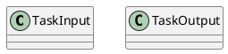
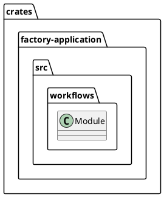
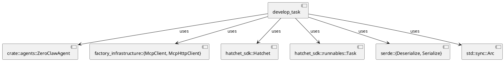
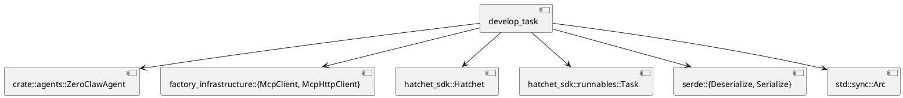
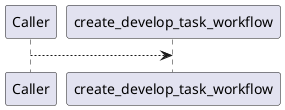
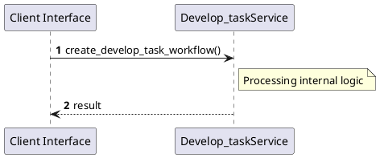

# File: develop_task.rs

**Source Path:** `crates/factory-application/src/workflows/develop_task.rs`

## Overview

### Purpose
Provides implementation for develop_task.rs.

### Responsibilities
* Handles logic related to develop_task.

### Dependencies
* crate::agents::ZeroClawAgent, factory_infrastructure::{McpClient, McpHttpClient}, hatchet_sdk::Hatchet, hatchet_sdk::runnables::Task, serde::{Deserialize, Serialize}, std::sync::Arc

### Imported modules
* None

### Exported classes
* TaskInput, TaskOutput

### Exported interfaces
* None

### Exported functions
* create_develop_task_workflow

## Public API

### Exported Classes / Structs / Interfaces

#### TaskInput

**Overview:**
No description provided.

**Constructor:**

Default constructor.

**Attributes:**

* `description` (String): Purpose - Stores description data. Constraints - Valid String.
* `relevant_files` (Vec<String>): Purpose - Stores relevant_files data. Constraints - Valid Vec<String>.
* `task_id` (String): Purpose - Stores task_id data. Constraints - Valid String.

**Public Methods:**

None.

**Private Methods:**

None.

#### TaskOutput

**Overview:**
No description provided.

**Constructor:**

Default constructor.

**Attributes:**

* `result` (serde_json::Value): Purpose - Stores result data. Constraints - Valid serde_json::Value.

**Public Methods:**

None.

**Private Methods:**

None.

### Exported Functions

#### `create_develop_task_workflow(hatchet (&Hatchet), mcp_url (String)) -> Task<TaskInput, TaskOutput>`
No description provided.

## Internal architecture



## Package Diagram



## Component Diagram



## Dependency Graph



## Call Graph



## Execution flow & Sequence explanation



## Examples

```
// Example usage of develop_task.rs components
import { ... } from 'crates/factory-application/src/workflows/develop_task.rs';
```

## Cross References
* **Parent module:** `crates/factory-application/src/workflows`
* **Dependencies:** crate::agents::ZeroClawAgent, factory_infrastructure::{McpClient, McpHttpClient}, hatchet_sdk::Hatchet, hatchet_sdk::runnables::Task, serde::{Deserialize, Serialize}, std::sync::Arc
