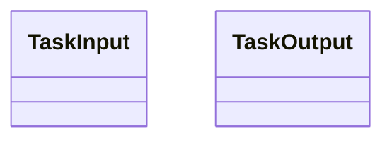
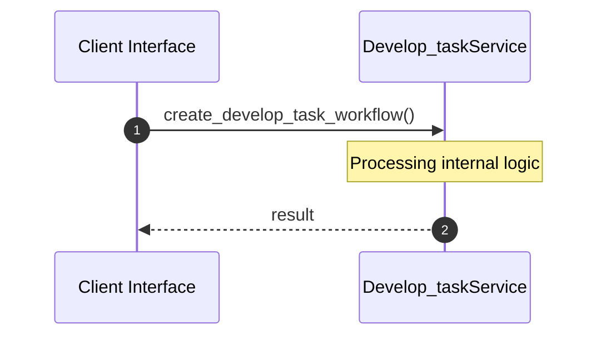
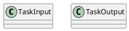
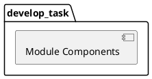
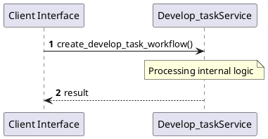
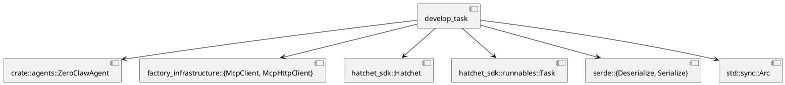
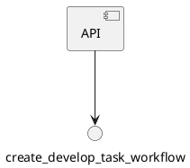

# File: develop_task.rs

**Source Path:** `crates/factory-application/src/workflows/develop_task.rs`

## Overview

### Purpose
Provides implementation for develop_task.rs.

### Responsibilities
* Handles logic related to develop_task.

### Main Workflow
* Initialization and execution of develop_task logic.

### Dependencies
* crate::agents::ZeroClawAgent, factory_infrastructure::{McpClient, McpHttpClient}, hatchet_sdk::Hatchet, hatchet_sdk::runnables::Task, serde::{Deserialize, Serialize}, std::sync::Arc

### Imported modules
* None

### Exported classes
* TaskInput, TaskOutput

### Exported interfaces
* None

### Exported functions
* create_develop_task_workflow

## Public API

### Exported Classes / Structs / Interfaces

#### TaskInput

**Overview:**
Why it exists:
Provides capabilities related to TaskInput.

What business capability it provides:
Supports core domain concepts.

How it collaborates with other classes:
Works with related entities to process logic.

**Constructor:**

Default constructor.

**Attributes:**

* `description` (String): Purpose - Stores description data. Constraints - Valid String.
* `relevant_files` (Vec<String>): Purpose - Stores relevant_files data. Constraints - Valid Vec<String>.
* `task_id` (String): Purpose - Stores task_id data. Constraints - Valid String.

**Public Methods:**

None.

**Private Methods:**

None.

#### TaskOutput

**Overview:**
Why it exists:
Provides capabilities related to TaskOutput.

What business capability it provides:
Supports core domain concepts.

How it collaborates with other classes:
Works with related entities to process logic.

**Constructor:**

Default constructor.

**Attributes:**

* `result` (serde_json::Value): Purpose - Stores result data. Constraints - Valid serde_json::Value.

**Public Methods:**

None.

**Private Methods:**

None.

### Exported Functions

#### `create_develop_task_workflow(hatchet: &Hatchet (Any), mcp_url: String (Any)) -> Task<TaskInput, TaskOutput>`
Executes create_develop_task_workflow.

## Internal architecture



## Execution flow & Sequence explanation



## UML

### Class Diagram


### Package Diagram


### Sequence Diagram


### Component Diagram
```plantuml
@startuml
component "develop_task" as comp
component "crate::agents::ZeroClawAgent" as crate::agents::ZeroClawAgent
comp --> crate::agents::ZeroClawAgent
component "factory_infrastructure::{McpClient, McpHttpClient}" as factory_infrastructure::{McpClient, McpHttpClient}
comp --> factory_infrastructure::{McpClient, McpHttpClient}
component "hatchet_sdk::Hatchet" as hatchet_sdk::Hatchet
comp --> hatchet_sdk::Hatchet
component "hatchet_sdk::runnables::Task" as hatchet_sdk::runnables::Task
comp --> hatchet_sdk::runnables::Task
component "serde::{Deserialize, Serialize}" as serde::{Deserialize, Serialize}
comp --> serde::{Deserialize, Serialize}
component "std::sync::Arc" as std::sync::Arc
comp --> std::sync::Arc
@enduml

```

### Dependency Graph


### Call Graph


## Examples

```
// Example usage of develop_task.rs components
import { ... } from 'crates/factory-application/src/workflows/develop_task.rs';
```

## Cross References
* **Parent module:** `crates/factory-application/src/workflows`
* **Dependencies:** crate::agents::ZeroClawAgent, factory_infrastructure::{McpClient, McpHttpClient}, hatchet_sdk::Hatchet, hatchet_sdk::runnables::Task, serde::{Deserialize, Serialize}, std::sync::Arc
