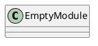
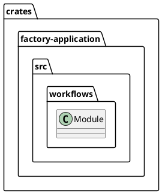
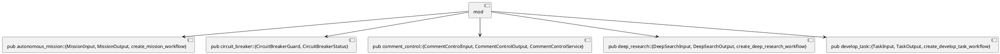
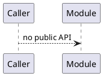
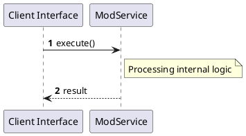

# File: mod.rs

**Source Path:** `crates/factory-application/src/workflows/mod.rs`

## Overview

### Purpose
Provides implementation for mod.rs.

### Responsibilities
* Handles logic related to mod.

### Dependencies
* pub autonomous_mission::{MissionInput, MissionOutput, create_mission_workflow}, pub circuit_breaker::{CircuitBreakerGuard, CircuitBreakerStatus}, pub comment_control::{CommentControlInput, CommentControlOutput, CommentControlService}, pub deep_research::{DeepSearchInput, DeepSearchOutput, create_deep_research_workflow}, pub develop_task::{TaskInput, TaskOutput, create_develop_task_workflow}

### Imported modules
* None

### Exported classes
* None

### Exported interfaces
* None

### Exported functions
* None

## Public API

### Exported Classes / Structs / Interfaces

### Exported Functions

None.

## Internal architecture



## Package Diagram



## Component Diagram

```plantuml
@startuml
component "mod" as Main
component "pub autonomous_mission::{MissionInput, MissionOutput, create_mission_workflow}" as pub_autonomous_mission___MissionInput__MissionOutput__create_mission_workflow_
Main --> pub_autonomous_mission___MissionInput__MissionOutput__create_mission_workflow_ : uses
component "pub circuit_breaker::{CircuitBreakerGuard, CircuitBreakerStatus}" as pub_circuit_breaker___CircuitBreakerGuard__CircuitBreakerStatus_
Main --> pub_circuit_breaker___CircuitBreakerGuard__CircuitBreakerStatus_ : uses
component "pub comment_control::{CommentControlInput, CommentControlOutput, CommentControlService}" as pub_comment_control___CommentControlInput__CommentControlOutput__CommentControlService_
Main --> pub_comment_control___CommentControlInput__CommentControlOutput__CommentControlService_ : uses
component "pub deep_research::{DeepSearchInput, DeepSearchOutput, create_deep_research_workflow}" as pub_deep_research___DeepSearchInput__DeepSearchOutput__create_deep_research_workflow_
Main --> pub_deep_research___DeepSearchInput__DeepSearchOutput__create_deep_research_workflow_ : uses
component "pub develop_task::{TaskInput, TaskOutput, create_develop_task_workflow}" as pub_develop_task___TaskInput__TaskOutput__create_develop_task_workflow_
Main --> pub_develop_task___TaskInput__TaskOutput__create_develop_task_workflow_ : uses
@enduml

```



## Dependency Graph



## Call Graph



## Execution flow & Sequence explanation



## Examples

```
// Example usage of mod.rs components
import { ... } from 'crates/factory-application/src/workflows/mod.rs';
```

## Cross References
* **Parent module:** `crates/factory-application/src/workflows`
* **Dependencies:** pub autonomous_mission::{MissionInput, MissionOutput, create_mission_workflow}, pub circuit_breaker::{CircuitBreakerGuard, CircuitBreakerStatus}, pub comment_control::{CommentControlInput, CommentControlOutput, CommentControlService}, pub deep_research::{DeepSearchInput, DeepSearchOutput, create_deep_research_workflow}, pub develop_task::{TaskInput, TaskOutput, create_develop_task_workflow}
