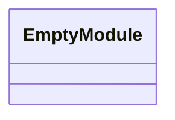
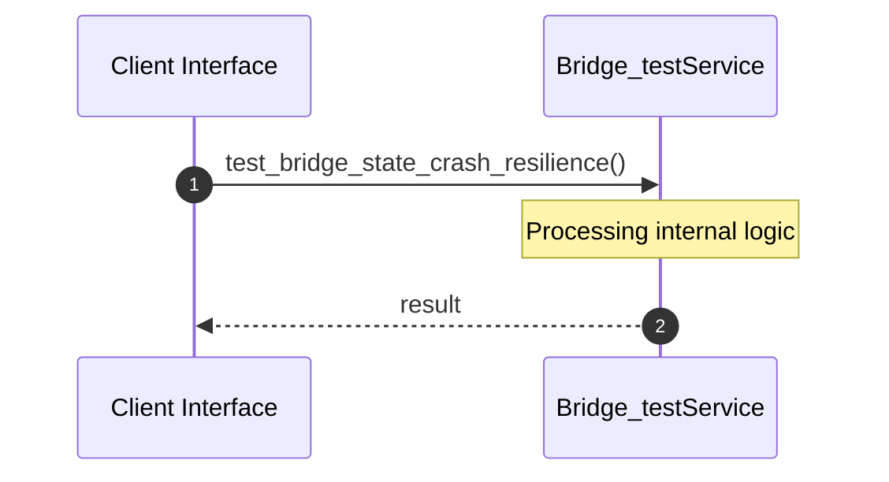
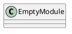
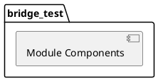
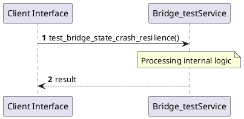
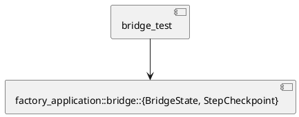
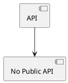

# File: bridge_test.rs

**Source Path:** `crates/factory-application/tests/bridge_test.rs`

## Overview

### Purpose
Provides implementation for bridge_test.rs.

### Responsibilities
* Handles logic related to bridge_test.

### Main Workflow
* Initialization and execution of bridge_test logic.

### Dependencies
* factory_application::bridge::{BridgeState, StepCheckpoint}

### Imported modules
* None

### Exported classes
* None

### Exported interfaces
* None

### Exported functions
* None

## Public API

### Exported Classes / Structs / Interfaces

### Exported Functions

None.

## Internal architecture



## Execution flow & Sequence explanation



## UML

### Class Diagram


### Package Diagram


### Sequence Diagram


### Component Diagram
```plantuml
@startuml
component "bridge_test" as comp
component "factory_application::bridge::{BridgeState, StepCheckpoint}" as factory_application::bridge::{BridgeState, StepCheckpoint}
comp --> factory_application::bridge::{BridgeState, StepCheckpoint}
@enduml

```

### Dependency Graph


### Call Graph


## Examples

```
// Example usage of bridge_test.rs components
import { ... } from 'crates/factory-application/tests/bridge_test.rs';
```

## Cross References
* **Parent module:** `crates/factory-application/tests`
* **Dependencies:** factory_application::bridge::{BridgeState, StepCheckpoint}
