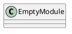
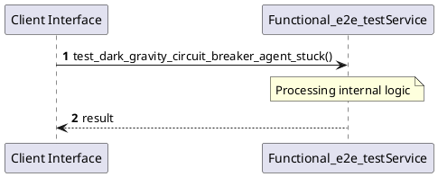

# File: functional_e2e_test.rs

**Source Path:** `crates/factory-application/tests/functional_e2e_test.rs`

## Overview

### Purpose
Provides implementation for functional_e2e_test.rs.

### Responsibilities
* Handles logic related to functional_e2e_test.

### Dependencies
* factory_application::agents::{RustantAgent, ZeroClawAgent}, factory_application::workflows::autonomous_mission::{MissionInput, MissionOutput}, factory_infrastructure::{
    MockAethalgardClient, MockMcpClient, MockR2rClient, MockSemanticaClient, ProvenanceReport,
    SemanticaClient,
}, hatchet_sdk::Hatchet, hatchet_sdk::Runnable, serde_json::json, std::sync::Arc

### Imported modules
* None

### Exported classes
* None

### Exported interfaces
* None

### Exported functions
* None

## Public API

### Exported Classes / Structs / Interfaces

### Exported Functions

None.

## Internal architecture



## Execution flow & Sequence explanation



## Examples

```
// Example usage of functional_e2e_test.rs components
import { ... } from 'crates/factory-application/tests/functional_e2e_test.rs';
```

## Cross References
* **Parent module:** `crates/factory-application/tests`
* **Dependencies:** factory_application::agents::{RustantAgent, ZeroClawAgent}, factory_application::workflows::autonomous_mission::{MissionInput, MissionOutput}, factory_infrastructure::{
    MockAethalgardClient, MockMcpClient, MockR2rClient, MockSemanticaClient, ProvenanceReport,
    SemanticaClient,
}, hatchet_sdk::Hatchet, hatchet_sdk::Runnable, serde_json::json, std::sync::Arc
