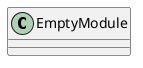
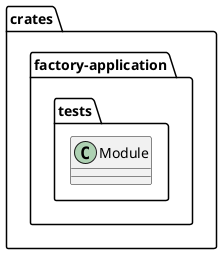
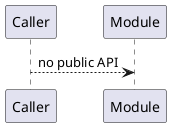
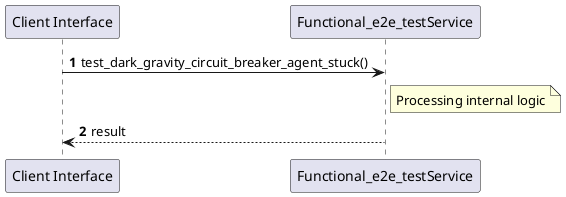

# File: functional_e2e_test.rs

**Source Path:** `crates/factory-application/tests/functional_e2e_test.rs`

## Overview

### Purpose
Provides implementation for functional_e2e_test.rs.

### Responsibilities
* Handles logic related to functional_e2e_test.

### Dependencies
* factory_application::agents::{RustantAgent, ZeroClawAgent}, factory_application::workflows::autonomous_mission::{MissionInput, MissionOutput}, factory_infrastructure::{
    MockAethalgardClient, MockMcpClient, MockR2rClient, MockSemanticaClient, ProvenanceReport,
    SemanticaClient,
}, hatchet_sdk::Hatchet, hatchet_sdk::Runnable, serde_json::json, std::sync::Arc

### Imported modules
* None

### Exported classes
* None

### Exported interfaces
* None

### Exported functions
* None

## Public API

### Exported Classes / Structs / Interfaces

### Exported Functions

None.

## Internal architecture



## Package Diagram



## Component Diagram

```plantuml
@startuml
component "functional_e2e_test" as Main
component "factory_application::agents::{RustantAgent, ZeroClawAgent}" as factory_application__agents___RustantAgent__ZeroClawAgent_
Main --> factory_application__agents___RustantAgent__ZeroClawAgent_ : uses
component "factory_application::workflows::autonomous_mission::{MissionInput, MissionOutput}" as factory_application__workflows__autonomous_mission___MissionInput__MissionOutput_
Main --> factory_application__workflows__autonomous_mission___MissionInput__MissionOutput_ : uses
component "factory_infrastructure::{
    MockAethalgardClient, MockMcpClient, MockR2rClient, MockSemanticaClient, ProvenanceReport,
    SemanticaClient,
}" as factory_infrastructure________MockAethalgardClient__MockMcpClient__MockR2rClient__MockSemanticaClient__ProvenanceReport______SemanticaClient___
Main --> factory_infrastructure________MockAethalgardClient__MockMcpClient__MockR2rClient__MockSemanticaClient__ProvenanceReport______SemanticaClient___ : uses
component "hatchet_sdk::Hatchet" as hatchet_sdk__Hatchet
Main --> hatchet_sdk__Hatchet : uses
component "hatchet_sdk::Runnable" as hatchet_sdk__Runnable
Main --> hatchet_sdk__Runnable : uses
component "serde_json::json" as serde_json__json
Main --> serde_json__json : uses
component "std::sync::Arc" as std__sync__Arc
Main --> std__sync__Arc : uses
@enduml

```

## Dependency Graph

```plantuml
@startuml
[functional_e2e_test]
[functional_e2e_test] --> [factory_application::agents::{RustantAgent, ZeroClawAgent}]
[functional_e2e_test] --> [factory_application::workflows::autonomous_mission::{MissionInput, MissionOutput}]
[functional_e2e_test] --> [factory_infrastructure::{
    MockAethalgardClient, MockMcpClient, MockR2rClient, MockSemanticaClient, ProvenanceReport,
    SemanticaClient,
}]
[functional_e2e_test] --> [hatchet_sdk::Hatchet]
[functional_e2e_test] --> [hatchet_sdk::Runnable]
[functional_e2e_test] --> [serde_json::json]
[functional_e2e_test] --> [std::sync::Arc]
@enduml

```

## Call Graph



## Execution flow & Sequence explanation



## Examples

```
// Example usage of functional_e2e_test.rs components
import { ... } from 'crates/factory-application/tests/functional_e2e_test.rs';
```

## Cross References
* **Parent module:** `crates/factory-application/tests`
* **Dependencies:** factory_application::agents::{RustantAgent, ZeroClawAgent}, factory_application::workflows::autonomous_mission::{MissionInput, MissionOutput}, factory_infrastructure::{
    MockAethalgardClient, MockMcpClient, MockR2rClient, MockSemanticaClient, ProvenanceReport,
    SemanticaClient,
}, hatchet_sdk::Hatchet, hatchet_sdk::Runnable, serde_json::json, std::sync::Arc
