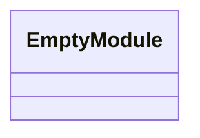
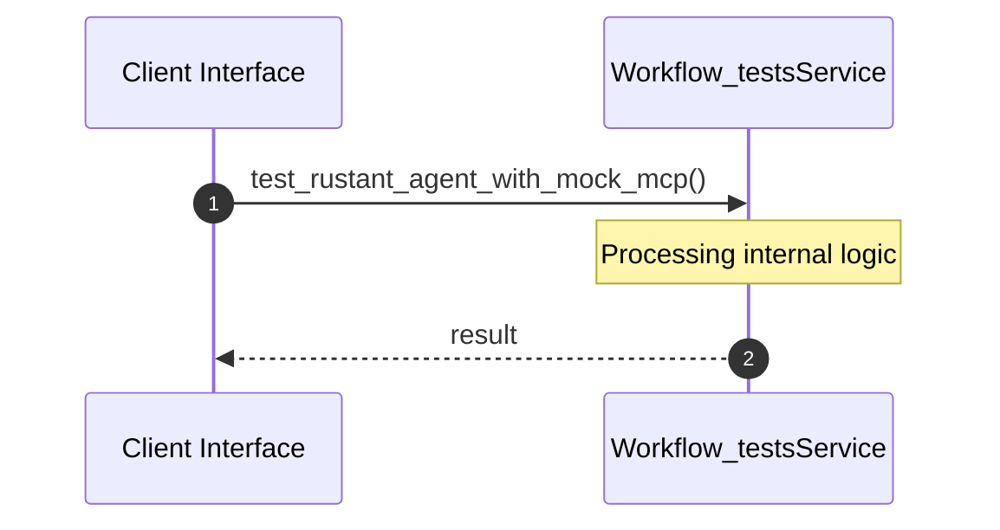
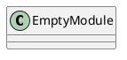
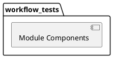
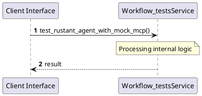
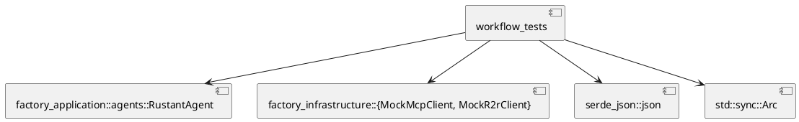
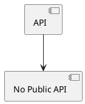

# File: workflow_tests.rs

**Source Path:** `crates/factory-application/tests/workflow_tests.rs`

## Overview

### Purpose
Provides implementation for workflow_tests.rs.

### Responsibilities
* Handles logic related to workflow_tests.

### Main Workflow
* Initialization and execution of workflow_tests logic.

### Dependencies
* factory_application::agents::RustantAgent, factory_infrastructure::{MockMcpClient, MockR2rClient}, serde_json::json, std::sync::Arc

### Imported modules
* None

### Exported classes
* None

### Exported interfaces
* None

### Exported functions
* None

## Public API

### Exported Classes / Structs / Interfaces

### Exported Functions

None.

## Internal architecture



## Execution flow & Sequence explanation



## UML

### Class Diagram


### Package Diagram


### Sequence Diagram


### Component Diagram
```plantuml
@startuml
component "workflow_tests" as comp
component "factory_application::agents::RustantAgent" as factory_application::agents::RustantAgent
comp --> factory_application::agents::RustantAgent
component "factory_infrastructure::{MockMcpClient, MockR2rClient}" as factory_infrastructure::{MockMcpClient, MockR2rClient}
comp --> factory_infrastructure::{MockMcpClient, MockR2rClient}
component "serde_json::json" as serde_json::json
comp --> serde_json::json
component "std::sync::Arc" as std::sync::Arc
comp --> std::sync::Arc
@enduml

```

### Dependency Graph


### Call Graph


## Examples

```
// Example usage of workflow_tests.rs components
import { ... } from 'crates/factory-application/tests/workflow_tests.rs';
```

## Cross References
* **Parent module:** `crates/factory-application/tests`
* **Dependencies:** factory_application::agents::RustantAgent, factory_infrastructure::{MockMcpClient, MockR2rClient}, serde_json::json, std::sync::Arc
