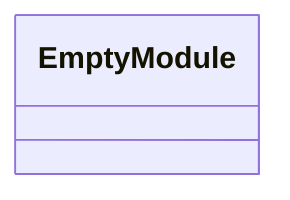
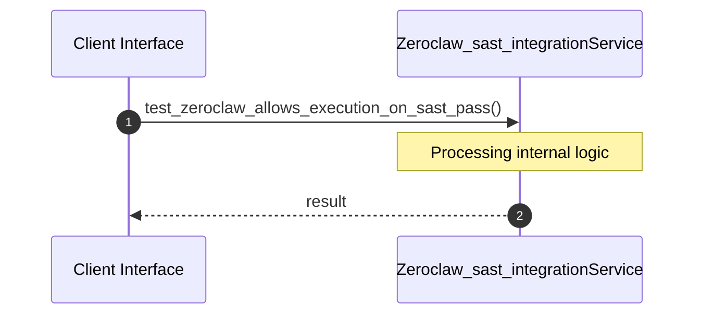

# File: zeroclaw_sast_integration.rs

**Source Path:** `crates/factory-application/tests/zeroclaw_sast_integration.rs`

## Overview

### Purpose
Provides implementation for zeroclaw_sast_integration.rs.

### Responsibilities
* Handles logic related to zeroclaw_sast_integration.

### Dependencies
* factory_application::agents::ZeroClawAgent, factory_infrastructure::MockMcpClient, serde_json::json, std::sync::Arc

### Imported modules
* None

### Exported classes
* None

### Exported interfaces
* None

### Exported functions
* None

## Public API

### Exported Classes / Structs / Interfaces

### Exported Functions

None.

## Internal architecture



## Execution flow & Sequence explanation



## Examples

```
// Example usage of zeroclaw_sast_integration.rs components
import { ... } from 'crates/factory-application/tests/zeroclaw_sast_integration.rs';
```

## Cross References
* **Parent module:** `crates/factory-application/tests`
* **Dependencies:** factory_application::agents::ZeroClawAgent, factory_infrastructure::MockMcpClient, serde_json::json, std::sync::Arc
