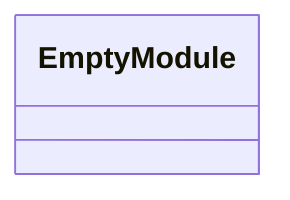
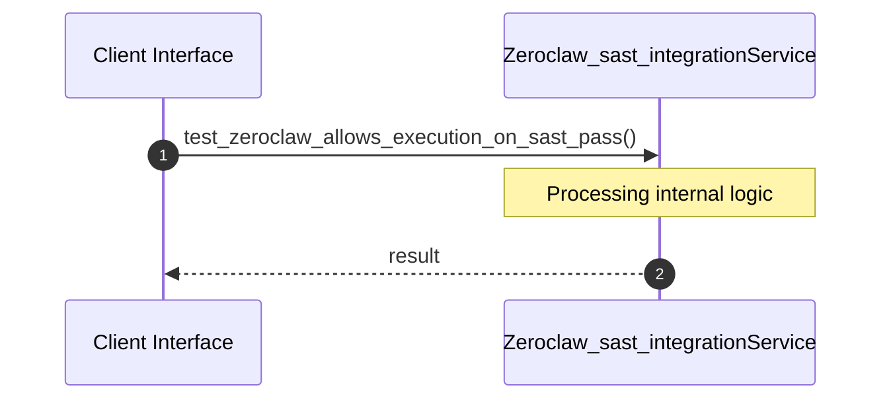
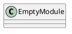
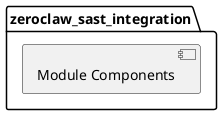
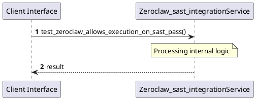
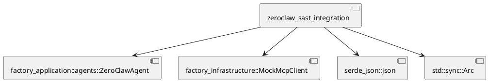
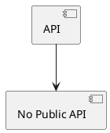

# File: zeroclaw_sast_integration.rs

**Source Path:** `crates/factory-application/tests/zeroclaw_sast_integration.rs`

## Overview

### Purpose
Provides implementation for zeroclaw_sast_integration.rs.

### Responsibilities
* Handles logic related to zeroclaw_sast_integration.

### Main Workflow
* Initialization and execution of zeroclaw_sast_integration logic.

### Dependencies
* factory_application::agents::ZeroClawAgent, factory_infrastructure::MockMcpClient, serde_json::json, std::sync::Arc

### Imported modules
* None

### Exported classes
* None

### Exported interfaces
* None

### Exported functions
* None

## Public API

### Exported Classes / Structs / Interfaces

### Exported Functions

None.

## Internal architecture



## Execution flow & Sequence explanation



## UML

### Class Diagram


### Package Diagram


### Sequence Diagram


### Component Diagram
```plantuml
@startuml
component "zeroclaw_sast_integration" as comp
component "factory_application::agents::ZeroClawAgent" as factory_application::agents::ZeroClawAgent
comp --> factory_application::agents::ZeroClawAgent
component "factory_infrastructure::MockMcpClient" as factory_infrastructure::MockMcpClient
comp --> factory_infrastructure::MockMcpClient
component "serde_json::json" as serde_json::json
comp --> serde_json::json
component "std::sync::Arc" as std::sync::Arc
comp --> std::sync::Arc
@enduml

```

### Dependency Graph


### Call Graph


## Examples

```
// Example usage of zeroclaw_sast_integration.rs components
import { ... } from 'crates/factory-application/tests/zeroclaw_sast_integration.rs';
```

## Cross References
* **Parent module:** `crates/factory-application/tests`
* **Dependencies:** factory_application::agents::ZeroClawAgent, factory_infrastructure::MockMcpClient, serde_json::json, std::sync::Arc
