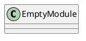
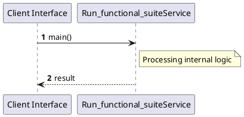

# File: run_functional_suite.rs

**Source Path:** `crates/factory-cli/src/bin/run_functional_suite.rs`

## Overview

### Purpose
Provides implementation for run_functional_suite.rs.

### Responsibilities
* Handles logic related to run_functional_suite.

### Dependencies
* factory_application::workflows::autonomous_mission::{MissionInput, MissionOutput}, hatchet_sdk::Hatchet, hatchet_sdk::Runnable, std::time::Duration, uuid::Uuid

### Imported modules
* None

### Exported classes
* None

### Exported interfaces
* None

### Exported functions
* None

## Public API

### Exported Classes / Structs / Interfaces

### Exported Functions

None.

## Internal architecture



## Execution flow & Sequence explanation



## Examples

```
// Example usage of run_functional_suite.rs components
import { ... } from 'crates/factory-cli/src/bin/run_functional_suite.rs';
```

## Cross References
* **Parent module:** `crates/factory-cli/src/bin`
* **Dependencies:** factory_application::workflows::autonomous_mission::{MissionInput, MissionOutput}, hatchet_sdk::Hatchet, hatchet_sdk::Runnable, std::time::Duration, uuid::Uuid
