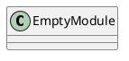
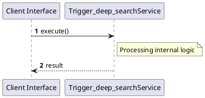

# File: trigger_deep_search.rs

**Source Path:** `crates/factory-cli/src/bin/trigger_deep_search.rs`

## Overview

### Purpose
Provides implementation for trigger_deep_search.rs.

### Responsibilities
* Handles logic related to trigger_deep_search.

### Dependencies
* factory_application::workflows::deep_research::DeepSearchInput, hatchet_sdk::Hatchet, hatchet_sdk::Runnable

### Imported modules
* None

### Exported classes
* None

### Exported interfaces
* None

### Exported functions
* None

## Public API

### Exported Classes / Structs / Interfaces

### Exported Functions

None.

## Internal architecture



## Execution flow & Sequence explanation




## Examples

```
// Example usage of trigger_deep_search.rs components
import { ... } from 'crates/factory-cli/src/bin/trigger_deep_search.rs';
```


## Cross References
* **Parent module:** `crates/factory-cli/src/bin`
* **Dependencies:** factory_application::workflows::deep_research::DeepSearchInput, hatchet_sdk::Hatchet, hatchet_sdk::Runnable
