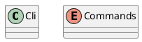
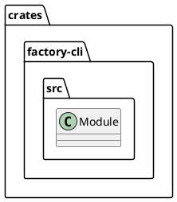
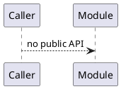
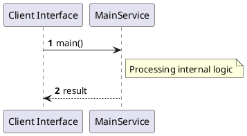

# File: main.rs

**Source Path:** `crates/factory-cli/src/main.rs`

## Overview

### Purpose
Provides implementation for main.rs.

### Responsibilities
* Handles logic related to main.

### Dependencies
* clap::{Parser, Subcommand}, factory_application::poller_service::PollerDaemonService, factory_application::workflows::comment_control::CommentControlService, factory_infrastructure::r2r::R2rClient, factory_infrastructure::{
                GitPlatformPoller, HttpAethalgardClient, HttpGithubClient, HttpGitlabClient,
                HttpR2rClient, HttpSemanticaClient, InMemoryCursorStore, KafkaClient,
                McpHttpClient, PostgresCursorStore,
            }, std::sync::Arc

### Imported modules
* None

### Exported classes
* Cli

### Exported interfaces
* None

### Exported functions
* None

## Public API

### Exported Classes / Structs / Interfaces

#### Cli

**Overview:**
No description provided.

**Constructor:**

Default constructor.

**Attributes:**

* `command` (Commands): Purpose - Stores command data. Constraints - Valid Commands.

**Public Methods:**

None.

**Private Methods:**

None.

#### Commands

**Overview:**
No description provided.

**Constructor:**

Default constructor.

**Attributes:**

None.

**Public Methods:**

None.

**Private Methods:**

None.

### Exported Functions

None.

## Internal architecture



## Package Diagram



## Component Diagram

```plantuml
@startuml
component "main" as Main
component "clap::{Parser, Subcommand}" as clap___Parser__Subcommand_
Main --> clap___Parser__Subcommand_ : uses
component "factory_application::poller_service::PollerDaemonService" as factory_application__poller_service__PollerDaemonService
Main --> factory_application__poller_service__PollerDaemonService : uses
component "factory_application::workflows::comment_control::CommentControlService" as factory_application__workflows__comment_control__CommentControlService
Main --> factory_application__workflows__comment_control__CommentControlService : uses
component "factory_infrastructure::r2r::R2rClient" as factory_infrastructure__r2r__R2rClient
Main --> factory_infrastructure__r2r__R2rClient : uses
component "factory_infrastructure::{
                GitPlatformPoller, HttpAethalgardClient, HttpGithubClient, HttpGitlabClient,
                HttpR2rClient, HttpSemanticaClient, InMemoryCursorStore, KafkaClient,
                McpHttpClient, PostgresCursorStore,
            }" as factory_infrastructure____________________GitPlatformPoller__HttpAethalgardClient__HttpGithubClient__HttpGitlabClient__________________HttpR2rClient__HttpSemanticaClient__InMemoryCursorStore__KafkaClient__________________McpHttpClient__PostgresCursorStore_______________
Main --> factory_infrastructure____________________GitPlatformPoller__HttpAethalgardClient__HttpGithubClient__HttpGitlabClient__________________HttpR2rClient__HttpSemanticaClient__InMemoryCursorStore__KafkaClient__________________McpHttpClient__PostgresCursorStore_______________ : uses
component "std::sync::Arc" as std__sync__Arc
Main --> std__sync__Arc : uses
@enduml

```

## Dependency Graph

```plantuml
@startuml
[main]
[main] --> [clap::{Parser, Subcommand}]
[main] --> [factory_application::poller_service::PollerDaemonService]
[main] --> [factory_application::workflows::comment_control::CommentControlService]
[main] --> [factory_infrastructure::r2r::R2rClient]
[main] --> [factory_infrastructure::{
                GitPlatformPoller, HttpAethalgardClient, HttpGithubClient, HttpGitlabClient,
                HttpR2rClient, HttpSemanticaClient, InMemoryCursorStore, KafkaClient,
                McpHttpClient, PostgresCursorStore,
            }]
[main] --> [std::sync::Arc]
@enduml

```

## Call Graph



## Execution flow & Sequence explanation



## Examples

```
// Example usage of main.rs components
import { ... } from 'crates/factory-cli/src/main.rs';
```

## Cross References
* **Parent module:** `crates/factory-cli/src`
* **Dependencies:** clap::{Parser, Subcommand}, factory_application::poller_service::PollerDaemonService, factory_application::workflows::comment_control::CommentControlService, factory_infrastructure::r2r::R2rClient, factory_infrastructure::{
                GitPlatformPoller, HttpAethalgardClient, HttpGithubClient, HttpGitlabClient,
                HttpR2rClient, HttpSemanticaClient, InMemoryCursorStore, KafkaClient,
                McpHttpClient, PostgresCursorStore,
            }, std::sync::Arc
