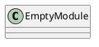
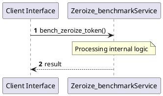

# File: zeroize_benchmark.rs

**Source Path:** `crates/factory-core/benches/zeroize_benchmark.rs`

## Overview

### Purpose
Provides implementation for zeroize_benchmark.rs.

### Responsibilities
* Handles logic related to zeroize_benchmark.

### Dependencies
* criterion::{black_box, criterion_group, criterion_main, Criterion}, factory_core::security::JitToken, zeroize::Zeroize

### Imported modules
* None

### Exported classes
* None

### Exported interfaces
* None

### Exported functions
* None

## Public API

### Exported Classes / Structs / Interfaces

### Exported Functions

None.

## Internal architecture



## Execution flow & Sequence explanation



## Examples

```
// Example usage of zeroize_benchmark.rs components
import { ... } from 'crates/factory-core/benches/zeroize_benchmark.rs';
```

## Cross References
* **Parent module:** `crates/factory-core/benches`
* **Dependencies:** criterion::{black_box, criterion_group, criterion_main, Criterion}, factory_core::security::JitToken, zeroize::Zeroize
