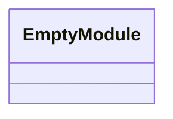
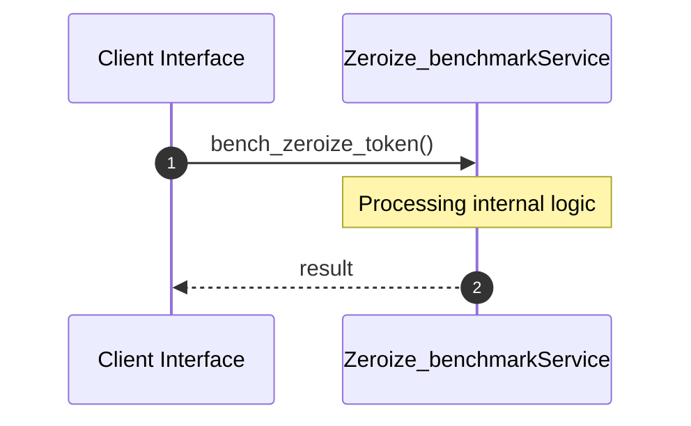
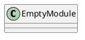
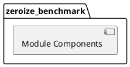
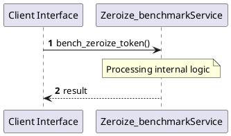
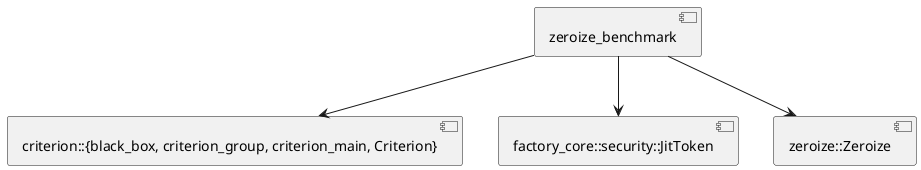
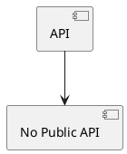

# File: zeroize_benchmark.rs

**Source Path:** `crates/factory-core/benches/zeroize_benchmark.rs`

## Overview

### Purpose
Provides implementation for zeroize_benchmark.rs.

### Responsibilities
* Handles logic related to zeroize_benchmark.

### Main Workflow
* Initialization and execution of zeroize_benchmark logic.

### Dependencies
* criterion::{black_box, criterion_group, criterion_main, Criterion}, factory_core::security::JitToken, zeroize::Zeroize

### Imported modules
* None

### Exported classes
* None

### Exported interfaces
* None

### Exported functions
* None

## Public API

### Exported Classes / Structs / Interfaces

### Exported Functions

None.

## Internal architecture



## Execution flow & Sequence explanation



## UML

### Class Diagram


### Package Diagram


### Sequence Diagram


### Component Diagram
```plantuml
@startuml
component "zeroize_benchmark" as comp
component "criterion::{black_box, criterion_group, criterion_main, Criterion}" as criterion::{black_box, criterion_group, criterion_main, Criterion}
comp --> criterion::{black_box, criterion_group, criterion_main, Criterion}
component "factory_core::security::JitToken" as factory_core::security::JitToken
comp --> factory_core::security::JitToken
component "zeroize::Zeroize" as zeroize::Zeroize
comp --> zeroize::Zeroize
@enduml

```

### Dependency Graph


### Call Graph


## Examples

```
// Example usage of zeroize_benchmark.rs components
import { ... } from 'crates/factory-core/benches/zeroize_benchmark.rs';
```

## Cross References
* **Parent module:** `crates/factory-core/benches`
* **Dependencies:** criterion::{black_box, criterion_group, criterion_main, Criterion}, factory_core::security::JitToken, zeroize::Zeroize
