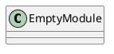
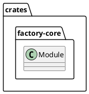
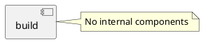
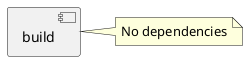
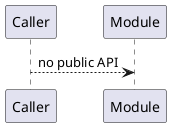
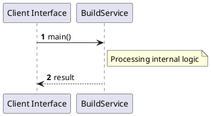

# File: build.rs

**Source Path:** `crates/factory-core/build.rs`

## Overview

### Purpose
Provides implementation for build.rs.

### Responsibilities
* Handles logic related to build.

### Dependencies
* None

### Imported modules
* None

### Exported classes
* None

### Exported interfaces
* None

### Exported functions
* None

## Public API

### Exported Classes / Structs / Interfaces

### Exported Functions

None.

## Internal architecture



## Package Diagram



## Component Diagram



## Dependency Graph



## Call Graph



## Execution flow & Sequence explanation



## Examples

```
// Example usage of build.rs components
import { ... } from 'crates/factory-core/build.rs';
```

## Cross References
* **Parent module:** `crates/factory-core`
* **Dependencies:** None
