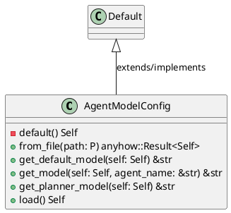
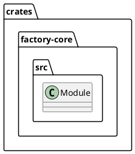
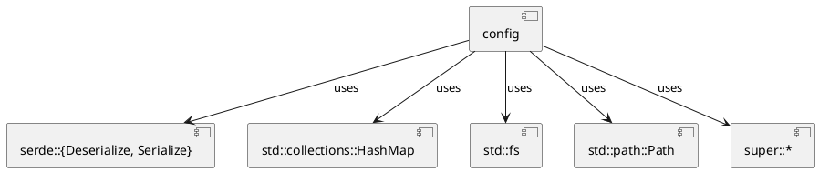
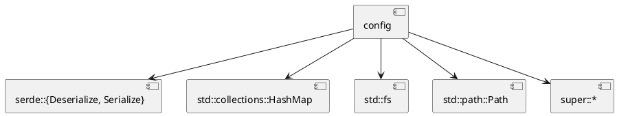
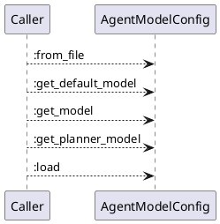
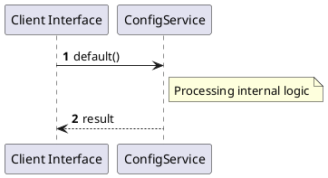

# File: config.rs

**Source Path:** `crates/factory-core/src/config.rs`

## Overview

### Purpose
Provides implementation for config.rs.

### Responsibilities
* Handles logic related to config.

### Dependencies
* serde::{Deserialize, Serialize}, std::collections::HashMap, std::fs, std::path::Path, super::*

### Imported modules
* None

### Exported classes
* AgentModelConfig

### Exported interfaces
* None

### Exported functions
* None

## Public API

### Exported Classes / Structs / Interfaces

#### AgentModelConfig

**Overview:**
/// Configuration mapping agents and tools to their respective LLM model endpoints.

**Constructor:**

Default constructor.

**Attributes:**

* `agents` (HashMap<String, String>): Purpose - Stores agents data. Constraints - Valid HashMap<String, String>.
* `default_model` (String): Purpose - Stores default_model data. Constraints - Valid String.
* `planner_model` (String): Purpose - Stores planner_model data. Constraints - Valid String.

**Public Methods:**

##### `from_file(path (P)) -> anyhow::Result<Self>`

###### Description
/// Parse configuration from a specific YAML or JSON file.

###### Inputs
* `path`: type=P, meaning=Input for path, valid values=Any valid P, optional=No, default value=None

###### Output
Return type: anyhow::Result<Self>
Semantic meaning: Result of from_file
Possible null values: Conditional
Exceptions: None handled explicitly

###### Side Effects
Database updates: None
File operations: None
Network calls: None
Cache: None
State changes: Updates internal variables

###### Complexity
Time Complexity: O(1) mostly
Space Complexity: O(1) mostly

###### Example
```
let result = instance.from_file();
```

##### `get_default_model(self (Self)) -> &str`

###### Description
/// Retrieve the default agent model

###### Inputs
* `self`: type=Self, meaning=Input for self, valid values=Any valid Self, optional=No, default value=None

###### Output
Return type: &str
Semantic meaning: Result of get_default_model
Possible null values: Conditional
Exceptions: None handled explicitly

###### Side Effects
Database updates: None
File operations: None
Network calls: None
Cache: None
State changes: Updates internal variables

###### Complexity
Time Complexity: O(1) mostly
Space Complexity: O(1) mostly

###### Example
```
let result = instance.get_default_model();
```

##### `get_model(self (Self), agent_name (&str)) -> &str`

###### Description
/// Retrieve model for a given agent or tool name.

/// If key is "planner" or "plan_mission", returns planner_model unless specifically overridden.

###### Inputs
* `self`: type=Self, meaning=Input for self, valid values=Any valid Self, optional=No, default value=None
* `agent_name`: type=&str, meaning=Input for agent_name, valid values=Any valid &str, optional=No, default value=None

###### Output
Return type: &str
Semantic meaning: Result of get_model
Possible null values: Conditional
Exceptions: None handled explicitly

###### Side Effects
Database updates: None
File operations: None
Network calls: None
Cache: None
State changes: Updates internal variables

###### Complexity
Time Complexity: O(1) mostly
Space Complexity: O(1) mostly

###### Example
```
let result = instance.get_model();
```

##### `get_planner_model(self (Self)) -> &str`

###### Description
/// Retrieve the planner model

###### Inputs
* `self`: type=Self, meaning=Input for self, valid values=Any valid Self, optional=No, default value=None

###### Output
Return type: &str
Semantic meaning: Result of get_planner_model
Possible null values: Conditional
Exceptions: None handled explicitly

###### Side Effects
Database updates: None
File operations: None
Network calls: None
Cache: None
State changes: Updates internal variables

###### Complexity
Time Complexity: O(1) mostly
Space Complexity: O(1) mostly

###### Example
```
let result = instance.get_planner_model();
```

##### `load() -> Self`

###### Description
/// Load configuration from file or fallback to environment variables and default constants.

###### Inputs
None.

###### Output
Return type: Self
Semantic meaning: Result of load
Possible null values: Conditional
Exceptions: None handled explicitly

###### Side Effects
Database updates: None
File operations: None
Network calls: None
Cache: None
State changes: Updates internal variables

###### Complexity
Time Complexity: O(1) mostly
Space Complexity: O(1) mostly

###### Example
```
let result = instance.load();
```

**Private Methods:**

* `default() -> Self`: Internal helper logic.

### Exported Functions

None.

## Internal architecture



## Package Diagram



## Component Diagram



## Dependency Graph



## Call Graph



## Execution flow & Sequence explanation



## Examples

```
// Example usage of config.rs components
import { ... } from 'crates/factory-core/src/config.rs';
```

## Cross References
* **Parent module:** `crates/factory-core/src`
* **Dependencies:** serde::{Deserialize, Serialize}, std::collections::HashMap, std::fs, std::path::Path, super::*
