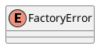
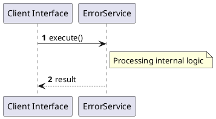

# File: error.rs

**Source Path:** `crates/factory-core/src/error.rs`

## Overview

### Purpose
Provides implementation for error.rs.

### Responsibilities
* Handles logic related to error.

### Dependencies
* thiserror::Error

### Imported modules
* None

### Exported classes
* None

### Exported interfaces
* None

### Exported functions
* None

## Public API

### Exported Classes / Structs / Interfaces

#### FactoryError

**Overview:**
No description provided.

**Constructor:**

Default constructor.

**Attributes:**

None.

**Public Methods:**

None.

**Private Methods:**

None.

### Exported Functions

None.

## Internal architecture



## Execution flow & Sequence explanation




## Examples

```
// Example usage of error.rs components
import { ... } from 'crates/factory-core/src/error.rs';
```


## Cross References
* **Parent module:** `crates/factory-core/src`
* **Dependencies:** thiserror::Error
