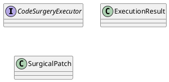
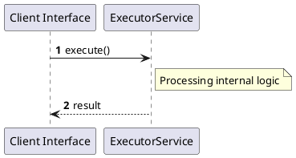

# File: executor.rs

**Source Path:** `crates/factory-core/src/executor.rs`

## Overview

### Purpose
Provides implementation for executor.rs.

### Responsibilities
* Handles logic related to executor.

### Dependencies
* async_trait::async_trait, crate::error::FactoryError, std::path::PathBuf

### Imported modules
* None

### Exported classes
* ExecutionResult, SurgicalPatch

### Exported interfaces
* CodeSurgeryExecutor

### Exported functions
* None

## Public API

### Exported Classes / Structs / Interfaces

#### CodeSurgeryExecutor

**Overview:**
No description provided.

**Constructor:**

Default constructor.

**Attributes:**

None.

**Public Methods:**

None.

**Private Methods:**

None.

#### ExecutionResult

**Overview:**
No description provided.

**Constructor:**

Default constructor.

**Attributes:**

* `commit_sha` (Option<String>): Purpose - Stores commit_sha data. Constraints - Valid Option<String>.
* `lines_modified` (usize): Purpose - Stores lines_modified data. Constraints - Valid usize.
* `success` (bool): Purpose - Stores success data. Constraints - Valid bool.

**Public Methods:**

None.

**Private Methods:**

None.

#### SurgicalPatch

**Overview:**
No description provided.

**Constructor:**

Default constructor.

**Attributes:**

* `file_path` (PathBuf): Purpose - Stores file_path data. Constraints - Valid PathBuf.
* `replace_block` (String): Purpose - Stores replace_block data. Constraints - Valid String.
* `search_block` (String): Purpose - Stores search_block data. Constraints - Valid String.

**Public Methods:**

None.

**Private Methods:**

None.

### Exported Functions

None.

## Internal architecture



## Execution flow & Sequence explanation



## Examples

```
// Example usage of executor.rs components
import { ... } from 'crates/factory-core/src/executor.rs';
```

## Cross References
* **Parent module:** `crates/factory-core/src`
* **Dependencies:** async_trait::async_trait, crate::error::FactoryError, std::path::PathBuf
