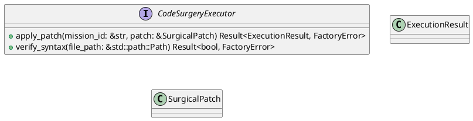
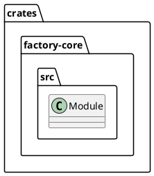
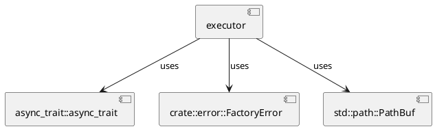
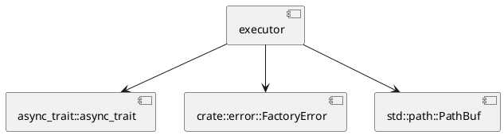
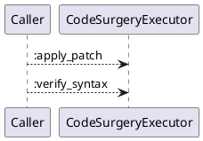
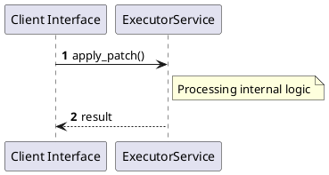

# File: executor.rs

**Source Path:** `crates/factory-core/src/executor.rs`

## Overview

### Purpose
Provides implementation for executor.rs.

### Responsibilities
* Handles logic related to executor.

### Dependencies
* async_trait::async_trait, crate::error::FactoryError, std::path::PathBuf

### Imported modules
* None

### Exported classes
* ExecutionResult, SurgicalPatch

### Exported interfaces
* CodeSurgeryExecutor

### Exported functions
* None

## Public API

### Exported Classes / Structs / Interfaces

#### CodeSurgeryExecutor

**Overview:**
No description provided.

**Constructor:**

Default constructor.

**Attributes:**

None.

**Public Methods:**

##### `apply_patch(mission_id (&str), patch (&SurgicalPatch)) -> Result<ExecutionResult, FactoryError>`

###### Description
No description provided.

###### Inputs
* `mission_id`: type=&str, meaning=Input for mission_id, valid values=Any valid &str, optional=No, default value=None
* `patch`: type=&SurgicalPatch, meaning=Input for patch, valid values=Any valid &SurgicalPatch, optional=No, default value=None

###### Output
Return type: Result<ExecutionResult, FactoryError>
Semantic meaning: Result of apply_patch
Possible null values: Conditional
Exceptions: None handled explicitly

###### Side Effects
Database updates: None
File operations: None
Network calls: None
Cache: None
State changes: Updates internal variables

###### Complexity
Time Complexity: O(1) mostly
Space Complexity: O(1) mostly

###### Example
```
let result = instance.apply_patch();
```

##### `verify_syntax(file_path (&std::path::Path)) -> Result<bool, FactoryError>`

###### Description
No description provided.

###### Inputs
* `file_path`: type=&std::path::Path, meaning=Input for file_path, valid values=Any valid &std::path::Path, optional=No, default value=None

###### Output
Return type: Result<bool, FactoryError>
Semantic meaning: Result of verify_syntax
Possible null values: Conditional
Exceptions: None handled explicitly

###### Side Effects
Database updates: None
File operations: None
Network calls: None
Cache: None
State changes: Updates internal variables

###### Complexity
Time Complexity: O(1) mostly
Space Complexity: O(1) mostly

###### Example
```
let result = instance.verify_syntax();
```

**Private Methods:**

None.

#### ExecutionResult

**Overview:**
No description provided.

**Constructor:**

Default constructor.

**Attributes:**

* `commit_sha` (Option<String>): Purpose - Stores commit_sha data. Constraints - Valid Option<String>.
* `lines_modified` (usize): Purpose - Stores lines_modified data. Constraints - Valid usize.
* `success` (bool): Purpose - Stores success data. Constraints - Valid bool.

**Public Methods:**

None.

**Private Methods:**

None.

#### SurgicalPatch

**Overview:**
No description provided.

**Constructor:**

Default constructor.

**Attributes:**

* `file_path` (PathBuf): Purpose - Stores file_path data. Constraints - Valid PathBuf.
* `replace_block` (String): Purpose - Stores replace_block data. Constraints - Valid String.
* `search_block` (String): Purpose - Stores search_block data. Constraints - Valid String.

**Public Methods:**

None.

**Private Methods:**

None.

### Exported Functions

None.

## Internal architecture



## Package Diagram



## Component Diagram



## Dependency Graph



## Call Graph



## Execution flow & Sequence explanation



## Examples

```
// Example usage of executor.rs components
import { ... } from 'crates/factory-core/src/executor.rs';
```

## Cross References
* **Parent module:** `crates/factory-core/src`
* **Dependencies:** async_trait::async_trait, crate::error::FactoryError, std::path::PathBuf
