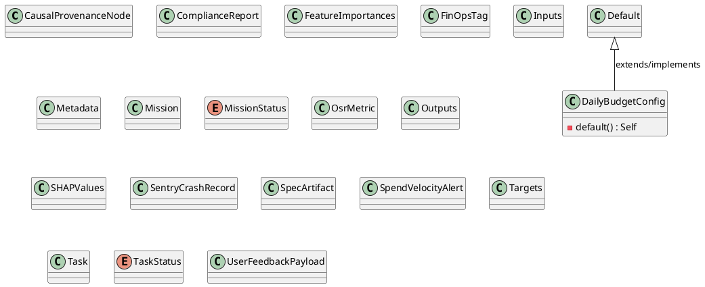
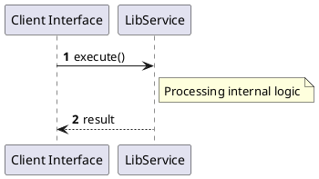

# File: lib.rs

**Source Path:** `crates/factory-core/src/lib.rs`

## Overview

### Purpose
Provides implementation for lib.rs.

### Responsibilities
* Handles logic related to lib.

### Dependencies
* chrono::{DateTime, Utc}, serde::{Deserialize, Serialize}, std::collections::HashMap, uuid::Uuid

### Imported modules
* None

### Exported classes
* CausalProvenanceNode, ComplianceReport, DailyBudgetConfig, FeatureImportances, FinOpsTag, Inputs, Metadata, Mission, OsrMetric, Outputs, SHAPValues, SentryCrashRecord, SpecArtifact, SpendVelocityAlert, Targets, Task, UserFeedbackPayload

### Exported interfaces
* None

### Exported functions
* None

## Public API

### Exported Classes / Structs / Interfaces

#### CausalProvenanceNode

**Overview:**
No description provided.

**Constructor:**

Default constructor.

**Attributes:**

* `ast_mutation_hash` (String): Purpose - Stores ast_mutation_hash data. Constraints - Valid String.
* `constitution_rule_id` (String): Purpose - Stores constitution_rule_id data. Constraints - Valid String.
* `is_valid` (bool): Purpose - Stores is_valid data. Constraints - Valid bool.
* `issue_id` (String): Purpose - Stores issue_id data. Constraints - Valid String.
* `node_id` (String): Purpose - Stores node_id data. Constraints - Valid String.
* `plan_id` (String): Purpose - Stores plan_id data. Constraints - Valid String.
* `spec_id` (String): Purpose - Stores spec_id data. Constraints - Valid String.
* `test_result` (String): Purpose - Stores test_result data. Constraints - Valid String.

**Public Methods:**

None.

**Private Methods:**

None.

#### ComplianceReport

**Overview:**
No description provided.

**Constructor:**

Default constructor.

**Attributes:**

* `findings` (Vec<String>): Purpose - Stores findings data. Constraints - Valid Vec<String>.
* `report_id` (Uuid): Purpose - Stores report_id data. Constraints - Valid Uuid.
* `status` (String): Purpose - Stores status data. Constraints - Valid String.

**Public Methods:**

None.

**Private Methods:**

None.

#### DailyBudgetConfig

**Overview:**
No description provided.

**Constructor:**

Default constructor.

**Attributes:**

* `hardstop_threshold_ratio` (f64): Purpose - Stores hardstop_threshold_ratio data. Constraints - Valid f64.
* `max_daily_budget_usd` (f64): Purpose - Stores max_daily_budget_usd data. Constraints - Valid f64.
* `velocity_threshold_usd_per_min` (f64): Purpose - Stores velocity_threshold_usd_per_min data. Constraints - Valid f64.

**Public Methods:**

None.

**Private Methods:**

* `default() -> Self`: Internal helper logic.

#### FeatureImportances

**Overview:**
No description provided.

**Constructor:**

Default constructor.

**Attributes:**

* `feature` (String): Purpose - Stores feature data. Constraints - Valid String.
* `importance` (f32): Purpose - Stores importance data. Constraints - Valid f32.

**Public Methods:**

None.

**Private Methods:**

None.

#### FinOpsTag

**Overview:**
No description provided.

**Constructor:**

Default constructor.

**Attributes:**

* `cost_center` (String): Purpose - Stores cost_center data. Constraints - Valid String.
* `environment` (String): Purpose - Stores environment data. Constraints - Valid String.
* `epic` (String): Purpose - Stores epic data. Constraints - Valid String.
* `microservice` (String): Purpose - Stores microservice data. Constraints - Valid String.
* `team` (String): Purpose - Stores team data. Constraints - Valid String.

**Public Methods:**

None.

**Private Methods:**

None.

#### Inputs

**Overview:**
No description provided.

**Constructor:**

Default constructor.

**Attributes:**

* `input` (String): Purpose - Stores input data. Constraints - Valid String.

**Public Methods:**

None.

**Private Methods:**

None.

#### Metadata

**Overview:**
No description provided.

**Constructor:**

Default constructor.

**Attributes:**

* `extra` (HashMap<String, serde_json::Value>): Purpose - Stores extra data. Constraints - Valid HashMap<String, serde_json::Value>.
* `model_version` (String): Purpose - Stores model_version data. Constraints - Valid String.
* `timestamp` (DateTime<Utc>): Purpose - Stores timestamp data. Constraints - Valid DateTime<Utc>.

**Public Methods:**

None.

**Private Methods:**

None.

#### Mission

**Overview:**
No description provided.

**Constructor:**

Default constructor.

**Attributes:**

* `created_at` (DateTime<Utc>): Purpose - Stores created_at data. Constraints - Valid DateTime<Utc>.
* `description` (String): Purpose - Stores description data. Constraints - Valid String.
* `id` (Uuid): Purpose - Stores id data. Constraints - Valid Uuid.
* `name` (String): Purpose - Stores name data. Constraints - Valid String.
* `status` (MissionStatus): Purpose - Stores status data. Constraints - Valid MissionStatus.
* `tasks` (Vec<Task>): Purpose - Stores tasks data. Constraints - Valid Vec<Task>.

**Public Methods:**

None.

**Private Methods:**

None.

#### MissionStatus

**Overview:**
No description provided.

**Constructor:**

Default constructor.

**Attributes:**

None.

**Public Methods:**

None.

**Private Methods:**

None.

#### OsrMetric

**Overview:**
No description provided.

**Constructor:**

Default constructor.

**Attributes:**

* `mission_id` (String): Purpose - Stores mission_id data. Constraints - Valid String.
* `osr_value` (f32): Purpose - Stores osr_value data. Constraints - Valid f32.
* `timestamp` (DateTime<Utc>): Purpose - Stores timestamp data. Constraints - Valid DateTime<Utc>.
* `wiki_commit_sha` (String): Purpose - Stores wiki_commit_sha data. Constraints - Valid String.

**Public Methods:**

None.

**Private Methods:**

None.

#### Outputs

**Overview:**
No description provided.

**Constructor:**

Default constructor.

**Attributes:**

* `metadata` (Metadata): Purpose - Stores metadata data. Constraints - Valid Metadata.
* `response` (String): Purpose - Stores response data. Constraints - Valid String.

**Public Methods:**

None.

**Private Methods:**

None.

#### SHAPValues

**Overview:**
No description provided.

**Constructor:**

Default constructor.

**Attributes:**

* `explanation` (String): Purpose - Stores explanation data. Constraints - Valid String.
* `sample` (String): Purpose - Stores sample data. Constraints - Valid String.
* `shap_value` (f32): Purpose - Stores shap_value data. Constraints - Valid f32.

**Public Methods:**

None.

**Private Methods:**

None.

#### SentryCrashRecord

**Overview:**
No description provided.

**Constructor:**

Default constructor.

**Attributes:**

* `culprit` (Option<String>): Purpose - Stores culprit data. Constraints - Valid Option<String>.
* `event_id` (String): Purpose - Stores event_id data. Constraints - Valid String.
* `level` (String): Purpose - Stores level data. Constraints - Valid String.
* `message` (String): Purpose - Stores message data. Constraints - Valid String.

**Public Methods:**

None.

**Private Methods:**

None.

#### SpecArtifact

**Overview:**
No description provided.

**Constructor:**

Default constructor.

**Attributes:**

* `data` (serde_json::Value): Purpose - Stores data data. Constraints - Valid serde_json::Value.
* `id` (Uuid): Purpose - Stores id data. Constraints - Valid Uuid.
* `name` (String): Purpose - Stores name data. Constraints - Valid String.

**Public Methods:**

None.

**Private Methods:**

None.

#### SpendVelocityAlert

**Overview:**
No description provided.

**Constructor:**

Default constructor.

**Attributes:**

* `current_spend` (f64): Purpose - Stores current_spend data. Constraints - Valid f64.
* `spend_velocity` (f64): Purpose - Stores spend_velocity data. Constraints - Valid f64.
* `threshold` (f64): Purpose - Stores threshold data. Constraints - Valid f64.
* `timestamp` (DateTime<Utc>): Purpose - Stores timestamp data. Constraints - Valid DateTime<Utc>.

**Public Methods:**

None.

**Private Methods:**

None.

#### Targets

**Overview:**
No description provided.

**Constructor:**

Default constructor.

**Attributes:**

* `input_target` (String): Purpose - Stores input_target data. Constraints - Valid String.
* `response` (String): Purpose - Stores response data. Constraints - Valid String.

**Public Methods:**

None.

**Private Methods:**

None.

#### Task

**Overview:**
No description provided.

**Constructor:**

Default constructor.

**Attributes:**

* `assigned_agent` (Option<String>): Purpose - Stores assigned_agent data. Constraints - Valid Option<String>.
* `dependencies` (Vec<Uuid>): Purpose - Stores dependencies data. Constraints - Valid Vec<Uuid>.
* `description` (String): Purpose - Stores description data. Constraints - Valid String.
* `id` (Uuid): Purpose - Stores id data. Constraints - Valid Uuid.
* `mission_id` (Uuid): Purpose - Stores mission_id data. Constraints - Valid Uuid.
* `status` (TaskStatus): Purpose - Stores status data. Constraints - Valid TaskStatus.

**Public Methods:**

None.

**Private Methods:**

None.

#### TaskStatus

**Overview:**
No description provided.

**Constructor:**

Default constructor.

**Attributes:**

None.

**Public Methods:**

None.

**Private Methods:**

None.

#### UserFeedbackPayload

**Overview:**
No description provided.

**Constructor:**

Default constructor.

**Attributes:**

* `feedback_text` (String): Purpose - Stores feedback_text data. Constraints - Valid String.
* `metadata` (Option<serde_json::Value>): Purpose - Stores metadata data. Constraints - Valid Option<serde_json::Value>.
* `sentiment` (String): Purpose - Stores sentiment data. Constraints - Valid String.
* `session_id` (Option<String>): Purpose - Stores session_id data. Constraints - Valid Option<String>.
* `user_id` (String): Purpose - Stores user_id data. Constraints - Valid String.

**Public Methods:**

None.

**Private Methods:**

None.

### Exported Functions

None.

## Internal architecture



## Execution flow & Sequence explanation




## Examples

```
// Example usage of lib.rs components
import { ... } from 'crates/factory-core/src/lib.rs';
```


## Cross References
* **Parent module:** `crates/factory-core/src`
* **Dependencies:** chrono::{DateTime, Utc}, serde::{Deserialize, Serialize}, std::collections::HashMap, uuid::Uuid
