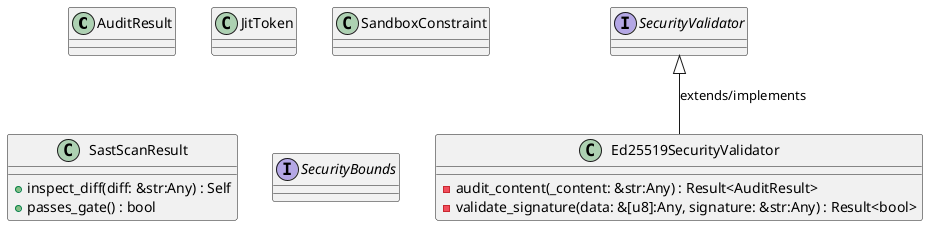
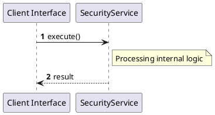

# File: security.rs

**Source Path:** `crates/factory-core/src/security.rs`

## Overview

### Purpose
Provides implementation for security.rs.

### Responsibilities
* Handles logic related to security.

### Dependencies
* async_trait::async_trait, base64::{engine::general_purpose::URL_SAFE_NO_PAD, Engine as _}, crate::error::Result, ed25519_dalek::{Signature, Verifier}, zeroize::Zeroize

### Imported modules
* None

### Exported classes
* AuditResult, Ed25519SecurityValidator, JitToken, SandboxConstraint, SastScanResult

### Exported interfaces
* SecurityBounds, SecurityValidator

### Exported functions
* None

## Public API

### Exported Classes / Structs / Interfaces

#### AuditResult

**Overview:**
No description provided.

**Constructor:**

Default constructor.

**Attributes:**

* `findings` (Vec<String>): Purpose - Stores findings data. Constraints - Valid Vec<String>.
* `is_safe` (bool): Purpose - Stores is_safe data. Constraints - Valid bool.

**Public Methods:**

None.

**Private Methods:**

None.

#### Ed25519SecurityValidator

**Overview:**
No description provided.

**Constructor:**

Default constructor.

**Attributes:**

* `public_key` (ed25519_dalek::VerifyingKey): Purpose - Stores public_key data. Constraints - Valid ed25519_dalek::VerifyingKey.

**Public Methods:**

None.

**Private Methods:**

* `audit_content(_content: &str (Any)) -> Result<AuditResult>`: Internal helper logic.
* `validate_signature(data: &[u8] (Any), signature: &str (Any)) -> Result<bool>`: Internal helper logic.

#### JitToken

**Overview:**
No description provided.

**Constructor:**

Default constructor.

**Attributes:**

* `token` (String): Purpose - Stores token data. Constraints - Valid String.

**Public Methods:**

None.

**Private Methods:**

None.

#### SandboxConstraint

**Overview:**
No description provided.

**Constructor:**

Default constructor.

**Attributes:**

* `max_cpu_cores` (f32): Purpose - Stores max_cpu_cores data. Constraints - Valid f32.
* `max_memory_mb` (u32): Purpose - Stores max_memory_mb data. Constraints - Valid u32.
* `network_egress_allowed` (bool): Purpose - Stores network_egress_allowed data. Constraints - Valid bool.

**Public Methods:**

None.

**Private Methods:**

None.

#### SastScanResult

**Overview:**
No description provided.

**Constructor:**

Default constructor.

**Attributes:**

* `critical_vulnerabilities_detected` (bool): Purpose - Stores critical_vulnerabilities_detected data. Constraints - Valid bool.
* `findings` (Vec<String>): Purpose - Stores findings data. Constraints - Valid Vec<String>.
* `is_safe` (bool): Purpose - Stores is_safe data. Constraints - Valid bool.
* `score` (f32): Purpose - Stores score data. Constraints - Valid f32.

**Public Methods:**

##### `inspect_diff(diff: &str (Any)) -> Self`

###### Description
No description provided.

###### Inputs
* `diff: &str`: type=Any, meaning=Input for diff: &str, valid values=Any valid Any, optional=No, default value=None

###### Output
Return type: Self
Semantic meaning: Result of inspect_diff
Possible null values: Conditional
Exceptions: None handled explicitly

###### Side Effects
Database updates: None
File operations: None
Network calls: None
Cache: None
State changes: Updates internal variables

###### Complexity
Time Complexity: O(1) mostly
Space Complexity: O(1) mostly

###### Example
```
let result = instance.inspect_diff();
```

##### `passes_gate() -> bool`

###### Description
No description provided.

###### Inputs
None.

###### Output
Return type: bool
Semantic meaning: Result of passes_gate
Possible null values: Conditional
Exceptions: None handled explicitly

###### Side Effects
Database updates: None
File operations: None
Network calls: None
Cache: None
State changes: Updates internal variables

###### Complexity
Time Complexity: O(1) mostly
Space Complexity: O(1) mostly

###### Example
```
let result = instance.passes_gate();
```

**Private Methods:**

None.

#### SecurityBounds

**Overview:**
No description provided.

**Constructor:**

Default constructor.

**Attributes:**

None.

**Public Methods:**

None.

**Private Methods:**

None.

#### SecurityValidator

**Overview:**
/// Trait for validating requests or agent responses.

**Constructor:**

Default constructor.

**Attributes:**

None.

**Public Methods:**

None.

**Private Methods:**

None.

### Exported Functions

None.

## Internal architecture



## Execution flow & Sequence explanation




## Examples

```
// Example usage of security.rs components
import { ... } from 'crates/factory-core/src/security.rs';
```


## Cross References
* **Parent module:** `crates/factory-core/src`
* **Dependencies:** async_trait::async_trait, base64::{engine::general_purpose::URL_SAFE_NO_PAD, Engine as _}, crate::error::Result, ed25519_dalek::{Signature, Verifier}, zeroize::Zeroize
