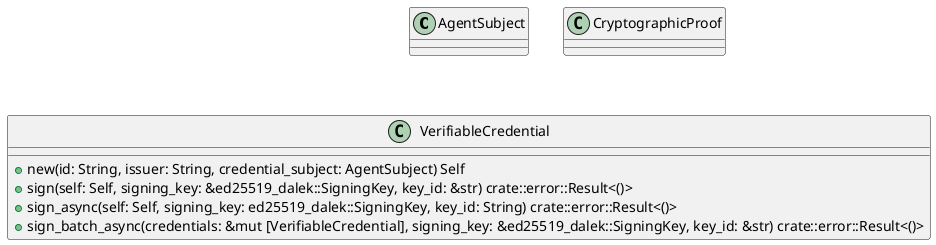
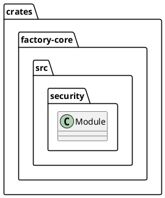
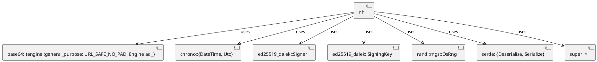
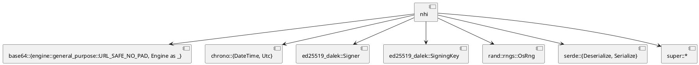
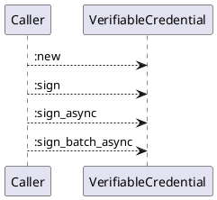
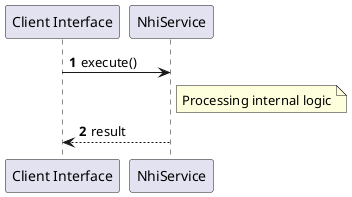

# File: nhi.rs

**Source Path:** `crates/factory-core/src/security/nhi.rs`

## Overview

### Purpose
Provides implementation for nhi.rs.

### Responsibilities
* Handles logic related to nhi.

### Dependencies
* base64::{engine::general_purpose::URL_SAFE_NO_PAD, Engine as _}, chrono::{DateTime, Utc}, ed25519_dalek::Signer, ed25519_dalek::SigningKey, rand::rngs::OsRng, serde::{Deserialize, Serialize}, super::*

### Imported modules
* None

### Exported classes
* AgentSubject, CryptographicProof, VerifiableCredential

### Exported interfaces
* None

### Exported functions
* None

## Public API

### Exported Classes / Structs / Interfaces

#### AgentSubject

**Overview:**
No description provided.

**Constructor:**

Default constructor.

**Attributes:**

* `allowed_namespaces` (Vec<String>): Purpose - Stores allowed_namespaces data. Constraints - Valid Vec<String>.
* `id` (String): Purpose - Stores id data. Constraints - Valid String.
* `roles` (Vec<String>): Purpose - Stores roles data. Constraints - Valid Vec<String>.

**Public Methods:**

None.

**Private Methods:**

None.

#### CryptographicProof

**Overview:**
No description provided.

**Constructor:**

Default constructor.

**Attributes:**

* `created` (DateTime<Utc>): Purpose - Stores created data. Constraints - Valid DateTime<Utc>.
* `jws` (String): Purpose - Stores jws data. Constraints - Valid String.
* `proof_purpose` (String): Purpose - Stores proof_purpose data. Constraints - Valid String.
* `proof_type` (String): Purpose - Stores proof_type data. Constraints - Valid String.
* `verification_method` (String): Purpose - Stores verification_method data. Constraints - Valid String.

**Public Methods:**

None.

**Private Methods:**

None.

#### VerifiableCredential

**Overview:**
No description provided.

**Constructor:**

##### `new(id (String), issuer (String), credential_subject (AgentSubject))`
Parameters: id (String), issuer (String), credential_subject (AgentSubject)
Dependencies: Inherited from context
Initialization: Sets up VerifiableCredential

**Attributes:**

* `context` (Vec<String>): Purpose - Stores context data. Constraints - Valid Vec<String>.
* `credential_subject` (AgentSubject): Purpose - Stores credential_subject data. Constraints - Valid AgentSubject.
* `credential_type` (Vec<String>): Purpose - Stores credential_type data. Constraints - Valid Vec<String>.
* `id` (String): Purpose - Stores id data. Constraints - Valid String.
* `issuance_date` (DateTime<Utc>): Purpose - Stores issuance_date data. Constraints - Valid DateTime<Utc>.
* `issuer` (String): Purpose - Stores issuer data. Constraints - Valid String.
* `proof` (Option<CryptographicProof>): Purpose - Stores proof data. Constraints - Valid Option<CryptographicProof>.

**Public Methods:**

##### `sign(self (Self), signing_key (&ed25519_dalek::SigningKey), key_id (&str)) -> crate::error::Result<()>`

###### Description
/// Generates a JWS for the credential and attaches it to the `proof` field.

###### Inputs
* `self`: type=Self, meaning=Input for self, valid values=Any valid Self, optional=No, default value=None
* `signing_key`: type=&ed25519_dalek::SigningKey, meaning=Input for signing_key, valid values=Any valid &ed25519_dalek::SigningKey, optional=No, default value=None
* `key_id`: type=&str, meaning=Input for key_id, valid values=Any valid &str, optional=No, default value=None

###### Output
Return type: crate::error::Result<()>
Semantic meaning: Result of sign
Possible null values: Conditional
Exceptions: None handled explicitly

###### Side Effects
Database updates: None
File operations: None
Network calls: None
Cache: None
State changes: Updates internal variables

###### Complexity
Time Complexity: O(1) mostly
Space Complexity: O(1) mostly

###### Example
```
let result = instance.sign();
```

##### `sign_async(self (Self), signing_key (ed25519_dalek::SigningKey), key_id (String)) -> crate::error::Result<()>`

###### Description
/// Asynchronously signs credentials without blocking the Tokio task executor.

###### Inputs
* `self`: type=Self, meaning=Input for self, valid values=Any valid Self, optional=No, default value=None
* `signing_key`: type=ed25519_dalek::SigningKey, meaning=Input for signing_key, valid values=Any valid ed25519_dalek::SigningKey, optional=No, default value=None
* `key_id`: type=String, meaning=Input for key_id, valid values=Any valid String, optional=No, default value=None

###### Output
Return type: crate::error::Result<()>
Semantic meaning: Result of sign_async
Possible null values: Conditional
Exceptions: None handled explicitly

###### Side Effects
Database updates: None
File operations: None
Network calls: None
Cache: None
State changes: Updates internal variables

###### Complexity
Time Complexity: O(1) mostly
Space Complexity: O(1) mostly

###### Example
```
let result = instance.sign_async();
```

##### `sign_batch_async(credentials (&mut [VerifiableCredential]), signing_key (&ed25519_dalek::SigningKey), key_id (&str)) -> crate::error::Result<()>`

###### Description
/// Asynchronously batch-signs multiple credentials concurrently.

###### Inputs
* `credentials`: type=&mut [VerifiableCredential], meaning=Input for credentials, valid values=Any valid &mut [VerifiableCredential], optional=No, default value=None
* `signing_key`: type=&ed25519_dalek::SigningKey, meaning=Input for signing_key, valid values=Any valid &ed25519_dalek::SigningKey, optional=No, default value=None
* `key_id`: type=&str, meaning=Input for key_id, valid values=Any valid &str, optional=No, default value=None

###### Output
Return type: crate::error::Result<()>
Semantic meaning: Result of sign_batch_async
Possible null values: Conditional
Exceptions: None handled explicitly

###### Side Effects
Database updates: None
File operations: None
Network calls: None
Cache: None
State changes: Updates internal variables

###### Complexity
Time Complexity: O(1) mostly
Space Complexity: O(1) mostly

###### Example
```
let result = instance.sign_batch_async();
```

**Private Methods:**

None.

### Exported Functions

None.

## Internal architecture



## Package Diagram



## Component Diagram



## Dependency Graph



## Call Graph



## Execution flow & Sequence explanation



## Examples

```
// Example usage of nhi.rs components
import { ... } from 'crates/factory-core/src/security/nhi.rs';
```

## Cross References
* **Parent module:** `crates/factory-core/src/security`
* **Dependencies:** base64::{engine::general_purpose::URL_SAFE_NO_PAD, Engine as _}, chrono::{DateTime, Utc}, ed25519_dalek::Signer, ed25519_dalek::SigningKey, rand::rngs::OsRng, serde::{Deserialize, Serialize}, super::*
