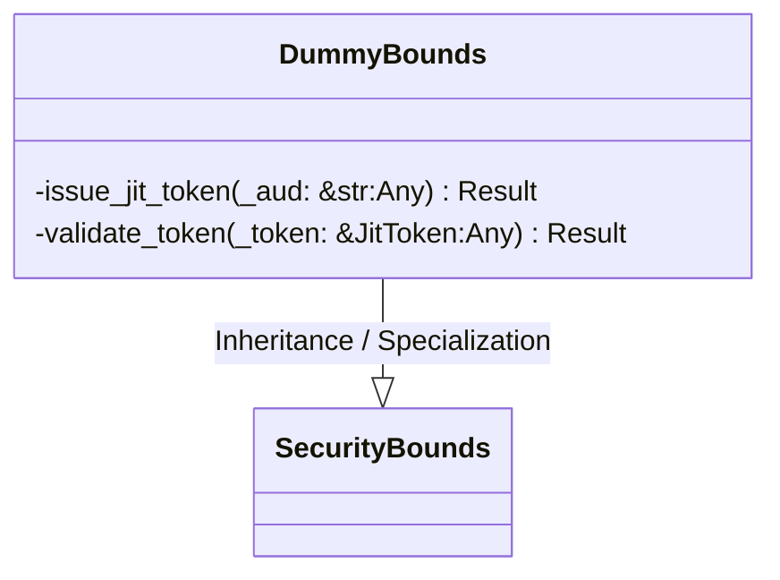
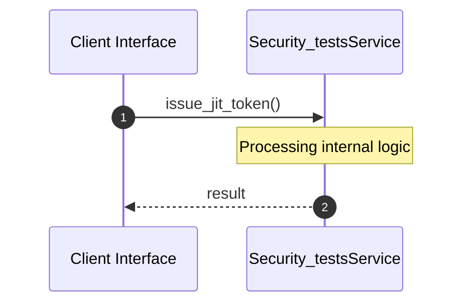
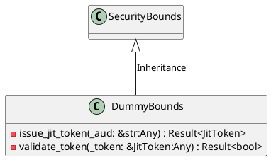
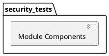
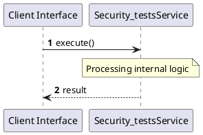
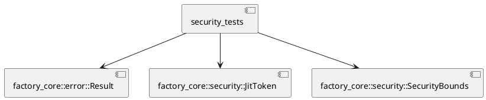
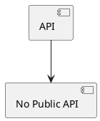

# File: security_tests.rs

**Source Path:** `crates/factory-core/tests/security_tests.rs`

## Overview

### Purpose
Provides implementation for security_tests.rs.

### Responsibilities
* Handles logic related to security_tests.

### Main Workflow
* Initialization and execution of security_tests logic.

### Dependencies
* factory_core::error::Result, factory_core::security::JitToken, factory_core::security::SecurityBounds

### Imported modules
* None

### Exported classes
* DummyBounds

### Exported interfaces
* None

### Exported functions
* None

## Public API

### Exported Classes / Structs / Interfaces

#### DummyBounds

**Overview:**
Why it exists:
Provides capabilities related to DummyBounds.

What business capability it provides:
Supports core domain concepts.

How it collaborates with other classes:
Works with related entities to process logic.

**Constructor:**

Default constructor.

**Attributes:**

None.

**Public Methods:**

None.

**Private Methods:**

* `issue_jit_token(_aud: &str (Any)) -> Result<JitToken>`: Internal helper logic.
* `validate_token(_token: &JitToken (Any)) -> Result<bool>`: Internal helper logic.

### Exported Functions

None.

## Internal architecture



## Execution flow & Sequence explanation



## UML

### Class Diagram


### Package Diagram


### Sequence Diagram


### Component Diagram
```plantuml
@startuml
component "security_tests" as comp
component "factory_core::error::Result" as factory_core::error::Result
comp --> factory_core::error::Result
component "factory_core::security::JitToken" as factory_core::security::JitToken
comp --> factory_core::security::JitToken
component "factory_core::security::SecurityBounds" as factory_core::security::SecurityBounds
comp --> factory_core::security::SecurityBounds
@enduml

```

### Dependency Graph


### Call Graph


## Examples

```
// Example usage of security_tests.rs components
import { ... } from 'crates/factory-core/tests/security_tests.rs';
```

## Cross References
* **Parent module:** `crates/factory-core/tests`
* **Dependencies:** factory_core::error::Result, factory_core::security::JitToken, factory_core::security::SecurityBounds
