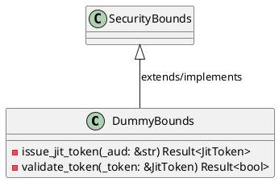
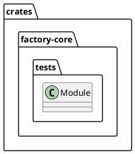
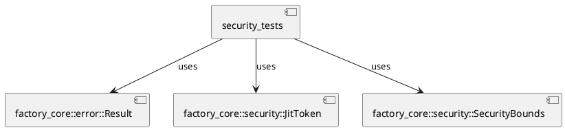
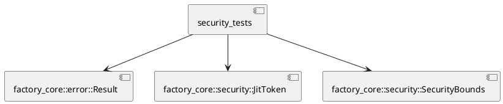
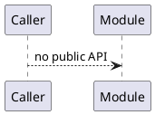
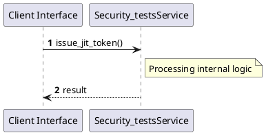

# File: security_tests.rs

**Source Path:** `crates/factory-core/tests/security_tests.rs`

## Overview

### Purpose
Provides implementation for security_tests.rs.

### Responsibilities
* Handles logic related to security_tests.

### Dependencies
* factory_core::error::Result, factory_core::security::JitToken, factory_core::security::SecurityBounds

### Imported modules
* None

### Exported classes
* DummyBounds

### Exported interfaces
* None

### Exported functions
* None

## Public API

### Exported Classes / Structs / Interfaces

#### DummyBounds

**Overview:**
No description provided.

**Constructor:**

Default constructor.

**Attributes:**

None.

**Public Methods:**

None.

**Private Methods:**

* `issue_jit_token(_aud (&str)) -> Result<JitToken>`: Internal helper logic.
* `validate_token(_token (&JitToken)) -> Result<bool>`: Internal helper logic.

### Exported Functions

None.

## Internal architecture



## Package Diagram



## Component Diagram



## Dependency Graph



## Call Graph



## Execution flow & Sequence explanation



## Examples

```
// Example usage of security_tests.rs components
import { ... } from 'crates/factory-core/tests/security_tests.rs';
```

## Cross References
* **Parent module:** `crates/factory-core/tests`
* **Dependencies:** factory_core::error::Result, factory_core::security::JitToken, factory_core::security::SecurityBounds
