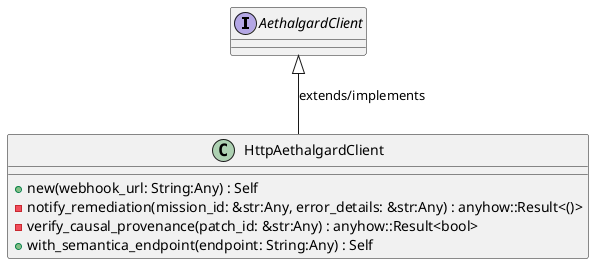
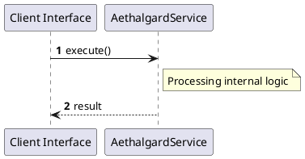

# File: aethalgard.rs

**Source Path:** `crates/factory-infrastructure/src/aethalgard.rs`

## Overview

### Purpose
Provides implementation for aethalgard.rs.

### Responsibilities
* Handles logic related to aethalgard.

### Dependencies
* async_trait::async_trait, crate::semantica::SemanticaClient, serde_json::json

### Imported modules
* None

### Exported classes
* HttpAethalgardClient

### Exported interfaces
* AethalgardClient

### Exported functions
* None

## Public API

### Exported Classes / Structs / Interfaces

#### AethalgardClient

**Overview:**
No description provided.

**Constructor:**

Default constructor.

**Attributes:**

None.

**Public Methods:**

None.

**Private Methods:**

None.

#### HttpAethalgardClient

**Overview:**
No description provided.

**Constructor:**

##### `new(webhook_url: String (Any))`
Parameters: webhook_url: String (Any)
Dependencies: Inherited from context
Initialization: Sets up HttpAethalgardClient

**Attributes:**

* `client` (reqwest::Client): Purpose - Stores client data. Constraints - Valid reqwest::Client.
* `semantica_endpoint` (Option<String>): Purpose - Stores semantica_endpoint data. Constraints - Valid Option<String>.
* `webhook_url` (String): Purpose - Stores webhook_url data. Constraints - Valid String.

**Public Methods:**

##### `with_semantica_endpoint(endpoint: String (Any)) -> Self`

###### Description
No description provided.

###### Inputs
* `endpoint: String`: type=Any, meaning=Input for endpoint: String, valid values=Any valid Any, optional=No, default value=None

###### Output
Return type: Self
Semantic meaning: Result of with_semantica_endpoint
Possible null values: Conditional
Exceptions: None handled explicitly

###### Side Effects
Database updates: None
File operations: None
Network calls: None
Cache: None
State changes: Updates internal variables

###### Complexity
Time Complexity: O(1) mostly
Space Complexity: O(1) mostly

###### Example
```
let result = instance.with_semantica_endpoint();
```

**Private Methods:**

* `notify_remediation(mission_id: &str (Any), error_details: &str (Any)) -> anyhow::Result<()>`: Internal helper logic.
* `verify_causal_provenance(patch_id: &str (Any)) -> anyhow::Result<bool>`: Internal helper logic.

### Exported Functions

None.

## Internal architecture



## Execution flow & Sequence explanation




## Examples

```
// Example usage of aethalgard.rs components
import { ... } from 'crates/factory-infrastructure/src/aethalgard.rs';
```


## Cross References
* **Parent module:** `crates/factory-infrastructure/src`
* **Dependencies:** async_trait::async_trait, crate::semantica::SemanticaClient, serde_json::json
