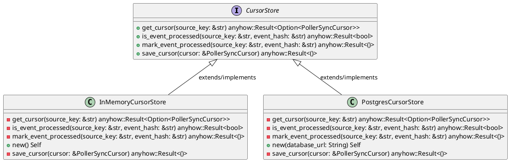
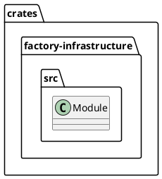
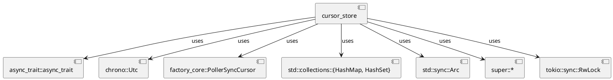
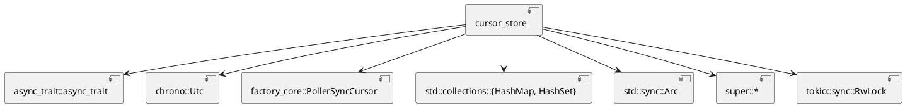
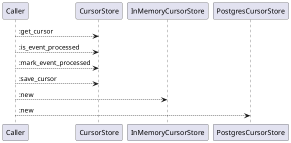
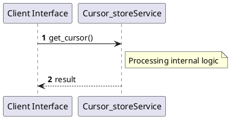

# File: cursor_store.rs

**Source Path:** `crates/factory-infrastructure/src/cursor_store.rs`

## Overview

### Purpose
Provides implementation for cursor_store.rs.

### Responsibilities
* Handles logic related to cursor_store.

### Dependencies
* async_trait::async_trait, chrono::Utc, factory_core::PollerSyncCursor, std::collections::{HashMap, HashSet}, std::sync::Arc, super::*, tokio::sync::RwLock

### Imported modules
* None

### Exported classes
* InMemoryCursorStore, PostgresCursorStore

### Exported interfaces
* CursorStore

### Exported functions
* None

## Public API

### Exported Classes / Structs / Interfaces

#### CursorStore

**Overview:**
No description provided.

**Constructor:**

Default constructor.

**Attributes:**

None.

**Public Methods:**

##### `get_cursor(source_key (&str)) -> anyhow::Result<Option<PollerSyncCursor>>`

###### Description
No description provided.

###### Inputs
* `source_key`: type=&str, meaning=Input for source_key, valid values=Any valid &str, optional=No, default value=None

###### Output
Return type: anyhow::Result<Option<PollerSyncCursor>>
Semantic meaning: Result of get_cursor
Possible null values: Conditional
Exceptions: None handled explicitly

###### Side Effects
Database updates: None
File operations: None
Network calls: None
Cache: None
State changes: Updates internal variables

###### Complexity
Time Complexity: O(1) mostly
Space Complexity: O(1) mostly

###### Example
```
let result = instance.get_cursor();
```

##### `is_event_processed(source_key (&str), event_hash (&str)) -> anyhow::Result<bool>`

###### Description
No description provided.

###### Inputs
* `source_key`: type=&str, meaning=Input for source_key, valid values=Any valid &str, optional=No, default value=None
* `event_hash`: type=&str, meaning=Input for event_hash, valid values=Any valid &str, optional=No, default value=None

###### Output
Return type: anyhow::Result<bool>
Semantic meaning: Result of is_event_processed
Possible null values: Conditional
Exceptions: None handled explicitly

###### Side Effects
Database updates: None
File operations: None
Network calls: None
Cache: None
State changes: Updates internal variables

###### Complexity
Time Complexity: O(1) mostly
Space Complexity: O(1) mostly

###### Example
```
let result = instance.is_event_processed();
```

##### `mark_event_processed(source_key (&str), event_hash (&str)) -> anyhow::Result<()>`

###### Description
No description provided.

###### Inputs
* `source_key`: type=&str, meaning=Input for source_key, valid values=Any valid &str, optional=No, default value=None
* `event_hash`: type=&str, meaning=Input for event_hash, valid values=Any valid &str, optional=No, default value=None

###### Output
Return type: anyhow::Result<()>
Semantic meaning: Result of mark_event_processed
Possible null values: Conditional
Exceptions: None handled explicitly

###### Side Effects
Database updates: None
File operations: None
Network calls: None
Cache: None
State changes: Updates internal variables

###### Complexity
Time Complexity: O(1) mostly
Space Complexity: O(1) mostly

###### Example
```
let result = instance.mark_event_processed();
```

##### `save_cursor(cursor (&PollerSyncCursor)) -> anyhow::Result<()>`

###### Description
No description provided.

###### Inputs
* `cursor`: type=&PollerSyncCursor, meaning=Input for cursor, valid values=Any valid &PollerSyncCursor, optional=No, default value=None

###### Output
Return type: anyhow::Result<()>
Semantic meaning: Result of save_cursor
Possible null values: Conditional
Exceptions: None handled explicitly

###### Side Effects
Database updates: None
File operations: None
Network calls: None
Cache: None
State changes: Updates internal variables

###### Complexity
Time Complexity: O(1) mostly
Space Complexity: O(1) mostly

###### Example
```
let result = instance.save_cursor();
```

**Private Methods:**

None.

#### InMemoryCursorStore

**Overview:**
No description provided.

**Constructor:**

##### `new()`
Parameters:
Dependencies: Inherited from context
Initialization: Sets up InMemoryCursorStore

**Attributes:**

* `cursors` (Arc<RwLock<HashMap<String, PollerSyncCursor>>>): Purpose - Stores cursors data. Constraints - Valid Arc<RwLock<HashMap<String, PollerSyncCursor>>>.
* `processed_events` (Arc<RwLock<HashMap<String, HashSet<String>>>>): Purpose - Stores processed_events data. Constraints - Valid Arc<RwLock<HashMap<String, HashSet<String>>>>.

**Public Methods:**

None.

**Private Methods:**

* `get_cursor(source_key (&str)) -> anyhow::Result<Option<PollerSyncCursor>>`: Internal helper logic.
* `is_event_processed(source_key (&str), event_hash (&str)) -> anyhow::Result<bool>`: Internal helper logic.
* `mark_event_processed(source_key (&str), event_hash (&str)) -> anyhow::Result<()>`: Internal helper logic.
* `save_cursor(cursor (&PollerSyncCursor)) -> anyhow::Result<()>`: Internal helper logic.

#### PostgresCursorStore

**Overview:**
No description provided.

**Constructor:**

##### `new(database_url (String))`
Parameters: database_url (String)
Dependencies: Inherited from context
Initialization: Sets up PostgresCursorStore

**Attributes:**

* `database_url` (String): Purpose - Stores database_url data. Constraints - Valid String.
* `fallback_store` (InMemoryCursorStore): Purpose - Stores fallback_store data. Constraints - Valid InMemoryCursorStore.

**Public Methods:**

None.

**Private Methods:**

* `get_cursor(source_key (&str)) -> anyhow::Result<Option<PollerSyncCursor>>`: Internal helper logic.
* `is_event_processed(source_key (&str), event_hash (&str)) -> anyhow::Result<bool>`: Internal helper logic.
* `mark_event_processed(source_key (&str), event_hash (&str)) -> anyhow::Result<()>`: Internal helper logic.
* `save_cursor(cursor (&PollerSyncCursor)) -> anyhow::Result<()>`: Internal helper logic.

### Exported Functions

None.

## Internal architecture



## Package Diagram



## Component Diagram



## Dependency Graph



## Call Graph



## Execution flow & Sequence explanation



## Examples

```
// Example usage of cursor_store.rs components
import { ... } from 'crates/factory-infrastructure/src/cursor_store.rs';
```

## Cross References
* **Parent module:** `crates/factory-infrastructure/src`
* **Dependencies:** async_trait::async_trait, chrono::Utc, factory_core::PollerSyncCursor, std::collections::{HashMap, HashSet}, std::sync::Arc, super::*, tokio::sync::RwLock
