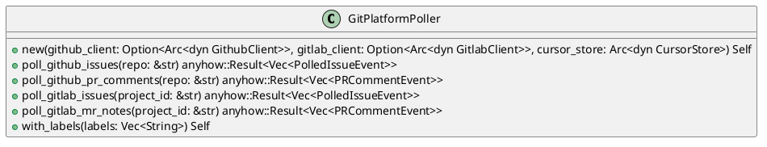
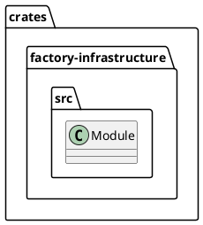
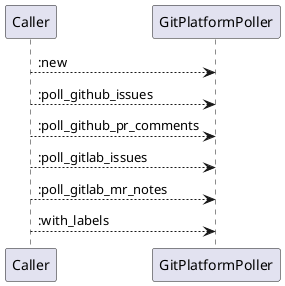
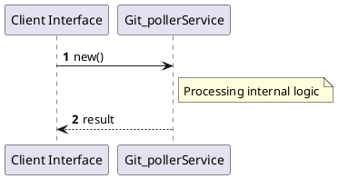

# File: git_poller.rs

**Source Path:** `crates/factory-infrastructure/src/git_poller.rs`

## Overview

### Purpose
Provides implementation for git_poller.rs.

### Responsibilities
* Handles logic related to git_poller.

### Dependencies
* chrono::Utc, crate::cursor_store::CursorStore, crate::cursor_store::InMemoryCursorStore, crate::github::GithubClient, crate::github::{
        GithubComment, GithubIssue, GithubPullRequest, GithubUser, MockGithubClient,
    }, crate::gitlab::GitlabClient, crate::gitlab::{
        GitlabAuthor, GitlabIssue, GitlabMergeRequest, GitlabNote, MockGitlabClient,
    }, factory_core::{PRCommentEvent, PRDirective, PolledIssueEvent, PollerSyncCursor}, std::sync::Arc, super::*

### Imported modules
* None

### Exported classes
* GitPlatformPoller

### Exported interfaces
* None

### Exported functions
* None

## Public API

### Exported Classes / Structs / Interfaces

#### GitPlatformPoller

**Overview:**
No description provided.

**Constructor:**

##### `new(github_client (Option<Arc<dyn GithubClient>>), gitlab_client (Option<Arc<dyn GitlabClient>>), cursor_store (Arc<dyn CursorStore>))`
Parameters: github_client (Option<Arc<dyn GithubClient>>), gitlab_client (Option<Arc<dyn GitlabClient>>), cursor_store (Arc<dyn CursorStore>)
Dependencies: Inherited from context
Initialization: Sets up GitPlatformPoller

**Attributes:**

* `cursor_store` (Arc<dyn CursorStore>): Purpose - Stores cursor_store data. Constraints - Valid Arc<dyn CursorStore>.
* `github_client` (Option<Arc<dyn GithubClient>>): Purpose - Stores github_client data. Constraints - Valid Option<Arc<dyn GithubClient>>.
* `gitlab_client` (Option<Arc<dyn GitlabClient>>): Purpose - Stores gitlab_client data. Constraints - Valid Option<Arc<dyn GitlabClient>>.
* `required_issue_labels` (Vec<String>): Purpose - Stores required_issue_labels data. Constraints - Valid Vec<String>.

**Public Methods:**

##### `poll_github_issues(repo (&str)) -> anyhow::Result<Vec<PolledIssueEvent>>`

###### Description
/// Polls GitHub repository for new/updated issues with control labels.

###### Inputs
* `repo`: type=&str, meaning=Input for repo, valid values=Any valid &str, optional=No, default value=None

###### Output
Return type: anyhow::Result<Vec<PolledIssueEvent>>
Semantic meaning: Result of poll_github_issues
Possible null values: Conditional
Exceptions: None handled explicitly

###### Side Effects
Database updates: None
File operations: None
Network calls: None
Cache: None
State changes: Updates internal variables

###### Complexity
Time Complexity: O(1) mostly
Space Complexity: O(1) mostly

###### Example
```
let result = instance.poll_github_issues();
```

##### `poll_github_pr_comments(repo (&str)) -> anyhow::Result<Vec<PRCommentEvent>>`

###### Description
/// Polls GitHub repository active PRs for directive comments.

###### Inputs
* `repo`: type=&str, meaning=Input for repo, valid values=Any valid &str, optional=No, default value=None

###### Output
Return type: anyhow::Result<Vec<PRCommentEvent>>
Semantic meaning: Result of poll_github_pr_comments
Possible null values: Conditional
Exceptions: None handled explicitly

###### Side Effects
Database updates: None
File operations: None
Network calls: None
Cache: None
State changes: Updates internal variables

###### Complexity
Time Complexity: O(1) mostly
Space Complexity: O(1) mostly

###### Example
```
let result = instance.poll_github_pr_comments();
```

##### `poll_gitlab_issues(project_id (&str)) -> anyhow::Result<Vec<PolledIssueEvent>>`

###### Description
/// Polls GitLab repository for new/updated issues.

###### Inputs
* `project_id`: type=&str, meaning=Input for project_id, valid values=Any valid &str, optional=No, default value=None

###### Output
Return type: anyhow::Result<Vec<PolledIssueEvent>>
Semantic meaning: Result of poll_gitlab_issues
Possible null values: Conditional
Exceptions: None handled explicitly

###### Side Effects
Database updates: None
File operations: None
Network calls: None
Cache: None
State changes: Updates internal variables

###### Complexity
Time Complexity: O(1) mostly
Space Complexity: O(1) mostly

###### Example
```
let result = instance.poll_gitlab_issues();
```

##### `poll_gitlab_mr_notes(project_id (&str)) -> anyhow::Result<Vec<PRCommentEvent>>`

###### Description
/// Polls GitLab merge requests for comments/notes with directives.

###### Inputs
* `project_id`: type=&str, meaning=Input for project_id, valid values=Any valid &str, optional=No, default value=None

###### Output
Return type: anyhow::Result<Vec<PRCommentEvent>>
Semantic meaning: Result of poll_gitlab_mr_notes
Possible null values: Conditional
Exceptions: None handled explicitly

###### Side Effects
Database updates: None
File operations: None
Network calls: None
Cache: None
State changes: Updates internal variables

###### Complexity
Time Complexity: O(1) mostly
Space Complexity: O(1) mostly

###### Example
```
let result = instance.poll_gitlab_mr_notes();
```

##### `with_labels(labels (Vec<String>)) -> Self`

###### Description
No description provided.

###### Inputs
* `labels`: type=Vec<String>, meaning=Input for labels, valid values=Any valid Vec<String>, optional=No, default value=None

###### Output
Return type: Self
Semantic meaning: Result of with_labels
Possible null values: Conditional
Exceptions: None handled explicitly

###### Side Effects
Database updates: None
File operations: None
Network calls: None
Cache: None
State changes: Updates internal variables

###### Complexity
Time Complexity: O(1) mostly
Space Complexity: O(1) mostly

###### Example
```
let result = instance.with_labels();
```

**Private Methods:**

None.

### Exported Functions

None.

## Internal architecture



## Package Diagram



## Component Diagram

```plantuml
@startuml
component "git_poller" as Main
component "chrono::Utc" as chrono__Utc
Main --> chrono__Utc : uses
component "crate::cursor_store::CursorStore" as crate__cursor_store__CursorStore
Main --> crate__cursor_store__CursorStore : uses
component "crate::cursor_store::InMemoryCursorStore" as crate__cursor_store__InMemoryCursorStore
Main --> crate__cursor_store__InMemoryCursorStore : uses
component "crate::github::GithubClient" as crate__github__GithubClient
Main --> crate__github__GithubClient : uses
component "crate::github::{
        GithubComment, GithubIssue, GithubPullRequest, GithubUser, MockGithubClient,
    }" as crate__github____________GithubComment__GithubIssue__GithubPullRequest__GithubUser__MockGithubClient_______
Main --> crate__github____________GithubComment__GithubIssue__GithubPullRequest__GithubUser__MockGithubClient_______ : uses
component "crate::gitlab::GitlabClient" as crate__gitlab__GitlabClient
Main --> crate__gitlab__GitlabClient : uses
component "crate::gitlab::{
        GitlabAuthor, GitlabIssue, GitlabMergeRequest, GitlabNote, MockGitlabClient,
    }" as crate__gitlab____________GitlabAuthor__GitlabIssue__GitlabMergeRequest__GitlabNote__MockGitlabClient_______
Main --> crate__gitlab____________GitlabAuthor__GitlabIssue__GitlabMergeRequest__GitlabNote__MockGitlabClient_______ : uses
component "factory_core::{PRCommentEvent, PRDirective, PolledIssueEvent, PollerSyncCursor}" as factory_core___PRCommentEvent__PRDirective__PolledIssueEvent__PollerSyncCursor_
Main --> factory_core___PRCommentEvent__PRDirective__PolledIssueEvent__PollerSyncCursor_ : uses
component "std::sync::Arc" as std__sync__Arc
Main --> std__sync__Arc : uses
component "super::*" as super___
Main --> super___ : uses
@enduml

```

## Dependency Graph

```plantuml
@startuml
[git_poller]
[git_poller] --> [chrono::Utc]
[git_poller] --> [crate::cursor_store::CursorStore]
[git_poller] --> [crate::cursor_store::InMemoryCursorStore]
[git_poller] --> [crate::github::GithubClient]
[git_poller] --> [crate::github::{
        GithubComment, GithubIssue, GithubPullRequest, GithubUser, MockGithubClient,
    }]
[git_poller] --> [crate::gitlab::GitlabClient]
[git_poller] --> [crate::gitlab::{
        GitlabAuthor, GitlabIssue, GitlabMergeRequest, GitlabNote, MockGitlabClient,
    }]
[git_poller] --> [factory_core::{PRCommentEvent, PRDirective, PolledIssueEvent, PollerSyncCursor}]
[git_poller] --> [std::sync::Arc]
[git_poller] --> [super::*]
@enduml

```

## Call Graph



## Execution flow & Sequence explanation



## Examples

```
// Example usage of git_poller.rs components
import { ... } from 'crates/factory-infrastructure/src/git_poller.rs';
```

## Cross References
* **Parent module:** `crates/factory-infrastructure/src`
* **Dependencies:** chrono::Utc, crate::cursor_store::CursorStore, crate::cursor_store::InMemoryCursorStore, crate::github::GithubClient, crate::github::{
        GithubComment, GithubIssue, GithubPullRequest, GithubUser, MockGithubClient,
    }, crate::gitlab::GitlabClient, crate::gitlab::{
        GitlabAuthor, GitlabIssue, GitlabMergeRequest, GitlabNote, MockGitlabClient,
    }, factory_core::{PRCommentEvent, PRDirective, PolledIssueEvent, PollerSyncCursor}, std::sync::Arc, super::*
