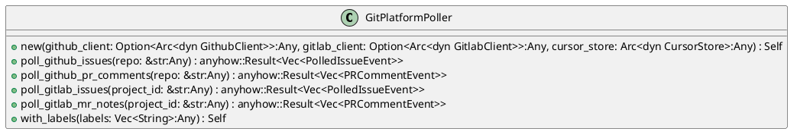
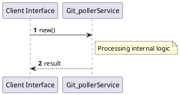

# File: git_poller.rs

**Source Path:** `crates/factory-infrastructure/src/git_poller.rs`

## Overview

### Purpose
Provides implementation for git_poller.rs.

### Responsibilities
* Handles logic related to git_poller.

### Dependencies
* chrono::Utc, crate::cursor_store::CursorStore, crate::cursor_store::InMemoryCursorStore, crate::github::GithubClient, crate::github::{
        GithubComment, GithubIssue, GithubPullRequest, GithubUser, MockGithubClient,
    }, crate::gitlab::GitlabClient, crate::gitlab::{
        GitlabAuthor, GitlabIssue, GitlabMergeRequest, GitlabNote, MockGitlabClient,
    }, factory_core::{PRCommentEvent, PRDirective, PolledIssueEvent, PollerSyncCursor}, std::sync::Arc, super::*

### Imported modules
* None

### Exported classes
* GitPlatformPoller

### Exported interfaces
* None

### Exported functions
* None

## Public API

### Exported Classes / Structs / Interfaces

#### GitPlatformPoller

**Overview:**
No description provided.

**Constructor:**

##### `new(github_client: Option<Arc<dyn GithubClient>> (Any), gitlab_client: Option<Arc<dyn GitlabClient>> (Any), cursor_store: Arc<dyn CursorStore> (Any))`
Parameters: github_client: Option<Arc<dyn GithubClient>> (Any), gitlab_client: Option<Arc<dyn GitlabClient>> (Any), cursor_store: Arc<dyn CursorStore> (Any)
Dependencies: Inherited from context
Initialization: Sets up GitPlatformPoller

**Attributes:**

* `cursor_store` (Arc<dyn CursorStore>): Purpose - Stores cursor_store data. Constraints - Valid Arc<dyn CursorStore>.
* `github_client` (Option<Arc<dyn GithubClient>>): Purpose - Stores github_client data. Constraints - Valid Option<Arc<dyn GithubClient>>.
* `gitlab_client` (Option<Arc<dyn GitlabClient>>): Purpose - Stores gitlab_client data. Constraints - Valid Option<Arc<dyn GitlabClient>>.
* `required_issue_labels` (Vec<String>): Purpose - Stores required_issue_labels data. Constraints - Valid Vec<String>.

**Public Methods:**

##### `poll_github_issues(repo: &str (Any)) -> anyhow::Result<Vec<PolledIssueEvent>>`

###### Description
/// Polls GitHub repository for new/updated issues with control labels.

###### Inputs
* `repo: &str`: type=Any, meaning=Input for repo: &str, valid values=Any valid Any, optional=No, default value=None

###### Output
Return type: anyhow::Result<Vec<PolledIssueEvent>>
Semantic meaning: Result of poll_github_issues
Possible null values: Conditional
Exceptions: None handled explicitly

###### Side Effects
Database updates: None
File operations: None
Network calls: None
Cache: None
State changes: Updates internal variables

###### Complexity
Time Complexity: O(1) mostly
Space Complexity: O(1) mostly

###### Example
```
let result = instance.poll_github_issues();
```

##### `poll_github_pr_comments(repo: &str (Any)) -> anyhow::Result<Vec<PRCommentEvent>>`

###### Description
/// Polls GitHub repository active PRs for directive comments.

###### Inputs
* `repo: &str`: type=Any, meaning=Input for repo: &str, valid values=Any valid Any, optional=No, default value=None

###### Output
Return type: anyhow::Result<Vec<PRCommentEvent>>
Semantic meaning: Result of poll_github_pr_comments
Possible null values: Conditional
Exceptions: None handled explicitly

###### Side Effects
Database updates: None
File operations: None
Network calls: None
Cache: None
State changes: Updates internal variables

###### Complexity
Time Complexity: O(1) mostly
Space Complexity: O(1) mostly

###### Example
```
let result = instance.poll_github_pr_comments();
```

##### `poll_gitlab_issues(project_id: &str (Any)) -> anyhow::Result<Vec<PolledIssueEvent>>`

###### Description
/// Polls GitLab repository for new/updated issues.

###### Inputs
* `project_id: &str`: type=Any, meaning=Input for project_id: &str, valid values=Any valid Any, optional=No, default value=None

###### Output
Return type: anyhow::Result<Vec<PolledIssueEvent>>
Semantic meaning: Result of poll_gitlab_issues
Possible null values: Conditional
Exceptions: None handled explicitly

###### Side Effects
Database updates: None
File operations: None
Network calls: None
Cache: None
State changes: Updates internal variables

###### Complexity
Time Complexity: O(1) mostly
Space Complexity: O(1) mostly

###### Example
```
let result = instance.poll_gitlab_issues();
```

##### `poll_gitlab_mr_notes(project_id: &str (Any)) -> anyhow::Result<Vec<PRCommentEvent>>`

###### Description
/// Polls GitLab merge requests for comments/notes with directives.

###### Inputs
* `project_id: &str`: type=Any, meaning=Input for project_id: &str, valid values=Any valid Any, optional=No, default value=None

###### Output
Return type: anyhow::Result<Vec<PRCommentEvent>>
Semantic meaning: Result of poll_gitlab_mr_notes
Possible null values: Conditional
Exceptions: None handled explicitly

###### Side Effects
Database updates: None
File operations: None
Network calls: None
Cache: None
State changes: Updates internal variables

###### Complexity
Time Complexity: O(1) mostly
Space Complexity: O(1) mostly

###### Example
```
let result = instance.poll_gitlab_mr_notes();
```

##### `with_labels(labels: Vec<String> (Any)) -> Self`

###### Description
No description provided.

###### Inputs
* `labels: Vec<String>`: type=Any, meaning=Input for labels: Vec<String>, valid values=Any valid Any, optional=No, default value=None

###### Output
Return type: Self
Semantic meaning: Result of with_labels
Possible null values: Conditional
Exceptions: None handled explicitly

###### Side Effects
Database updates: None
File operations: None
Network calls: None
Cache: None
State changes: Updates internal variables

###### Complexity
Time Complexity: O(1) mostly
Space Complexity: O(1) mostly

###### Example
```
let result = instance.with_labels();
```

**Private Methods:**

None.

### Exported Functions

None.

## Internal architecture



## Execution flow & Sequence explanation



## Examples

```
// Example usage of git_poller.rs components
import { ... } from 'crates/factory-infrastructure/src/git_poller.rs';
```

## Cross References
* **Parent module:** `crates/factory-infrastructure/src`
* **Dependencies:** chrono::Utc, crate::cursor_store::CursorStore, crate::cursor_store::InMemoryCursorStore, crate::github::GithubClient, crate::github::{
        GithubComment, GithubIssue, GithubPullRequest, GithubUser, MockGithubClient,
    }, crate::gitlab::GitlabClient, crate::gitlab::{
        GitlabAuthor, GitlabIssue, GitlabMergeRequest, GitlabNote, MockGitlabClient,
    }, factory_core::{PRCommentEvent, PRDirective, PolledIssueEvent, PollerSyncCursor}, std::sync::Arc, super::*
