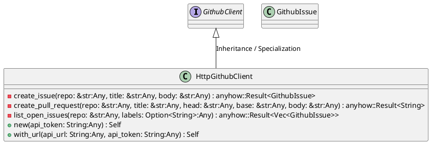
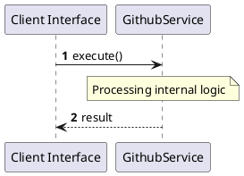

# File: github.rs

**Source Path:** `crates/factory-infrastructure/src/github.rs`

## Overview

### Purpose
Provides implementation for github.rs.

### Responsibilities
* Handles logic related to github.

### Dependencies
* async_trait::async_trait, serde::{Deserialize, Serialize}, super::*, wiremock::matchers::{header, method, path}, wiremock::{Mock, MockServer, ResponseTemplate}

### Imported modules
* None

### Exported classes
* GithubIssue, HttpGithubClient

### Exported interfaces
* GithubClient

### Exported functions
* None

## Public API

### Exported Classes / Structs / Interfaces

#### GithubClient

**Overview:**
Why it exists:
Provides capabilities related to GithubClient.

What business capability it provides:
Supports core domain concepts.

How it collaborates with other classes:
Works with related entities to process logic.

**Constructor:**

Default constructor.

**Attributes:**

None.

**Public Methods:**

None.

**Private Methods:**

None.

#### GithubIssue

**Overview:**
Why it exists:
Provides capabilities related to GithubIssue.

What business capability it provides:
Supports core domain concepts.

How it collaborates with other classes:
Works with related entities to process logic.

**Constructor:**

Default constructor.

**Attributes:**

* `body` (Option<String>): Purpose - Stores body data. Constraints - Valid Option<String>.
* `html_url` (String): Purpose - Stores html_url data. Constraints - Valid String.
* `id` (u64): Purpose - Stores id data. Constraints - Valid u64.
* `number` (u64): Purpose - Stores number data. Constraints - Valid u64.
* `title` (String): Purpose - Stores title data. Constraints - Valid String.

**Public Methods:**

None.

**Private Methods:**

None.

#### HttpGithubClient

**Overview:**
Why it exists:
Provides capabilities related to HttpGithubClient.

What business capability it provides:
Supports core domain concepts.

How it collaborates with other classes:
Works with related entities to process logic.

**Constructor:**

##### `new(api_token: String (Any))`
Parameters: api_token: String (Any)
Dependencies: Inherited from context
Initialization: Sets up HttpGithubClient

**Attributes:**

* `api_token` (String): Purpose - Stores api_token data. Constraints - Valid String.
* `api_url` (String): Purpose - Stores api_url data. Constraints - Valid String.
* `client` (reqwest::Client): Purpose - Stores client data. Constraints - Valid reqwest::Client.

**Public Methods:**

##### `with_url(api_url: String (Any), api_token: String (Any)) -> Self`

###### Description
Executes with_url.

###### Inputs
* `api_url: String`: type=Any, meaning=Input for api_url: String, valid values=Any valid Any, optional=No, default value=None
* `api_token: String`: type=Any, meaning=Input for api_token: String, valid values=Any valid Any, optional=No, default value=None

###### Output
Return type: Self
Semantic meaning: Result of with_url
Possible null values: Conditional
Exceptions: None handled explicitly

###### Side Effects
Database updates: None
File operations: None
Network calls: None
Cache: None
State changes: Updates internal variables

###### Complexity
Time Complexity: O(1) mostly
Space Complexity: O(1) mostly

###### Example
```
let result = instance.with_url();
```

**Private Methods:**

* `create_issue(repo: &str (Any), title: &str (Any), body: &str (Any)) -> anyhow::Result<GithubIssue>`: Internal helper logic.
* `create_pull_request(repo: &str (Any), title: &str (Any), head: &str (Any), base: &str (Any), body: &str (Any)) -> anyhow::Result<String>`: Internal helper logic.
* `list_open_issues(repo: &str (Any), labels: Option<String> (Any)) -> anyhow::Result<Vec<GithubIssue>>`: Internal helper logic.

### Exported Functions

None.

## Internal architecture



## Execution flow & Sequence explanation



## Examples

```
// Example usage of github.rs components
import { ... } from 'crates/factory-infrastructure/src/github.rs';
```

## Cross References
* **Parent module:** `crates/factory-infrastructure/src`
* **Dependencies:** async_trait::async_trait, serde::{Deserialize, Serialize}, super::*, wiremock::matchers::{header, method, path}, wiremock::{Mock, MockServer, ResponseTemplate}
