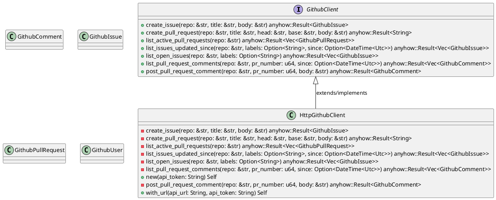
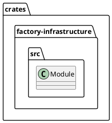
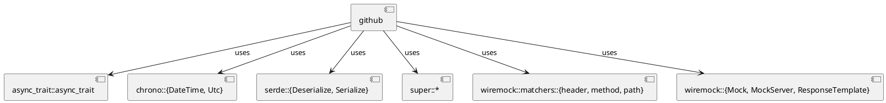
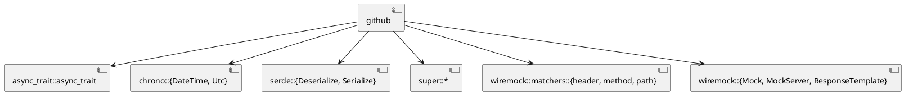
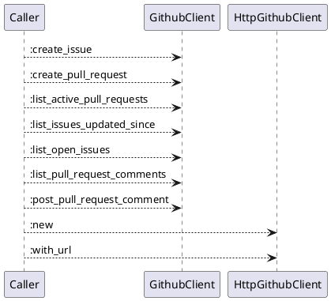
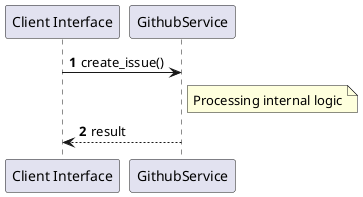

# File: github.rs

**Source Path:** `crates/factory-infrastructure/src/github.rs`

## Overview

### Purpose
Provides implementation for github.rs.

### Responsibilities
* Handles logic related to github.

### Dependencies
* async_trait::async_trait, chrono::{DateTime, Utc}, serde::{Deserialize, Serialize}, super::*, wiremock::matchers::{header, method, path}, wiremock::{Mock, MockServer, ResponseTemplate}

### Imported modules
* None

### Exported classes
* GithubComment, GithubIssue, GithubPullRequest, GithubUser, HttpGithubClient

### Exported interfaces
* GithubClient

### Exported functions
* None

## Public API

### Exported Classes / Structs / Interfaces

#### GithubClient

**Overview:**
No description provided.

**Constructor:**

Default constructor.

**Attributes:**

None.

**Public Methods:**

##### `create_issue(repo (&str), title (&str), body (&str)) -> anyhow::Result<GithubIssue>`

###### Description
No description provided.

###### Inputs
* `repo`: type=&str, meaning=Input for repo, valid values=Any valid &str, optional=No, default value=None
* `title`: type=&str, meaning=Input for title, valid values=Any valid &str, optional=No, default value=None
* `body`: type=&str, meaning=Input for body, valid values=Any valid &str, optional=No, default value=None

###### Output
Return type: anyhow::Result<GithubIssue>
Semantic meaning: Result of create_issue
Possible null values: Conditional
Exceptions: None handled explicitly

###### Side Effects
Database updates: None
File operations: None
Network calls: None
Cache: None
State changes: Updates internal variables

###### Complexity
Time Complexity: O(1) mostly
Space Complexity: O(1) mostly

###### Example
```
let result = instance.create_issue();
```

##### `create_pull_request(repo (&str), title (&str), head (&str), base (&str), body (&str)) -> anyhow::Result<String>`

###### Description
No description provided.

###### Inputs
* `repo`: type=&str, meaning=Input for repo, valid values=Any valid &str, optional=No, default value=None
* `title`: type=&str, meaning=Input for title, valid values=Any valid &str, optional=No, default value=None
* `head`: type=&str, meaning=Input for head, valid values=Any valid &str, optional=No, default value=None
* `base`: type=&str, meaning=Input for base, valid values=Any valid &str, optional=No, default value=None
* `body`: type=&str, meaning=Input for body, valid values=Any valid &str, optional=No, default value=None

###### Output
Return type: anyhow::Result<String>
Semantic meaning: Result of create_pull_request
Possible null values: Conditional
Exceptions: None handled explicitly

###### Side Effects
Database updates: None
File operations: None
Network calls: None
Cache: None
State changes: Updates internal variables

###### Complexity
Time Complexity: O(1) mostly
Space Complexity: O(1) mostly

###### Example
```
let result = instance.create_pull_request();
```

##### `list_active_pull_requests(repo (&str)) -> anyhow::Result<Vec<GithubPullRequest>>`

###### Description
No description provided.

###### Inputs
* `repo`: type=&str, meaning=Input for repo, valid values=Any valid &str, optional=No, default value=None

###### Output
Return type: anyhow::Result<Vec<GithubPullRequest>>
Semantic meaning: Result of list_active_pull_requests
Possible null values: Conditional
Exceptions: None handled explicitly

###### Side Effects
Database updates: None
File operations: None
Network calls: None
Cache: None
State changes: Updates internal variables

###### Complexity
Time Complexity: O(1) mostly
Space Complexity: O(1) mostly

###### Example
```
let result = instance.list_active_pull_requests();
```

##### `list_issues_updated_since(repo (&str), labels (Option<String>), since (Option<DateTime<Utc>>)) -> anyhow::Result<Vec<GithubIssue>>`

###### Description
No description provided.

###### Inputs
* `repo`: type=&str, meaning=Input for repo, valid values=Any valid &str, optional=No, default value=None
* `labels`: type=Option<String>, meaning=Input for labels, valid values=Any valid Option<String>, optional=No, default value=None
* `since`: type=Option<DateTime<Utc>>, meaning=Input for since, valid values=Any valid Option<DateTime<Utc>>, optional=No, default value=None

###### Output
Return type: anyhow::Result<Vec<GithubIssue>>
Semantic meaning: Result of list_issues_updated_since
Possible null values: Conditional
Exceptions: None handled explicitly

###### Side Effects
Database updates: None
File operations: None
Network calls: None
Cache: None
State changes: Updates internal variables

###### Complexity
Time Complexity: O(1) mostly
Space Complexity: O(1) mostly

###### Example
```
let result = instance.list_issues_updated_since();
```

##### `list_open_issues(repo (&str), labels (Option<String>)) -> anyhow::Result<Vec<GithubIssue>>`

###### Description
No description provided.

###### Inputs
* `repo`: type=&str, meaning=Input for repo, valid values=Any valid &str, optional=No, default value=None
* `labels`: type=Option<String>, meaning=Input for labels, valid values=Any valid Option<String>, optional=No, default value=None

###### Output
Return type: anyhow::Result<Vec<GithubIssue>>
Semantic meaning: Result of list_open_issues
Possible null values: Conditional
Exceptions: None handled explicitly

###### Side Effects
Database updates: None
File operations: None
Network calls: None
Cache: None
State changes: Updates internal variables

###### Complexity
Time Complexity: O(1) mostly
Space Complexity: O(1) mostly

###### Example
```
let result = instance.list_open_issues();
```

##### `list_pull_request_comments(repo (&str), pr_number (u64), since (Option<DateTime<Utc>>)) -> anyhow::Result<Vec<GithubComment>>`

###### Description
No description provided.

###### Inputs
* `repo`: type=&str, meaning=Input for repo, valid values=Any valid &str, optional=No, default value=None
* `pr_number`: type=u64, meaning=Input for pr_number, valid values=Any valid u64, optional=No, default value=None
* `since`: type=Option<DateTime<Utc>>, meaning=Input for since, valid values=Any valid Option<DateTime<Utc>>, optional=No, default value=None

###### Output
Return type: anyhow::Result<Vec<GithubComment>>
Semantic meaning: Result of list_pull_request_comments
Possible null values: Conditional
Exceptions: None handled explicitly

###### Side Effects
Database updates: None
File operations: None
Network calls: None
Cache: None
State changes: Updates internal variables

###### Complexity
Time Complexity: O(1) mostly
Space Complexity: O(1) mostly

###### Example
```
let result = instance.list_pull_request_comments();
```

##### `post_pull_request_comment(repo (&str), pr_number (u64), body (&str)) -> anyhow::Result<GithubComment>`

###### Description
No description provided.

###### Inputs
* `repo`: type=&str, meaning=Input for repo, valid values=Any valid &str, optional=No, default value=None
* `pr_number`: type=u64, meaning=Input for pr_number, valid values=Any valid u64, optional=No, default value=None
* `body`: type=&str, meaning=Input for body, valid values=Any valid &str, optional=No, default value=None

###### Output
Return type: anyhow::Result<GithubComment>
Semantic meaning: Result of post_pull_request_comment
Possible null values: Conditional
Exceptions: None handled explicitly

###### Side Effects
Database updates: None
File operations: None
Network calls: None
Cache: None
State changes: Updates internal variables

###### Complexity
Time Complexity: O(1) mostly
Space Complexity: O(1) mostly

###### Example
```
let result = instance.post_pull_request_comment();
```

**Private Methods:**

None.

#### GithubComment

**Overview:**
No description provided.

**Constructor:**

Default constructor.

**Attributes:**

* `body` (String): Purpose - Stores body data. Constraints - Valid String.
* `html_url` (String): Purpose - Stores html_url data. Constraints - Valid String.
* `id` (u64): Purpose - Stores id data. Constraints - Valid u64.
* `updated_at` (Option<DateTime<Utc>>): Purpose - Stores updated_at data. Constraints - Valid Option<DateTime<Utc>>.
* `user` (GithubUser): Purpose - Stores user data. Constraints - Valid GithubUser.

**Public Methods:**

None.

**Private Methods:**

None.

#### GithubIssue

**Overview:**
No description provided.

**Constructor:**

Default constructor.

**Attributes:**

* `body` (Option<String>): Purpose - Stores body data. Constraints - Valid Option<String>.
* `html_url` (String): Purpose - Stores html_url data. Constraints - Valid String.
* `id` (u64): Purpose - Stores id data. Constraints - Valid u64.
* `number` (u64): Purpose - Stores number data. Constraints - Valid u64.
* `title` (String): Purpose - Stores title data. Constraints - Valid String.
* `updated_at` (Option<DateTime<Utc>>): Purpose - Stores updated_at data. Constraints - Valid Option<DateTime<Utc>>.

**Public Methods:**

None.

**Private Methods:**

None.

#### GithubPullRequest

**Overview:**
No description provided.

**Constructor:**

Default constructor.

**Attributes:**

* `body` (Option<String>): Purpose - Stores body data. Constraints - Valid Option<String>.
* `html_url` (String): Purpose - Stores html_url data. Constraints - Valid String.
* `id` (u64): Purpose - Stores id data. Constraints - Valid u64.
* `number` (u64): Purpose - Stores number data. Constraints - Valid u64.
* `state` (String): Purpose - Stores state data. Constraints - Valid String.
* `title` (String): Purpose - Stores title data. Constraints - Valid String.
* `updated_at` (Option<DateTime<Utc>>): Purpose - Stores updated_at data. Constraints - Valid Option<DateTime<Utc>>.

**Public Methods:**

None.

**Private Methods:**

None.

#### GithubUser

**Overview:**
No description provided.

**Constructor:**

Default constructor.

**Attributes:**

* `login` (String): Purpose - Stores login data. Constraints - Valid String.

**Public Methods:**

None.

**Private Methods:**

None.

#### HttpGithubClient

**Overview:**
No description provided.

**Constructor:**

##### `new(api_token (String))`
Parameters: api_token (String)
Dependencies: Inherited from context
Initialization: Sets up HttpGithubClient

**Attributes:**

* `api_token` (String): Purpose - Stores api_token data. Constraints - Valid String.
* `api_url` (String): Purpose - Stores api_url data. Constraints - Valid String.
* `client` (reqwest::Client): Purpose - Stores client data. Constraints - Valid reqwest::Client.

**Public Methods:**

##### `with_url(api_url (String), api_token (String)) -> Self`

###### Description
No description provided.

###### Inputs
* `api_url`: type=String, meaning=Input for api_url, valid values=Any valid String, optional=No, default value=None
* `api_token`: type=String, meaning=Input for api_token, valid values=Any valid String, optional=No, default value=None

###### Output
Return type: Self
Semantic meaning: Result of with_url
Possible null values: Conditional
Exceptions: None handled explicitly

###### Side Effects
Database updates: None
File operations: None
Network calls: None
Cache: None
State changes: Updates internal variables

###### Complexity
Time Complexity: O(1) mostly
Space Complexity: O(1) mostly

###### Example
```
let result = instance.with_url();
```

**Private Methods:**

* `create_issue(repo (&str), title (&str), body (&str)) -> anyhow::Result<GithubIssue>`: Internal helper logic.
* `create_pull_request(repo (&str), title (&str), head (&str), base (&str), body (&str)) -> anyhow::Result<String>`: Internal helper logic.
* `list_active_pull_requests(repo (&str)) -> anyhow::Result<Vec<GithubPullRequest>>`: Internal helper logic.
* `list_issues_updated_since(repo (&str), labels (Option<String>), since (Option<DateTime<Utc>>)) -> anyhow::Result<Vec<GithubIssue>>`: Internal helper logic.
* `list_open_issues(repo (&str), labels (Option<String>)) -> anyhow::Result<Vec<GithubIssue>>`: Internal helper logic.
* `list_pull_request_comments(repo (&str), pr_number (u64), since (Option<DateTime<Utc>>)) -> anyhow::Result<Vec<GithubComment>>`: Internal helper logic.
* `post_pull_request_comment(repo (&str), pr_number (u64), body (&str)) -> anyhow::Result<GithubComment>`: Internal helper logic.

### Exported Functions

None.

## Internal architecture



## Package Diagram



## Component Diagram



## Dependency Graph



## Call Graph



## Execution flow & Sequence explanation



## Examples

```
// Example usage of github.rs components
import { ... } from 'crates/factory-infrastructure/src/github.rs';
```

## Cross References
* **Parent module:** `crates/factory-infrastructure/src`
* **Dependencies:** async_trait::async_trait, chrono::{DateTime, Utc}, serde::{Deserialize, Serialize}, super::*, wiremock::matchers::{header, method, path}, wiremock::{Mock, MockServer, ResponseTemplate}
