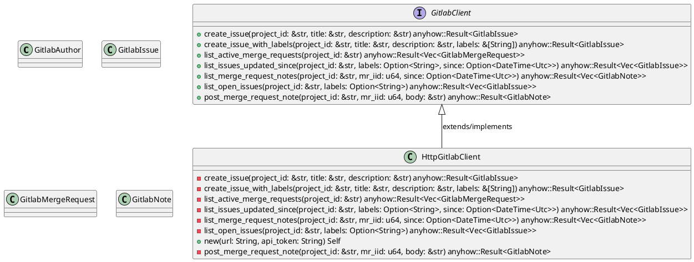
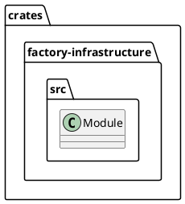
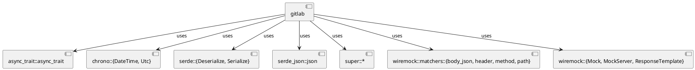
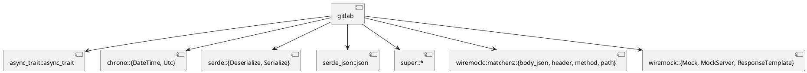
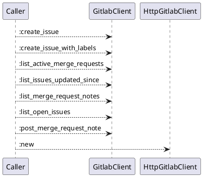
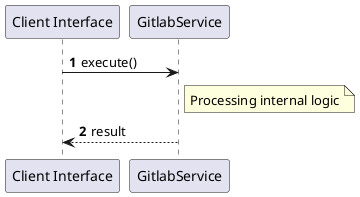

# File: gitlab.rs

**Source Path:** `crates/factory-infrastructure/src/gitlab.rs`

## Overview

### Purpose
Provides implementation for gitlab.rs.

### Responsibilities
* Handles logic related to gitlab.

### Dependencies
* async_trait::async_trait, chrono::{DateTime, Utc}, serde::{Deserialize, Serialize}, serde_json::json, super::*, wiremock::matchers::{body_json, header, method, path}, wiremock::{Mock, MockServer, ResponseTemplate}

### Imported modules
* None

### Exported classes
* GitlabAuthor, GitlabIssue, GitlabMergeRequest, GitlabNote, HttpGitlabClient

### Exported interfaces
* GitlabClient

### Exported functions
* None

## Public API

### Exported Classes / Structs / Interfaces

#### GitlabAuthor

**Overview:**
No description provided.

**Constructor:**

Default constructor.

**Attributes:**

* `username` (String): Purpose - Stores username data. Constraints - Valid String.

**Public Methods:**

None.

**Private Methods:**

None.

#### GitlabClient

**Overview:**
No description provided.

**Constructor:**

Default constructor.

**Attributes:**

None.

**Public Methods:**

##### `create_issue(project_id (&str), title (&str), description (&str)) -> anyhow::Result<GitlabIssue>`

###### Description
No description provided.

###### Inputs
* `project_id`: type=&str, meaning=Input for project_id, valid values=Any valid &str, optional=No, default value=None
* `title`: type=&str, meaning=Input for title, valid values=Any valid &str, optional=No, default value=None
* `description`: type=&str, meaning=Input for description, valid values=Any valid &str, optional=No, default value=None

###### Output
Return type: anyhow::Result<GitlabIssue>
Semantic meaning: Result of create_issue
Possible null values: Conditional
Exceptions: None handled explicitly

###### Side Effects
Database updates: None
File operations: None
Network calls: None
Cache: None
State changes: Updates internal variables

###### Complexity
Time Complexity: O(1) mostly
Space Complexity: O(1) mostly

###### Example
```
let result = instance.create_issue();
```

##### `create_issue_with_labels(project_id (&str), title (&str), description (&str), labels (&[String])) -> anyhow::Result<GitlabIssue>`

###### Description
No description provided.

###### Inputs
* `project_id`: type=&str, meaning=Input for project_id, valid values=Any valid &str, optional=No, default value=None
* `title`: type=&str, meaning=Input for title, valid values=Any valid &str, optional=No, default value=None
* `description`: type=&str, meaning=Input for description, valid values=Any valid &str, optional=No, default value=None
* `labels`: type=&[String], meaning=Input for labels, valid values=Any valid &[String], optional=No, default value=None

###### Output
Return type: anyhow::Result<GitlabIssue>
Semantic meaning: Result of create_issue_with_labels
Possible null values: Conditional
Exceptions: None handled explicitly

###### Side Effects
Database updates: None
File operations: None
Network calls: None
Cache: None
State changes: Updates internal variables

###### Complexity
Time Complexity: O(1) mostly
Space Complexity: O(1) mostly

###### Example
```
let result = instance.create_issue_with_labels();
```

##### `list_active_merge_requests(project_id (&str)) -> anyhow::Result<Vec<GitlabMergeRequest>>`

###### Description
No description provided.

###### Inputs
* `project_id`: type=&str, meaning=Input for project_id, valid values=Any valid &str, optional=No, default value=None

###### Output
Return type: anyhow::Result<Vec<GitlabMergeRequest>>
Semantic meaning: Result of list_active_merge_requests
Possible null values: Conditional
Exceptions: None handled explicitly

###### Side Effects
Database updates: None
File operations: None
Network calls: None
Cache: None
State changes: Updates internal variables

###### Complexity
Time Complexity: O(1) mostly
Space Complexity: O(1) mostly

###### Example
```
let result = instance.list_active_merge_requests();
```

##### `list_issues_updated_since(project_id (&str), labels (Option<String>), since (Option<DateTime<Utc>>)) -> anyhow::Result<Vec<GitlabIssue>>`

###### Description
No description provided.

###### Inputs
* `project_id`: type=&str, meaning=Input for project_id, valid values=Any valid &str, optional=No, default value=None
* `labels`: type=Option<String>, meaning=Input for labels, valid values=Any valid Option<String>, optional=No, default value=None
* `since`: type=Option<DateTime<Utc>>, meaning=Input for since, valid values=Any valid Option<DateTime<Utc>>, optional=No, default value=None

###### Output
Return type: anyhow::Result<Vec<GitlabIssue>>
Semantic meaning: Result of list_issues_updated_since
Possible null values: Conditional
Exceptions: None handled explicitly

###### Side Effects
Database updates: None
File operations: None
Network calls: None
Cache: None
State changes: Updates internal variables

###### Complexity
Time Complexity: O(1) mostly
Space Complexity: O(1) mostly

###### Example
```
let result = instance.list_issues_updated_since();
```

##### `list_merge_request_notes(project_id (&str), mr_iid (u64), since (Option<DateTime<Utc>>)) -> anyhow::Result<Vec<GitlabNote>>`

###### Description
No description provided.

###### Inputs
* `project_id`: type=&str, meaning=Input for project_id, valid values=Any valid &str, optional=No, default value=None
* `mr_iid`: type=u64, meaning=Input for mr_iid, valid values=Any valid u64, optional=No, default value=None
* `since`: type=Option<DateTime<Utc>>, meaning=Input for since, valid values=Any valid Option<DateTime<Utc>>, optional=No, default value=None

###### Output
Return type: anyhow::Result<Vec<GitlabNote>>
Semantic meaning: Result of list_merge_request_notes
Possible null values: Conditional
Exceptions: None handled explicitly

###### Side Effects
Database updates: None
File operations: None
Network calls: None
Cache: None
State changes: Updates internal variables

###### Complexity
Time Complexity: O(1) mostly
Space Complexity: O(1) mostly

###### Example
```
let result = instance.list_merge_request_notes();
```

##### `list_open_issues(project_id (&str), labels (Option<String>)) -> anyhow::Result<Vec<GitlabIssue>>`

###### Description
No description provided.

###### Inputs
* `project_id`: type=&str, meaning=Input for project_id, valid values=Any valid &str, optional=No, default value=None
* `labels`: type=Option<String>, meaning=Input for labels, valid values=Any valid Option<String>, optional=No, default value=None

###### Output
Return type: anyhow::Result<Vec<GitlabIssue>>
Semantic meaning: Result of list_open_issues
Possible null values: Conditional
Exceptions: None handled explicitly

###### Side Effects
Database updates: None
File operations: None
Network calls: None
Cache: None
State changes: Updates internal variables

###### Complexity
Time Complexity: O(1) mostly
Space Complexity: O(1) mostly

###### Example
```
let result = instance.list_open_issues();
```

##### `post_merge_request_note(project_id (&str), mr_iid (u64), body (&str)) -> anyhow::Result<GitlabNote>`

###### Description
No description provided.

###### Inputs
* `project_id`: type=&str, meaning=Input for project_id, valid values=Any valid &str, optional=No, default value=None
* `mr_iid`: type=u64, meaning=Input for mr_iid, valid values=Any valid u64, optional=No, default value=None
* `body`: type=&str, meaning=Input for body, valid values=Any valid &str, optional=No, default value=None

###### Output
Return type: anyhow::Result<GitlabNote>
Semantic meaning: Result of post_merge_request_note
Possible null values: Conditional
Exceptions: None handled explicitly

###### Side Effects
Database updates: None
File operations: None
Network calls: None
Cache: None
State changes: Updates internal variables

###### Complexity
Time Complexity: O(1) mostly
Space Complexity: O(1) mostly

###### Example
```
let result = instance.post_merge_request_note();
```

**Private Methods:**

None.

#### GitlabIssue

**Overview:**
No description provided.

**Constructor:**

Default constructor.

**Attributes:**

* `description` (Option<String>): Purpose - Stores description data. Constraints - Valid Option<String>.
* `id` (u64): Purpose - Stores id data. Constraints - Valid u64.
* `iid` (u64): Purpose - Stores iid data. Constraints - Valid u64.
* `title` (String): Purpose - Stores title data. Constraints - Valid String.
* `updated_at` (Option<DateTime<Utc>>): Purpose - Stores updated_at data. Constraints - Valid Option<DateTime<Utc>>.
* `web_url` (String): Purpose - Stores web_url data. Constraints - Valid String.

**Public Methods:**

None.

**Private Methods:**

None.

#### GitlabMergeRequest

**Overview:**
No description provided.

**Constructor:**

Default constructor.

**Attributes:**

* `description` (Option<String>): Purpose - Stores description data. Constraints - Valid Option<String>.
* `id` (u64): Purpose - Stores id data. Constraints - Valid u64.
* `iid` (u64): Purpose - Stores iid data. Constraints - Valid u64.
* `state` (String): Purpose - Stores state data. Constraints - Valid String.
* `title` (String): Purpose - Stores title data. Constraints - Valid String.
* `updated_at` (Option<DateTime<Utc>>): Purpose - Stores updated_at data. Constraints - Valid Option<DateTime<Utc>>.
* `web_url` (String): Purpose - Stores web_url data. Constraints - Valid String.

**Public Methods:**

None.

**Private Methods:**

None.

#### GitlabNote

**Overview:**
No description provided.

**Constructor:**

Default constructor.

**Attributes:**

* `author` (GitlabAuthor): Purpose - Stores author data. Constraints - Valid GitlabAuthor.
* `body` (String): Purpose - Stores body data. Constraints - Valid String.
* `id` (u64): Purpose - Stores id data. Constraints - Valid u64.
* `updated_at` (Option<DateTime<Utc>>): Purpose - Stores updated_at data. Constraints - Valid Option<DateTime<Utc>>.

**Public Methods:**

None.

**Private Methods:**

None.

#### HttpGitlabClient

**Overview:**
No description provided.

**Constructor:**

##### `new(url (String), api_token (String))`
Parameters: url (String), api_token (String)
Dependencies: Inherited from context
Initialization: Sets up HttpGitlabClient

**Attributes:**

* `api_token` (String): Purpose - Stores api_token data. Constraints - Valid String.
* `client` (reqwest::Client): Purpose - Stores client data. Constraints - Valid reqwest::Client.
* `url` (String): Purpose - Stores url data. Constraints - Valid String.

**Public Methods:**

None.

**Private Methods:**

* `create_issue(project_id (&str), title (&str), description (&str)) -> anyhow::Result<GitlabIssue>`: Internal helper logic.
* `create_issue_with_labels(project_id (&str), title (&str), description (&str), labels (&[String])) -> anyhow::Result<GitlabIssue>`: Internal helper logic.
* `list_active_merge_requests(project_id (&str)) -> anyhow::Result<Vec<GitlabMergeRequest>>`: Internal helper logic.
* `list_issues_updated_since(project_id (&str), labels (Option<String>), since (Option<DateTime<Utc>>)) -> anyhow::Result<Vec<GitlabIssue>>`: Internal helper logic.
* `list_merge_request_notes(project_id (&str), mr_iid (u64), since (Option<DateTime<Utc>>)) -> anyhow::Result<Vec<GitlabNote>>`: Internal helper logic.
* `list_open_issues(project_id (&str), labels (Option<String>)) -> anyhow::Result<Vec<GitlabIssue>>`: Internal helper logic.
* `post_merge_request_note(project_id (&str), mr_iid (u64), body (&str)) -> anyhow::Result<GitlabNote>`: Internal helper logic.

### Exported Functions

None.

## Internal architecture



## Package Diagram



## Component Diagram



## Dependency Graph



## Call Graph



## Execution flow & Sequence explanation



## Examples

```
// Example usage of gitlab.rs components
import { ... } from 'crates/factory-infrastructure/src/gitlab.rs';
```

## Cross References
* **Parent module:** `crates/factory-infrastructure/src`
* **Dependencies:** async_trait::async_trait, chrono::{DateTime, Utc}, serde::{Deserialize, Serialize}, serde_json::json, super::*, wiremock::matchers::{body_json, header, method, path}, wiremock::{Mock, MockServer, ResponseTemplate}
