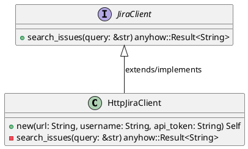
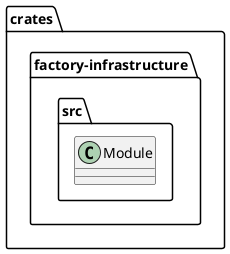
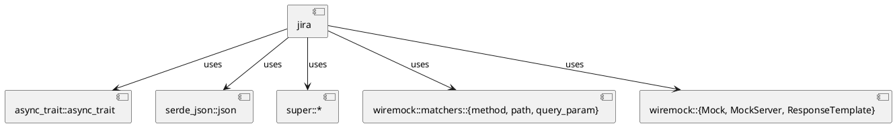
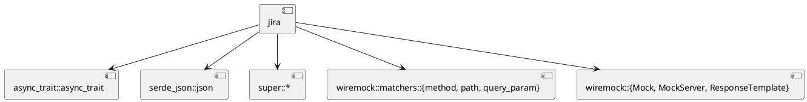
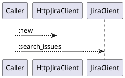
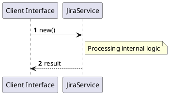

# File: jira.rs

**Source Path:** `crates/factory-infrastructure/src/jira.rs`

## Overview

### Purpose
Provides implementation for jira.rs.

### Responsibilities
* Handles logic related to jira.

### Dependencies
* async_trait::async_trait, serde_json::json, super::*, wiremock::matchers::{method, path, query_param}, wiremock::{Mock, MockServer, ResponseTemplate}

### Imported modules
* None

### Exported classes
* HttpJiraClient

### Exported interfaces
* JiraClient

### Exported functions
* None

## Public API

### Exported Classes / Structs / Interfaces

#### HttpJiraClient

**Overview:**
No description provided.

**Constructor:**

##### `new(url (String), username (String), api_token (String))`
Parameters: url (String), username (String), api_token (String)
Dependencies: Inherited from context
Initialization: Sets up HttpJiraClient

**Attributes:**

* `api_token` (String): Purpose - Stores api_token data. Constraints - Valid String.
* `client` (reqwest::Client): Purpose - Stores client data. Constraints - Valid reqwest::Client.
* `url` (String): Purpose - Stores url data. Constraints - Valid String.
* `username` (String): Purpose - Stores username data. Constraints - Valid String.

**Public Methods:**

None.

**Private Methods:**

* `search_issues(query (&str)) -> anyhow::Result<String>`: Internal helper logic.

#### JiraClient

**Overview:**
No description provided.

**Constructor:**

Default constructor.

**Attributes:**

None.

**Public Methods:**

##### `search_issues(query (&str)) -> anyhow::Result<String>`

###### Description
No description provided.

###### Inputs
* `query`: type=&str, meaning=Input for query, valid values=Any valid &str, optional=No, default value=None

###### Output
Return type: anyhow::Result<String>
Semantic meaning: Result of search_issues
Possible null values: Conditional
Exceptions: None handled explicitly

###### Side Effects
Database updates: None
File operations: None
Network calls: None
Cache: None
State changes: Updates internal variables

###### Complexity
Time Complexity: O(1) mostly
Space Complexity: O(1) mostly

###### Example
```
let result = instance.search_issues();
```

**Private Methods:**

None.

### Exported Functions

None.

## Internal architecture



## Package Diagram



## Component Diagram



## Dependency Graph



## Call Graph



## Execution flow & Sequence explanation



## Examples

```
// Example usage of jira.rs components
import { ... } from 'crates/factory-infrastructure/src/jira.rs';
```

## Cross References
* **Parent module:** `crates/factory-infrastructure/src`
* **Dependencies:** async_trait::async_trait, serde_json::json, super::*, wiremock::matchers::{method, path, query_param}, wiremock::{Mock, MockServer, ResponseTemplate}
